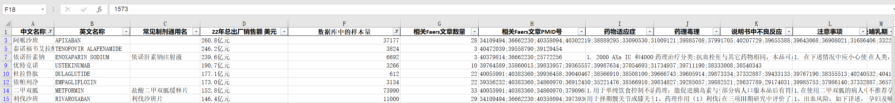
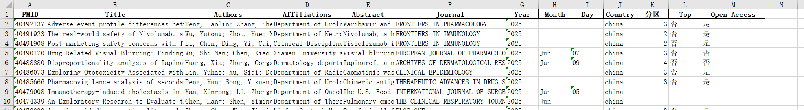

## 使用说明

为方便查阅，所有内容已整理在此页面，建议使用Ctrl+F搜索功能快速定位所需信息。

## 产品介绍

### 1. 绘图工具包（免费开源）
- **特点**：开源共享，符合GPL-3.0协议，支持传播和商用
- **内容**：目前包含80+绘图脚本，涵盖此方向论文绝大多数配图
- **获取方式**：随更新推送，也可在这里[下载最新版体验](./绘图工具+部分脚本/绘图工具v2.1下载链接.md)
- **演示视频**：https://www.bilibili.com/video/BV1tFNqzyEqM/

### 2. 数据分析系统（付费服务）

**价格**：

因平台功能全面升级与性能提升（包含作图脚本扩展、[Jader数据库挖掘](./旧物/Jader数据库挖掘工具.md)、[机器学习完善](./文章套路.md#s机器学习预测药物的不良反应与传统方法的性能比对)、[药物联用算法完善](./文章套路.md#联用药物分析)等），自 2025 年 7 月 31 日起，数据分析系统价格将进行调整：
- **半年期**：700元 → 800元  
- **一年期**：1100元 → 1200元  
（服务包含使用期内的全部功能与更新。如需长期使用可另行约定）
- 可在调价前以原价订购，老用户的续期仍维持原有价格方案

**功能模块**：
| 工具名称 | 功能定位 | 主要用途 | 适用场景 |
|---------|----------|----------|----------|
| [**不良数据库信号监测系统**](./软件操作说明.md#一不良数据库信号监测系统) | 核心分析引擎 | • 药物不良反应信号检测 • 生成各类分析报告 • 基线数据统计 • 提供原始数据源 | • 药物安全性评估 • 不良反应信号筛选 • 监管申报材料准备 |
| [**亚组分析工具（小数据）**](./软件操作说明.md#二亚组分析工具（小数据）) | 精细化分组工具 | • 对已有数据进行细分 • 特定人群/条件筛选 • 支持复杂逻辑组合 • 配合其他工具深度分析 | • 特定年龄段分析 • 性别差异研究 • 药物联用/单用对比 • 特殊人群安全性评估 |
| [**亚组分析工具（大数据）**](./软件操作说明.md#三亚组分析工具（大数据）) | 数据库预处理工具 | • 整体数据库分割 • 特定人群数据库构建 • 反向分析（从AE找药物） • 为信号监测提供基础数据 | • 构建特定人群数据库 • 某种不良反应的药物筛查 • 大规模数据预处理 |
| [**信息统计工具**](./软件操作说明.md#四信息统计工具) | 统计分析与可视化工具 | • 生成详细统计报表 • 基线数据分析 • 多维度统计图表 • 支持后续绘图分析 | • 研究报告撰写 • 统计描述分析 • 数据可视化展示 • 学术论文图表制作 |
| [**特征工程提取(机器学习)**](./软件操作说明.md#六特征提取工具机器学习用) | 智能特征提取引擎 | • 从数据库提取多维特征 • 器官特异性特征识别 • 协变量特征构建 • 生成结构化特征报告 • 为机器学习建模提供数据基础 | • 机器学习预处理 • 算法模型搭建前准备 • 多维特征分析 • 自动化特征工程 • 大数据挖掘项目 |

### 3. 信息服务（每月中旬更新推送）
- #### 选题投刊信息：
  1. 所有药物的历史发表情况统计（9千种左右）
  2. NCBI数据库中所有FAERS文章的基础信息
  3. 其他
- #### 功能更新推送
  1. 分析绘图脚本更新（每次推送都是整合包，不用担心缺漏）
  2. 公众号推送文章解读

## 操作指南

**重要提醒**：使用教程如下，请仔细阅读
- [软件操作说明](./软件操作说明.md)
- [如何用软件实现90%的文章套路](./文章套路.md)

## 实用建议

### 快速入门方法
参考大佬分享的经验：选择一篇目标文章，从分析方法、流程设计到图像制作，先评估可行性，然后借鉴其研究思路应用到自己的课题中。接着融合第二篇、第三篇文章的优秀元素，先完成初稿，再逐步精简优化。

### 高效发文策略
1. **选题优势**：此类文章写作难度较低，套路相对固定，方法具有很强的复用性
2. **并行操作**：建议同时开展三个或以上课题的写作工作
3. **选题工具**：附赠的《所有药物发表情况》和《发表文章一览》两个Excel表格（每月更新）可帮助快速筛选研究方向
4. **经济效益**：从投入产出角度考虑，在前期边际成本较低的阶段，文章数量越多，整体收益越高

**重要提醒：**
- 本平台为自助式服务，主要提供软件使用指导和故障排查
- 论文撰写指导：可推荐在该研究领域发表过三篇以上学术论文的资深硕士/博士导师
- 付费服务仅限**服务期内**的软件使用和更新
- 系统学习完全免费，请关注我们的B站视频教程合集：[从零开始的Faers数据库挖掘](https://www.bilibili.com/video/BV1uifhYdEQn/?vd_source=4559e47be658149d4030a5ba8050d24e)

- Wechat（需要备注来意）：

  

