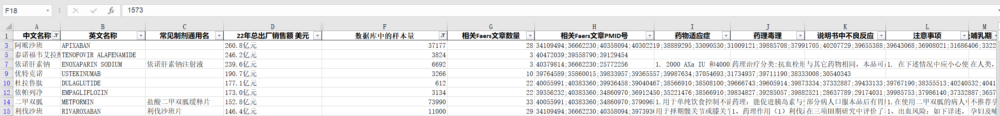
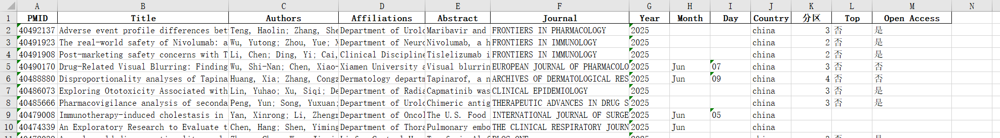

# SciFaersLab 产品说明
> 基于 FAERS 等多个药物不良反应数据库的图形化、零代码药物警戒研究平台。

SciFaersLab 面向医学、药学及生命科学研究人员，
无需编程基础即可完成 FAERS 数据整理、信号检测、亚组分析、
统计分析及论文级图表制作。
> - 整合包解压即用，无需配置R、Sass、Python、SQL等复杂环境  

---
## 🚀 快速开始

- 📖 [文章套路归纳](./文章套路.md) —— 推荐首次使用者阅读
- 🖥️ [软件操作说明](./软件操作说明.md) —— 查看完整功能及操作方法
- 🎬 [免费视频教程](https://www.bilibili.com/video/BV1AHeozNEXt/)
- 📊 [绘图工具包](https://www.bilibili.com/video/BV1KApvzmENr/)
- 📋 [当前数据库覆盖范围和本平台方法学说明](./数据库范围和方法说明.md)

---
### 适用人群
医学、药学研究生、医生及科研人员

### 系统要求
- 操作系统：Windows 10 & Windows 11
- 内存：建议8GB以上
- 存储空间：至少5GB可用空间

## ✨ 核心能力

### 📊 数据分析

- **[FAERS 数据挖掘](https://www.bilibili.com/video/BV1AHeozNEXt/)**：支持药物不良事件信号检测、基线数据统计及多维度数据分析
- **[亚组分析](https://www.bilibili.com/video/BV1taJdzqEYT/)**：支持年龄、性别、联合用药及特定人群等多种条件下的精细化分析
- **[逻辑回归统计分析](./特殊图像绘制教程/多元Logistic回归分析，单药or多药or联合用药适用.md)**：支持多因素 Logistic 回归等常用统计方法，适用于单药、联合用药及多种研究设计
- **[机器学习分析](https://www.bilibili.com/video/BV1su39zKEPX/)**：支持特征工程及机器学习建模，用于潜在不良反应预测，并可与传统信号检测方法进行性能比较

### 🎨 论文绘图

- **150+ 绘图脚本**：持续更新，覆盖 FAERS 研究中绝大多数常见图表需求
- **论文级图表输出**：支持 PNG、PDF、TIFF、EPS、SVG 等多种格式，满足论文投稿及后续编辑需求
- **图形化操作**：无需编程基础即可完成常见科研图表制作，降低数据分析与绘图的使用门槛
- **英文 / 中文图表**：脚本默认生成英文图表，并支持[一键转换](./特殊图像绘制教程/汉化英文脚本的方法.md)为中文版本
- [查看绘图工具包视频教程](https://www.bilibili.com/video/BV1gBhCzNEpc/)

### 🧬 拓展分析

- **多数据库药物警戒**：支持 [JADER](./旧物/Jader数据库挖掘工具.md)、[CVADR](./旧物/CVARD加拿大数据库挖掘工具.md) 等数据库的数据挖掘与亚组分析
- **[药物相互作用（DDI）](./旧物/DDI药物相互作用计算说明文档.md)**：提供药物联用及相互作用分析工具，辅助开展联合用药安全性研究
- **[网络药理学拓展](./旧物/网络药理学拓展模块.md)**：将 FAERS 数据挖掘与网络药理学分析相结合，支持成分–靶点–通路网络构建与可视化
- **[敏感性分析](./文章套路.md)**：支持药物联用、不同分析条件及研究方案下的敏感性分析，检验研究结果的稳健性

### 📚 研究辅助

- **FAERS 研究模式解析**：总结常见研究设计与分析流程，提供 [八大文章模式解析](./文章套路.md)，辅助快速构建研究方案
- **选题与文献参考**：提供药物历史发表情况、FAERS 相关文章等研究信息，辅助研究方向筛选
- **完整研究流程支持**：从数据提取、统计分析、信号检测到论文绘图，为 FAERS 研究提供一体化工具支持
- **持续更新**：绘图脚本、分析功能及研究资料持续更新，随版本迭代不断扩展研究能力

---
## 产品构成

> **项目定位：** 绘图工具包免费开源；完整 FAERS 数据分析系统及持续更新服务为付费服务。
### 1. 绘图工具包（免费开源）
- **特点**：开源共享，符合GPL-3.0协议，支持传播和商用
- **内容**：目前包含150+绘图脚本，涵盖此方向论文绝大多数配图，图形模板可点击"绘图工具+部分脚本"-"图像模板目录"进行查看
- **获取方式**：随更新推送，也可在这里[下载最新版体验](./绘图工具+部分脚本/绘图工具v3.0下载链接.md)
- **演示视频**：https://www.bilibili.com/video/BV1tFNqzyEqM/
> 支持多格式保存：PNG/PDF/TIFF/EPS/SVG  
> 脚本文件默认生成英文图像，如需中文版本，可使用[一键转换功能](./特殊图像绘制教程/汉化英文脚本的方法.md)将英文脚本转换为中文脚本进行绘图

### 2. 数据分析系统（付费服务）

**价格**：

- **半年期**：800元  
- **一年期**：1200元  

**服务内容**：
- 使用期内的全部功能与更新，如需长期使用可另行约定
- 邮箱发送软件整合包，包含完整季度FAERS数据库，无需用户手动下载
- 若FDA更新了季度数据，通过邮箱推送最新整合包
> **数据说明**：当前数据库覆盖范围与文章方法学(Method)部分说明请参阅：[数据库范围和方法说明](./数据库范围和方法说明.md)

#### - 功能组件
**核心功能模块**：
| 工具名称 | 功能定位 | 主要用途 | 适用场景 |
|---------|----------|----------|----------|
| [**不良数据库信号监测系统**](./软件操作说明.md#一不良数据库信号监测系统) | 核心分析引擎 | • 药物不良反应信号检测 • 生成各类分析报告 • 基线数据统计 • 提供原始数据源 | • 药物安全性评估 • 不良反应信号筛选 • 监管申报材料准备 |
| [**亚组分析工具（小数据）**](./软件操作说明.md#二亚组分析工具（小数据）) | 精细化分组工具 | • 对已有数据进行细分 • 特定人群/条件筛选 • 支持复杂逻辑组合 • 配合其他工具深度分析 | • 特定年龄段分析 • 性别差异研究 • 药物联用/单用对比 • 特殊人群安全性评估 |
| [**亚组分析工具（大数据）**](./软件操作说明.md#三亚组分析工具（大数据）) | 数据库预处理工具 | • 整体数据库分割 • 特定人群数据库构建 • 反向分析（从AE找药物） • 为信号监测提供基础数据 | • 构建特定人群数据库 • 某种不良反应的药物筛查 • 大规模数据预处理 |
| [**信息统计工具**](./软件操作说明.md#四信息统计工具) | 统计分析与可视化工具 | • 生成详细统计报表 • 基线数据分析 • 多维度统计图表 • 支持后续绘图分析 | • 研究报告撰写 • 统计描述分析 • 数据可视化展示 • 学术论文图表制作 |
| [**特征工程提取(机器学习)**](./软件操作说明.md#六特征提取工具机器学习用) | 智能特征提取引擎 | • 从数据库提取多维特征 • 器官特异性特征识别 • 协变量特征构建 • 生成结构化特征报告 • 为机器学习建模提供数据基础 | • 机器学习预处理 • 算法模型搭建前准备 • 多维特征分析 • 自动化特征工程 • 大数据挖掘项目 |

**其他功能模块**：提供[**日本Jader挖掘&亚组分析**](./旧物/Jader数据库挖掘工具.md#基础说明)、[**药物-作用代码-对应的不良报告个数计数器**](./软件操作说明.md#小工具药物-作用代码-对应的不良报告个数计数器)、[**药学辅助查询工具**](./软件操作说明.md#小工具药学辅助查询工具)、[**数据挖掘AI助手**](./软件操作说明.md#小工具数据库挖掘ai小助手)等实用工具。
- [查看完整功能列表](./旧物/功能模块详解.md)

### 3. 信息服务（每月中旬更新推送）
#### 选题投刊信息推送：  

1. 所有药物的历史发表情况统计（9千种左右）[点击下载节选版参考](./旧物/9000种药物(化学物质)发表情况节选.md)  
   
   
2. NCBI数据库中所有FAERS文章的基础信息  
   
   
3. 其他  

#### 功能更新推送
1. 绘图脚本更新（每次推送都是整合包，不用担心缺漏）
2. 上述核心功能模块和辅助功能模块的性能优化与功能更新
3. [微信公众号](https://mp.weixin.qq.com/s/FA-xaTbnpw_iuZi7ZEQtig)推送文章解读

---

## 入门建议
选择一篇目标文章，从分析方法、流程设计到图像制作，先评估可行性，然后借鉴其研究思路应用到自己的课题中。接着融合第二篇、第三篇文章的优秀元素，先完成初稿，再逐步精简优化。

### 高效发文策略
1. **选题优势**：此类文章写作难度较低，套路相对固定，方法具有很强的复用性
2. **并行操作**：建议同时开展三个或以上课题的写作工作
3. **选题工具**：附赠的《所有药物发表情况》和《发表文章一览》两个Excel表格（每月更新）可帮助快速筛选研究方向
4. **经济效益**：从投入产出角度考虑，在前期边际成本较低的阶段，文章数量越多，整体收益越高

---
## 📌 项目状态

当前版本：v1.59-26H2（2026-10-01）

当前状态：持续开发与更新

主要更新：
- 网络药理学拓展模块
- 新增并更新 FAERS、JADER、CVARD 三大不良反应数据库，覆盖最新数据版本
- 新增三大数据库复杂药物筛选与联用分析功能，支持联用、单独用药及敏感性分析
- 扩充并优化科研绘图与情报数据模块，绘图脚本增至 159 个，并更新 FAERS 药物样本量及文献数据

详细更新记录：
[查看更新日志](./旧物/v1.59版本更新日志.md)

---

## 声明与服务说明
### 数据与研究声明
- SciFaersLab 主要用于药物警戒研究、数据探索及科研分析。

- FAERS 属于自发报告数据库，分析结果用于信号发现和假设生成，不能直接用于计算药物不良反应发生率，也不能单独证明药物与不良事件之间存在因果关系。

- 研究结果应结合研究设计、临床背景及其他数据来源进行综合判断。

### 服务说明
- 本平台为自助式服务，主要提供软件使用指导和故障排查
- 论文撰写指导：可推荐在该研究领域发表过三篇以上学术论文的资深硕士/博士
- 付费服务仅限**服务期内**的软件使用和更新
- Wechat（需要备注来意）：

  

