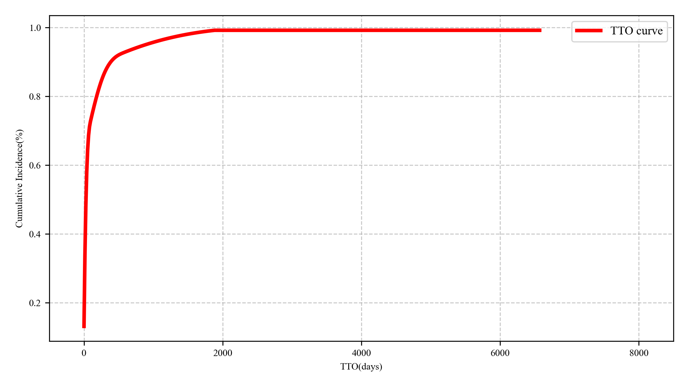
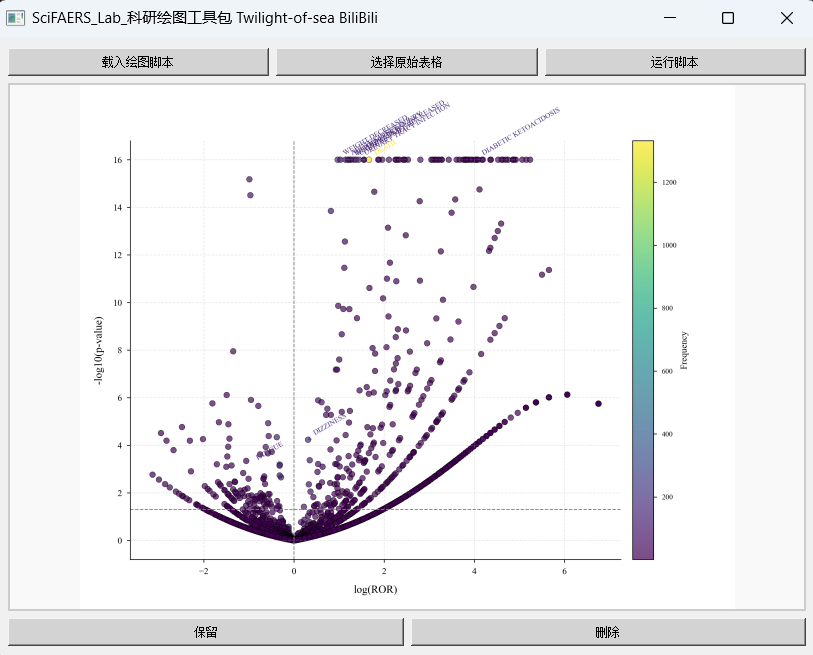

# **分析角度指引**

- #### 常见套路归纳：
    
    1. 单个药物的不良事件分析；
    2. 单个药物对于某一类不良事件的分析；
    3. 多个药物的不良事件分析；
    4. 多个药物针对某一个/某一类不良事件的分析；
    5. 某种不良反应是哪些药物引起的
    6. 联合用药。
    
### 总体概述和目录
 - 这篇笔记会列举一些分析的角度，以及如何利用配套软件工具实现数据分析和图形化
 - P和S开头的作图脚本，可能涉及到手动操作的过程，如有必要，本文中会给出操作说明的链接。

#### 1. 基础
  - 这个课题的核心目的是探究药物和不良反应二者之间的关系，适用这个分析场景的统计学方法有：ROR、PRR、BCPNN、MGPS等等。原理都在衡量某药物的某不良反应发生情况在整个数据库背景下的不对称性。这几种算法的Features的概念均来自于比例失衡四格表。
  - 算法公式、阈值和在线计算器请见附加文件。算法越复杂，其可解释性越低，尤其以BCPNN、经验贝叶斯为代表的贝叶斯方法为盛，鼓励去深入研究。PS：从港大经济学系揪出来100个人，可能没有1个人能把BCPNN的推导过程说清晰。
  - 本软件涉及到的机器学习方法，之所以表现有时优于传统算法，并非因为常见的这些机器学习方法比传统方法更加高明，而是因为我们抽提出了更多features，并将之作为影响因素去考虑。

#### 2. 多药分析和单药分析
  - 多药分析是基于单药的，核心就是看不同药物在什么方面，存在什么差异，并且在文章中给出解释，能起一定的指导用药。
    - 比如看某个药在女性人群中引起不良反应A的风险大，但是另一个药物，在女性群体中引起A的风险相对小一些。这样子可以用作图工具画两个亚组显著性对比火山图表示性别差异。
    - 
    - 再比如说，总体上看一下哪些信号强，哪些信号弱，具体往哪个方向上写，看大家的阅读文章的丰富程度和科研能力。
    - 
  - 多药分析的解释，可以从毒理、靶点、分子机制的角度去入手，适当结合一些网络药理学的内容也可以拿高分。

#### 3. 联用药物分析
  - 如果在第四条药物联用情况分析中发现：药物A常常于B联用，然后我想探究A单独使用和联合B使用时两种情景发生的不良事件情况
  - 信号监测系统框中输入：A#B，为单独用A的情况挖掘；框中输入：A&B，是二者联合使用情况
  - 重点还是看怎么对结果做出解释和相应的图形化：最常见的就是上边这个图，哪些不良反应信号强或者弱，绘图方法没有任何区别
  - 也可以再加上一些角度，比如男女差异？老少差异？等等
  - 还有一个问题：再做这个分析之前，我们怎么看目标药物和哪些药物联用的多呢？
    - 运行小工具：药物-作用代码-对应的不良报告个数计数器.exe，选择DRUG_GOAL.csv，会导出一个计数表格，即可查看药物使用情况，可以用[S2015]画一个树形图看看联用情况
    - 
    
#### 5. 诱发时间曲线和韦伯分布
- 不良报告的诱发时间分析越来越常出现在论文中，现在基本每个文章都有。
- 可以对比两种不同药物的诱发时间，也可以对比在老年人和年轻人群体中的诱发时间，也可以对比引起不良反应A的报告的诱发时间，和B有什么不同。任何亚组分析都能够画下边的图，然后再做一下下边提到的韦伯分布：
-  

- [3001][C0009]Time-to-onset条形图绘制
  
- [2010]累积发生率
  
- [2005]诱发时间韦伯分布（ WSP analysis）：使用 bootstrap 方法计算置信区间，可调整脚本中n_iterations的取值来改变重采样次数，default = 100
  
- **Weibull分布参数**：
    - **Scale (α)**：尺度参数，表示特征寿命（63.2%的样本发生失效的时间），其95%置信区间（CI）反映参数估计的稳定性。
    - **Shape (β)**：形状参数，决定失效风险随时间的变化模式：
        - β < 1：风险递减（早期失效）。
        - β = 1：风险恒定（随机失效）。
        - β > 1：风险递增（损耗失效）。
- **Failure Type**：失效类型，基于形状参数（β）的统计学判断。
    1. **Early Failure（早期失效）**：  
        - **条件**：形状参数（β）的95%置信区间不包含1，且β < 1。  
        - **含义**：失效风险随时间递减，早期事件发生率高（如药物不良反应早期出现）。  
        - **示例**：肝功异常（β=0.80，CI=0.65–0.94）和肝衰竭（β=0.69，CI=0.48–0.90）。

    2. **Random Failure（随机失效）**：  
        - **条件**：形状参数（β）的95%置信区间包含1。  
        - **含义**：失效风险恒定，事件随机发生（符合指数分布）。  
        - **示例**：疾病进展（β=0.83，CI=0.65–1.00）和腹水（β=0.87，CI=0.73–1.01）。    
        

    
#### 6. 信号值（PT）分析（作图脚本太多了，只讲典型案例）
  - [1004]多算法韦恩分布
  
  - [1002]TOP不良事件条形图
  
  - [P1005]多药对比信号（PT）-Top30热力图ROR [多药信号图绘制教程](./范文拆解/多药信号图绘制教程.md)
  
  - [1010]、[1011]ROR火山图
  

#### 7. 信号值（SOC）分析（作图脚本太多了，只讲典型案例）
  - 个人认为做SOC层级没啥必要，可以整体看一下，不良反应集中在哪些器官系统层级
  - [1008]条形图
    
  - [1000]森林图
      

    
#### 10. 性别，年龄和年龄-性别的累计变化分析：
  - [2004]、[2008]、[C0002]、[C0005]等
    
  - [3002]年龄-性别频数分布-分组柱状图等
  - [C0006]数据统计表-年龄-性别频数分布-堆叠柱状图等
    
    
#### 11. 不良报告上报者分析：
  - 数据库中的代号是二字代码，看不明白的，去看附件中的文件
  - [2007]、[C0004]作图
    
#### 12. 不良反应上报时间分析：
  - [2011]、[2002]、[2001]等
    
#### 13. 体重段位分析\国家分析：
  - [2008]、[2006]
    
#### 14. **某种不良反应是哪些药物引起的：**
  - 亚组分析工具（大数据）：筛选某个或者某些PT
  - 小工具：去重，处理导出的数据
  - 小工具：药物-作用代码-对应的不良报告个数计数器，看目标不良反应是哪些药物引起的.[S2012]、[S2014]作泡泡和树状图
  
  - 信号监测系统：看这些药物和此不良反应之间的相关信号计算
  - 信息统计工具：制表+各种脚本作图
  - 亚组分析：可针对年龄段、性别等进一步分析，作图。先用csv格式转换工具、再用亚组分析工具（小数据），再如法炮制分析作图
  - 此不良反应的并发症分析：树状图、泡泡矩阵、层次聚类算法
    
    
    