- [视频教程](https://www.bilibili.com/video/BV1aWmgBeEoW/)：数据库更新、数据挖掘&亚组分析,支持100+专业SCI图片绘制

### 基础说明
- Canada Vigilance Adverse Reaction Online Database药物-不良反应报告数据库，简称CVARD，相较于FDA的FAERS数据库，字段非常丰富，但是数据量和大小较小。常配合FAERS数据库进行结论验证、联合使用。目前为止涉及到CVARD数据库的文章数量在100篇以下。
- 作为SciFaersLab的免费插件使用，数据库和分析程序在SciFaersLab整合包V1.57版本后整合，无需手动安装。
- [点击这里跳转下载CVARD数据库](https://www.canada.ca/en/health-canada/services/drugs-health-products/medeffect-canada/adverse-reaction-database/medeffect-canada-caveat-privacy-statement-interpretation-data-search-canada-vigilance-adverse-reaction-online-database.html)

### 操作方法
- 1. 数据库文件存放位置：Lib_Data/Data_Lake_Ca，该数据库每月更新，可通过上述链接更新数据库，操作方法可看视频教程  

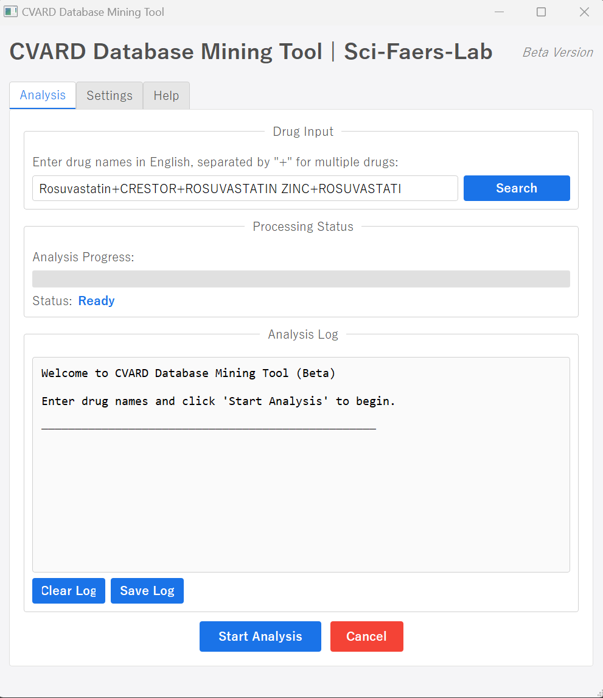

- 2. 运行小工具：CVARD挖掘，打开上面的页面

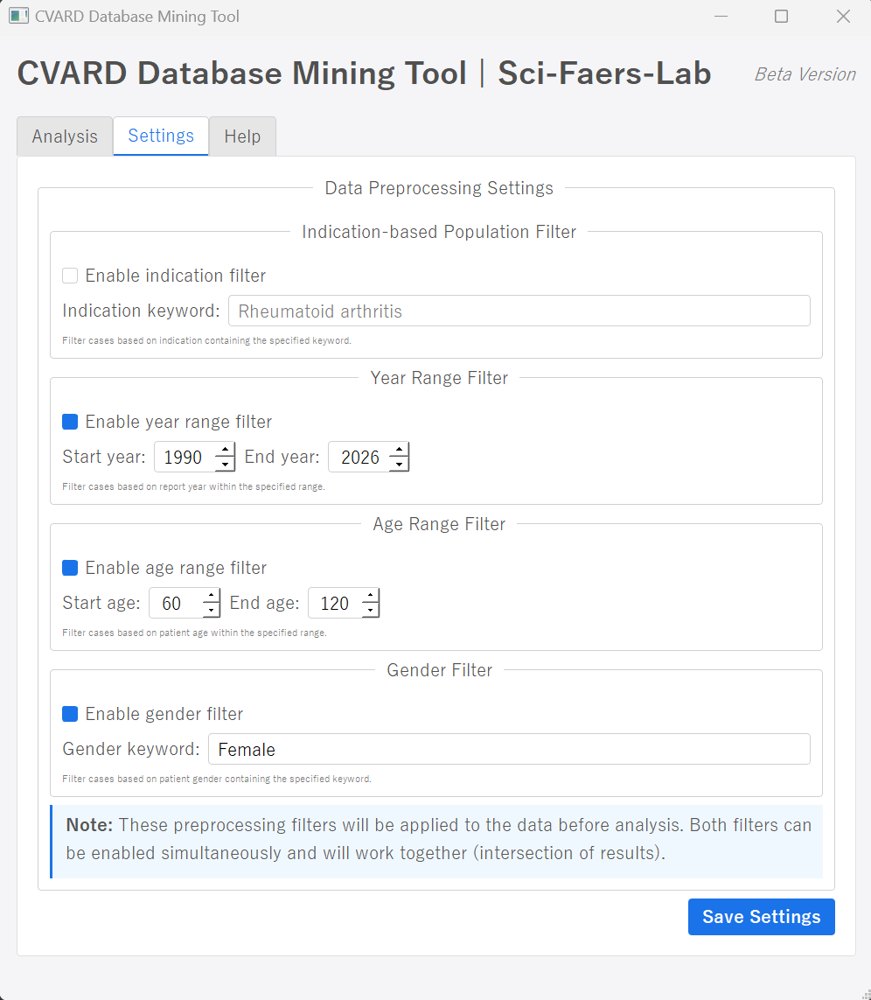  

- 3. 如果需要限定数据挖掘的范围，点击Setting，设置预处理选项，支持限定人群**年龄、性别、适应症**以及**报告年份范围**做数据挖掘  

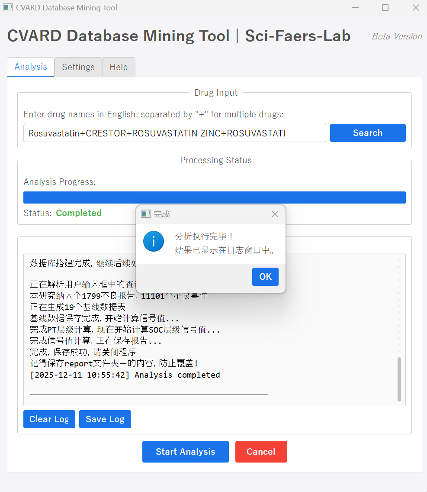  

- 4. 点击Start Analysis按钮，开始进行数据挖掘，纳入目标药物作为怀疑药物(Suspect)引起的不良报告，进行原始数据提取、基线数据生成、四算法(ROR/PRR/BCPNN/MGPS)信号值计算

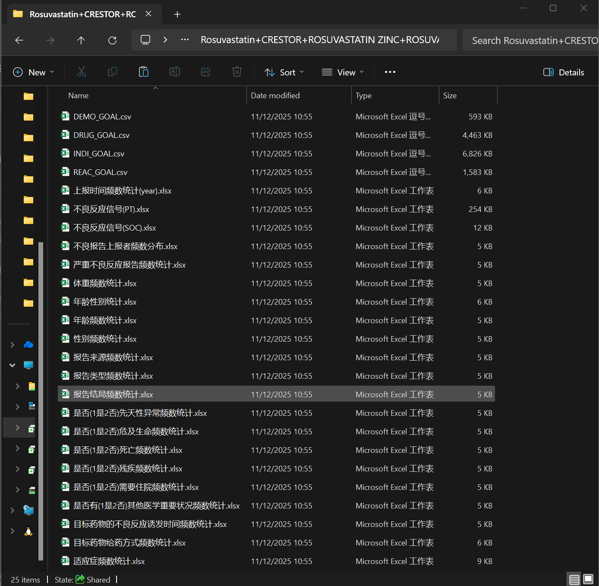  

- 5. 生成25个数据表，包括两个层级的信号值报告(PT/SOC)，基线数据表(19个)，原始数据提取(4个)

### 亚组分析
支持对数据挖掘工具的导出结果进行进一步的亚组分析，可以通过16个维度无限精细的划分亚组。

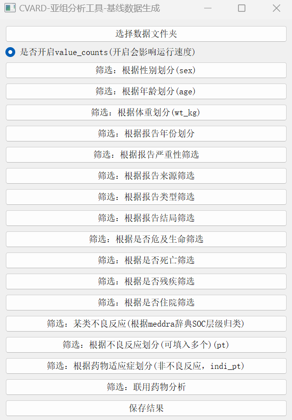

### 图形化
- 支持脚本数量：110+
- 支持FAERS绘图脚本中的大部分(100+)，涵盖信号值森林图、事件频数图、热力图、气泡图、雷达图、堆积图、生存分析曲线和韦伯分布等。详见[脚本兼容性列表](./CVARD脚本兼容性列表.md)
- CVARD数据库专用绘图脚本：报告多结局Upset图、BMI分位数回归和散点图+回归线+置信区间等  

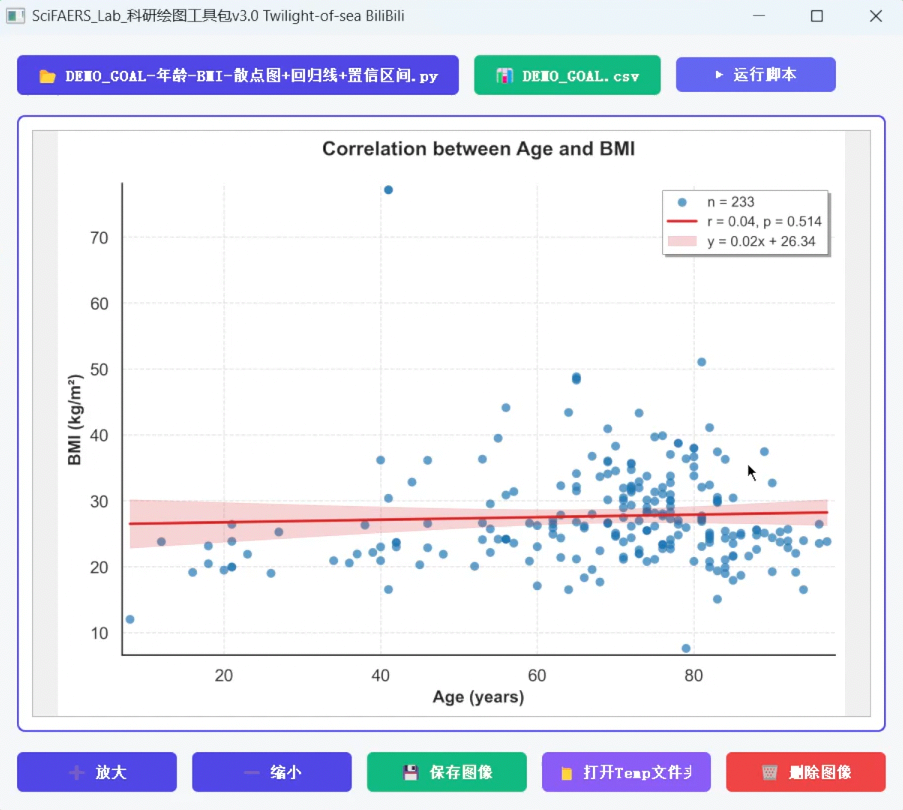
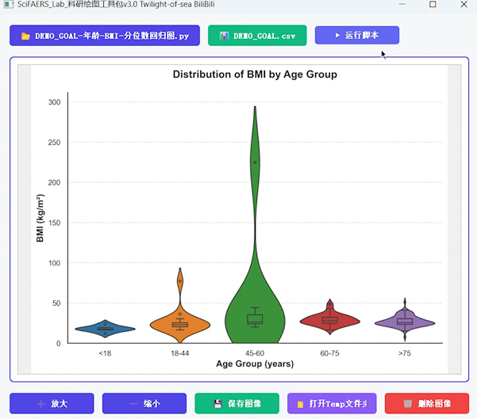

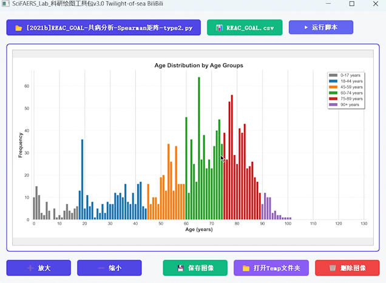
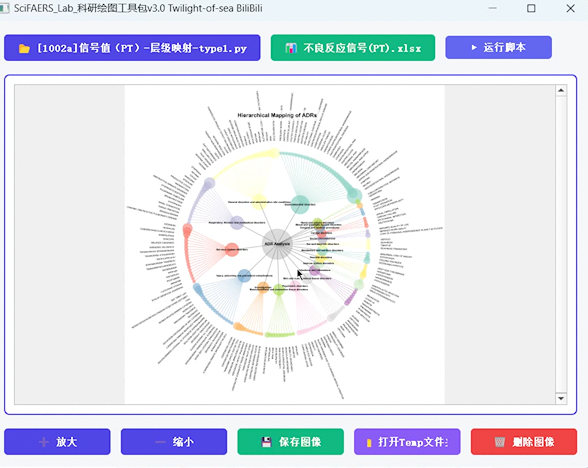
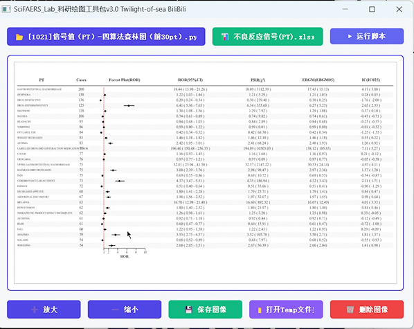
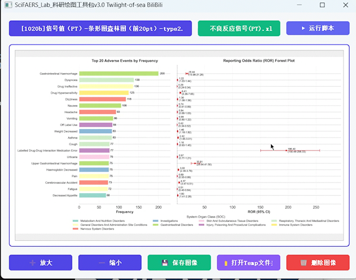
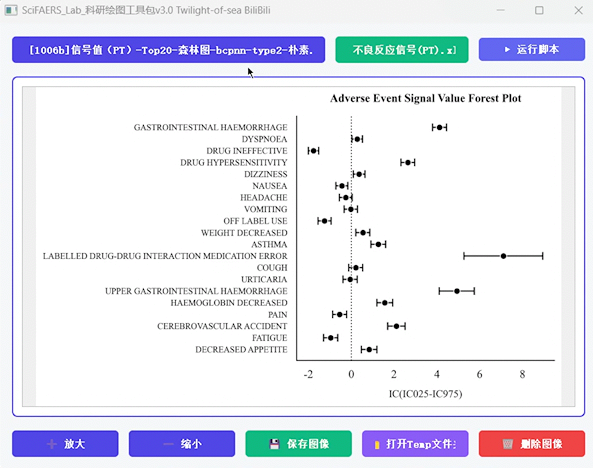
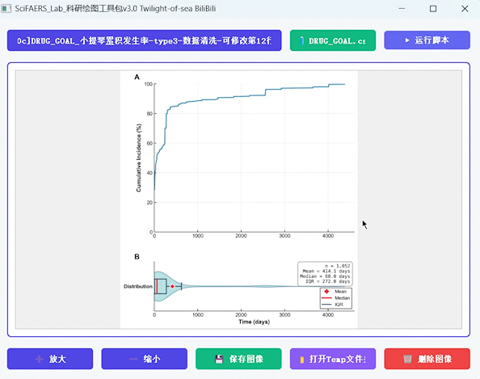
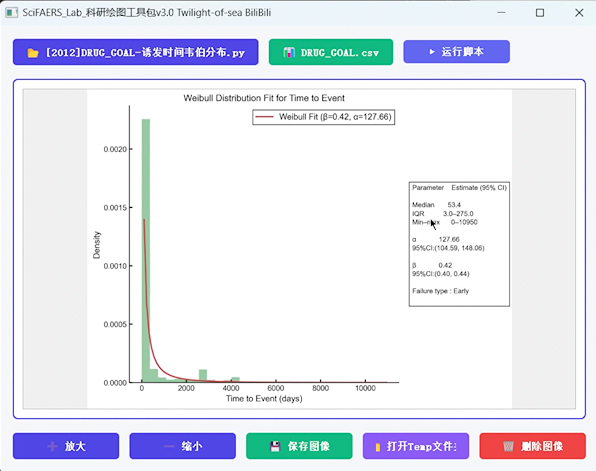

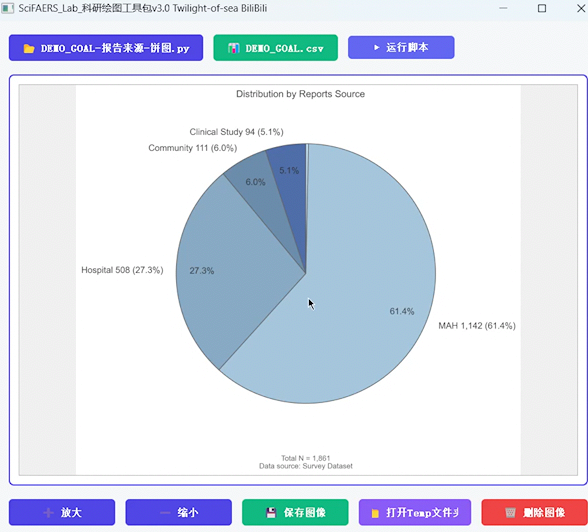
