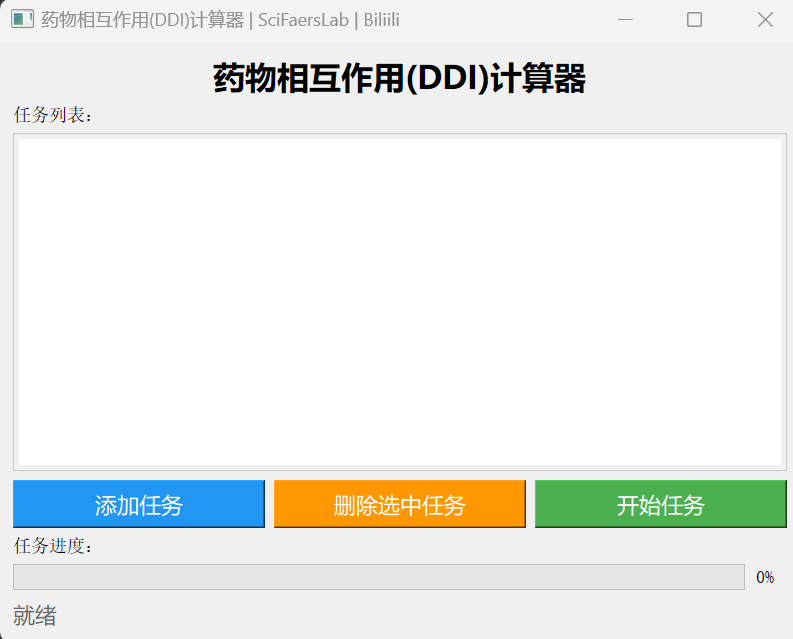
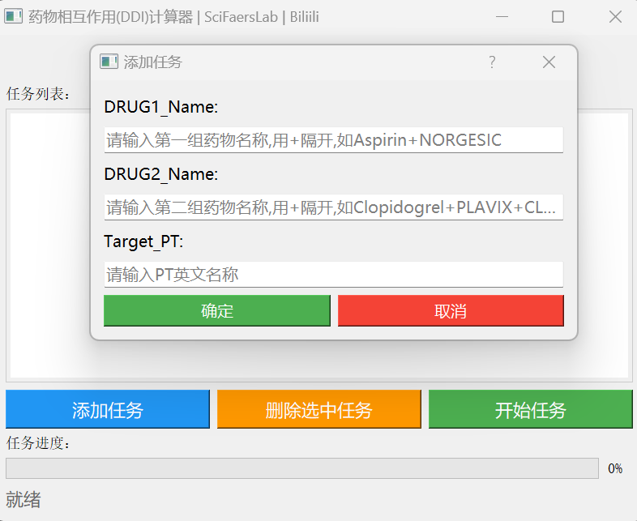

- [视频教程]()
### 操作说明
- 打开DDI计算器，点击右下方的"添加任务"按钮
- 在弹出的输入框中，分别输入两组药物的名称，每组药物中用加号连接，以纳入相同药物的不同名称；以及目标不良事件(PT)的英文名称
- 添加完成后，点击"开始任务"按钮
- 报告生成在Report文件夹中，包含计算结果，以及原始数据报告两个部分
  - 原始数据说明：分为三种情况：两种药物联合使用、药物1单独使用、药物2单独使用。一共有7*3共21个数据文件。后续可作为三个独立亚组做**基线数据生成(信息统计工具)**、若需要增加文章内容，也可也做**韦伯分布-累积发生率**、**多因素逻辑回归分析**等
  - 计算结果：包含下列算法的参数及判定结果  

- **注意**：此方法纳入的报告，包含目标药物的**全部报告类型**（如PS、SS、I、CC等），与主流的**仅纳入目标药物作为首要怀疑药物（PS）** 的方法存在区别。
若需计算**纳入所有药物的信号值**，可使用[信号监测系统魔改版](./信号监测系统魔改版.md)；但**绝大多数场景下**，更建议采用**以目标药物作为PS**的计算方式，即使用原版软件。

### 药物相互作用(DDI)信号检测统计算法说明文档

文档说明

本文档整理了自发报告系统（Spontaneous Reporting Systems）中用于药物相互作用（Drug-Drug Interaction, DDI）信号检测的主流统计算法，包括各算法的原理、公式、优势与局限性，同时明确了分析所用列联表参数的定义。

---
1. 概述（Overview）

Several statistical algorithms have been developed for exploring DDI signals, yet no de facto standard exists for DDI signal detection in spontaneous reporting systems. Each method has inherent advantages and limitations.

已开发出几种用于探索药物相互作用信号的统计算法，但在自发报告系统中，尚无公认的药物相互作用信号检测标准。每种方法都有其固有的优势和局限性。

---
1. 核心算法介绍（Introduction to Core Algorithms）

2.1 Ω 缩减度量模型（Ω Shrinkage Measure Model）

2.1.1 算法原理（Principle）

Proposed by Norén et al and used by the World Health Organization Uppsala Monitoring Center, this model calculates an observed-to-expected ratio for disproportionality measurement of potential DDIs. It demonstrates a conservative signal detection trend among frequentist-based approaches, effectively minimizing false positives by handling sparse data, adjusting for deviations in expected frequencies, and shrinking the extreme ratios toward the overall mean.

该模型由Norén等人提出，并被世界卫生组织乌普萨拉监测中心采用，通过计算观察值与期望值的比值，实现潜在药物相互作用的不均衡性测量。在基于频率的方法中，该模型呈现保守的信号检测趋势，通过处理稀疏数据、校正预期频率偏差，以及将极端比值向整体均值收缩，有效降低假阳性结果。

2.1.2 适用场景与局限性（Application Scenarios and Limitations）

It is particularly well-suited for monitoring rare Adverse Events (AEs, eg, TdP) in noisy databases like FAERS but requires clinical validation to confirm associations between drug combinations and adverse reactions.

该模型特别适用于在FAERS等噪声较大的数据库中监测罕见不良事件（如TdP），但需通过临床验证来确认药物组合与不良反应之间的关联性。

2.1.3 计算公式（Calculation Formulas）
$$E_{111} = n_{11+} \times \left( \frac{n_{101}}{n_{10+}} \right) \times \left( \frac{n_{011}}{n_{01+}} \right)$$

$$V_{111} \approx E_{111} \times \left(\frac{1}{n_{101}} + \frac{1}{n_{011}} - \frac{1}{n_{10+}} - \frac{1}{n_{01+}}\right)$$

$$\theta = \frac{n_{111} - E_{111}}{\sqrt{V_{111}}}$$

$$\Omega = \left(\frac{\theta}{\sqrt{V_{111}}}\right) \times \left(\frac{V_{111}}{V_{111} + \sigma^2}\right) = \frac{n_{111} - E_{111}}{V_{111} + \sigma^2}$$

信号判定条件：

$$\Omega - \frac{\phi(0.975)}{\log(2)\sqrt{n_{111}}} > 0$$

其中，$\text{Omega}_{025}$ 定义为：

$$\text{Omega}_{025} = \Omega - \frac{\phi(0.975)}{\log(2)\sqrt{n_{111}}}$$

2.2 加法模型（Additive Model）

2.2.1 算法原理（Principle）

Described by Thakrar et al, the additive model estimates co-medication risks by evaluating target AE incidences across different exposure scenarios. It is highly sensitive for detecting potential drug synergies.

该模型由Thakrar等人提出，通过评估不同暴露场景下目标不良事件的发生率，对联合用药风险进行估算，对检测潜在的药物协同作用具有高灵敏度。

2.2.2 适用场景与局限性（Application Scenarios and Limitations）

It is prone to spurious associations due to noise and biases in spontaneous reporting systems.

由于自发报告系统存在噪声和偏倚，该模型易产生虚假关联结果。

2.2.3 计算公式（Calculation Formulas）

信号判定条件：

$$\frac{n_{111}}{n_{11+}} - \frac{n_{101}}{n_{10+}} - \frac{n_{011}}{n_{01+}} - \frac{n_{001}}{n_{00+}} > 0$$

其中，$Adt$ 定义为：

$$Adt = \frac{n_{111}}{n_{11+}} - \frac{n_{101}}{n_{10+}} - \frac{n_{011}}{n_{01+}} - \frac{n_{001}}{n_{00+}}$$

2.3 乘法模型（Multiplicative Model）

2.3.1 计算公式（Calculation Formula）

信号判定条件：

$$\frac{n_{111} \times n_{001} \times n_{10+} \times n_{01+}}{n_{11+} \times n_{00+} \times n_{101} \times n_{011}} > 1$$

其中，$mtp$ 定义为：

$$mtp = \frac{n_{111} \times n_{001} \times n_{10+} \times n_{01+}}{n_{11+} \times n_{00+} \times n_{101} \times n_{011}}$$

2.4 组合风险比模型（Combination Risk Ratio, CRR Model）

2.4.1 算法原理（Principle）

Proposed by Noguchi et al, the CRR model offers a theoretical framework for assessing the joint risk of co-medicated drugs by assuming that the occurrence of AEs represents a combined risk of both drugs. It is valuable for exploring potential interactions.

该模型由Noguchi等人提出，假设不良事件的发生是两种药物的联合风险所致，为评估联合用药的风险提供了理论框架，对探索潜在药物相互作用具有参考价值。

2.4.2 适用场景与局限性（Application Scenarios and Limitations）

It relies heavily on sufficient co-medication frequency, limiting its effectiveness with rare drug combinations.

该模型严重依赖充足的联合用药频率，因此对罕见药物组合的分析效果受限。

2.4.3 计算公式（Calculation Formulas）

信号判定条件：

$$CRR = \frac{PRR_{DRUG1 \cap DRUG2}}{\max(PRR_{DRUG1}, PRR_{DRUG2})} > 2$$

附加判定条件：

$$n_{111} \ge 3, PRR_{DRUG1 \cap DRUG2} > 2, \chi^2_{DRUG1 \cap DRUG2} > 4$$

---
1. 列联表参数定义（Contingency Table Parameter Definitions）

Table 1 shows the 4×2 contingency table for drug-drug interaction signal analysis, where the drugs are generalized as DRUG1 and DRUG2.

|                       | AEsofInterest | OtherAEs | Total |
|-----------------------|----------------|----------|--------|
| Concomitant use of DRUG1 and DRUG2 | n111           | n110     | n11+  |
| DRUG1 without DRUG2               | n101           | n100     | n10+  |
| DRUG2 without DRUG1               | n011           | n010     | n01+  |
| Neither DRUG1 nor DRUG2           | n001           | n000     | n00+  |
| **Total**                          | n++1           | n++0     | n+++  |

---
1. 推荐阅读资料

https://pubmed.ncbi.nlm.nih.gov/18344185/ Ω收缩度量模型
https://pubmed.ncbi.nlm.nih.gov/32356247/ 组合风险比（CRR）
https://link.springer.com/article/10.1007/s11095-020-02801-3
https://www.jmir.org/2025/1/e65872#ref16 

