- [插件安装演示视频](https://www.bilibili.com/video/BV1y5uFzLE3e/) | 1.52之后的版本会自带，无需安装
- [数据库结构、挖掘工具使用演示视频](https://www.bilibili.com/video/BV1C732z2ECR/)
---
### 定位
- Jader是日本厚生劳动省（PMDA）的药物-不良反应报告数据库，相较于FDA的FAERS数据库，数据量和大小仅5%不到。常配合FAERS数据库进行结论验证、联合使用，不建议单独用这个数据库来做。
- 作为SciFaersLab的免费插件使用，现最新1.52版本请参考上边视频和邮箱的推送安装，后续版本自带，无需额外安装 

### 操作方法
- 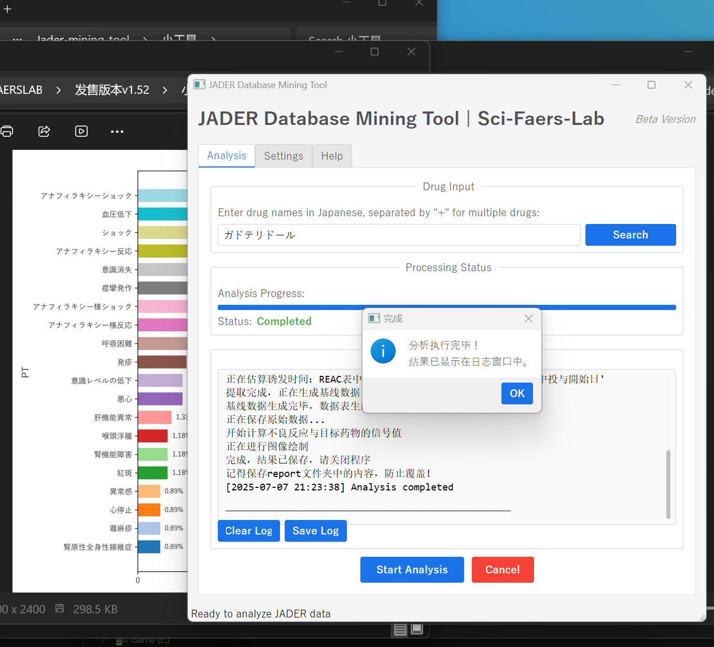  

  - 1. 点击Search，弹出日本上市药物数据库网站，复制药物名称
  - 2. 粘贴到输入框中，点击Start Analysis按钮即可
  - 3. 导出报告在该插件的同目录的Report文件夹中


- 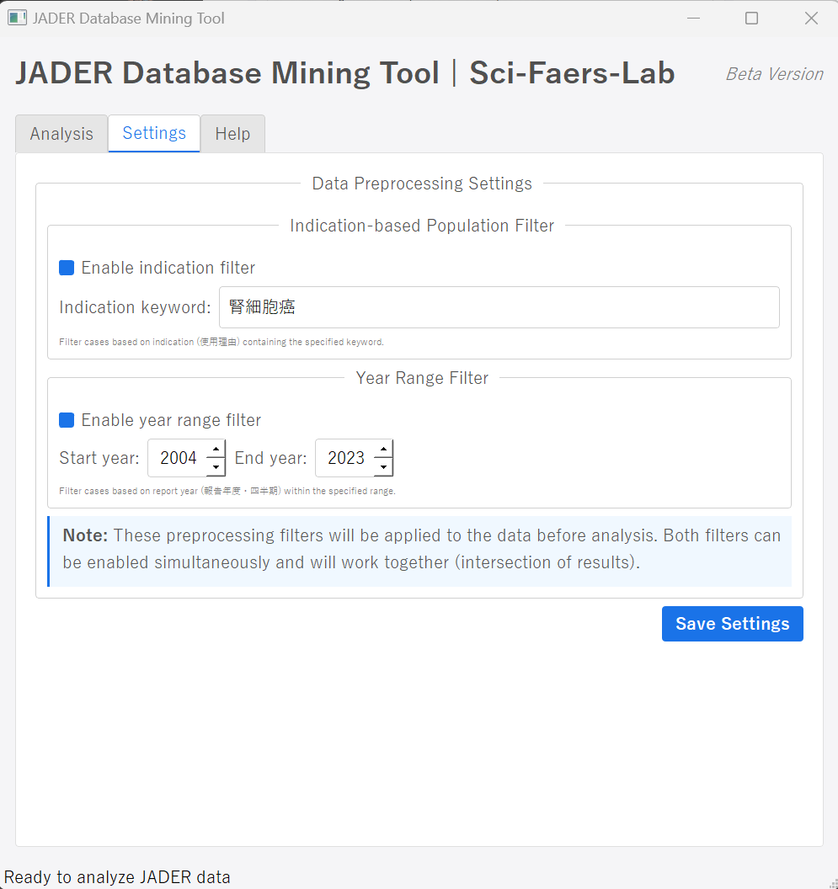

  - **预处理功能**：可以限定在适应症下做挖掘、也可以设置纳入的报告年份，(点击Save后生效)


#### 导出报告包括：
- 1. 目标药物的原始数据x4
- 2. 基线数据统计表x13
- 3. 重要图像x12
- 4. 不良反应信号值计算结果x2  

    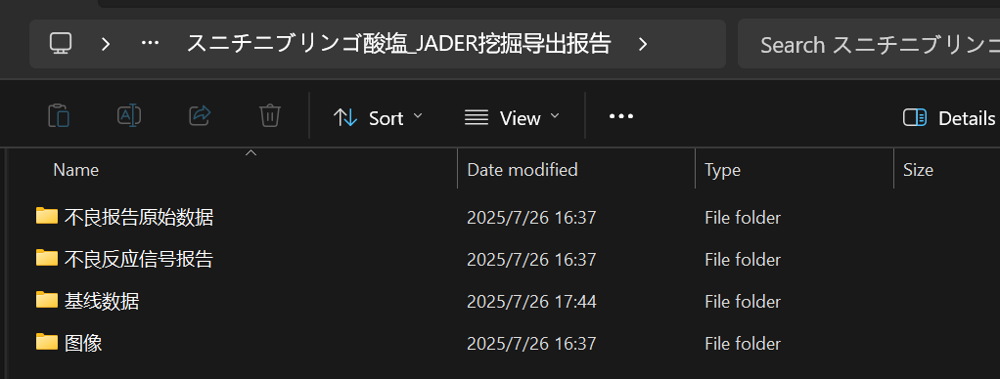

标准导出报告可在**导出数据示例文件夹**中下载查看

#### Jader亚组分析插件：

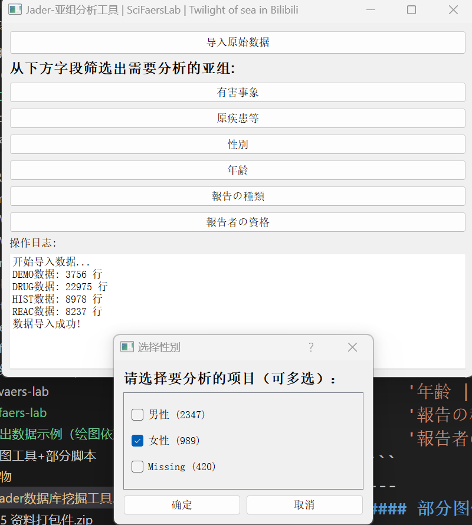

```python
可以针对如下亚组进行划分和分析：
    '有害事象 | 不良事件(PT)': 'REAC',
    '原疾患等 | 患者过往病史': 'HIST', 
    '性別 | 性别': 'DEMO',
    '年齢 | 年龄': 'DEMO',
    '報告の種類 | 报告的种类': 'DEMO',
    '報告者の資格 | 报告者资格': 'DEMO'
```
- 数据导出：
  - 基线数据
  - 图像
  - 该亚组的原始数据报告
---
#### 部分图像导出  


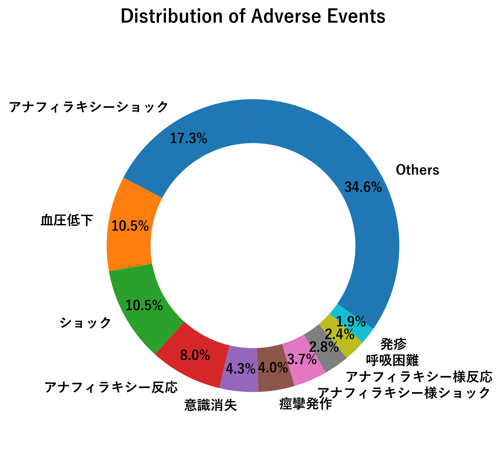
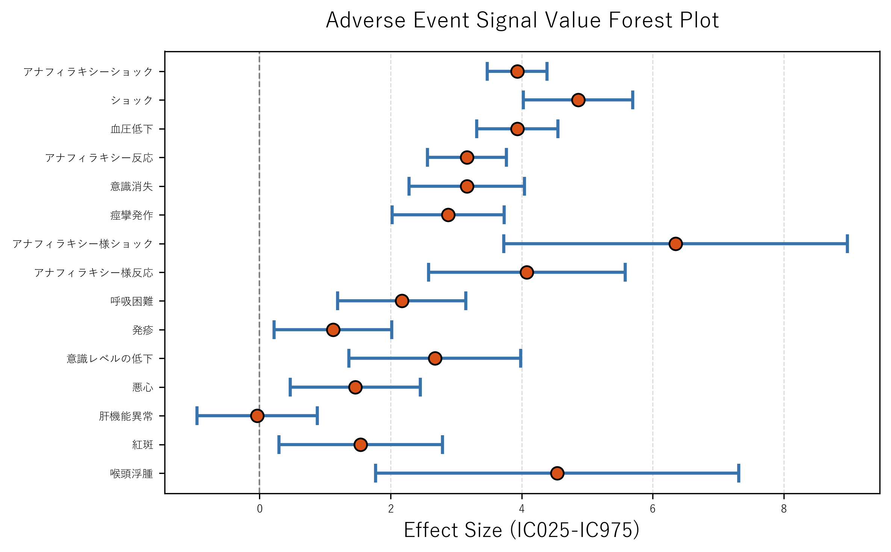
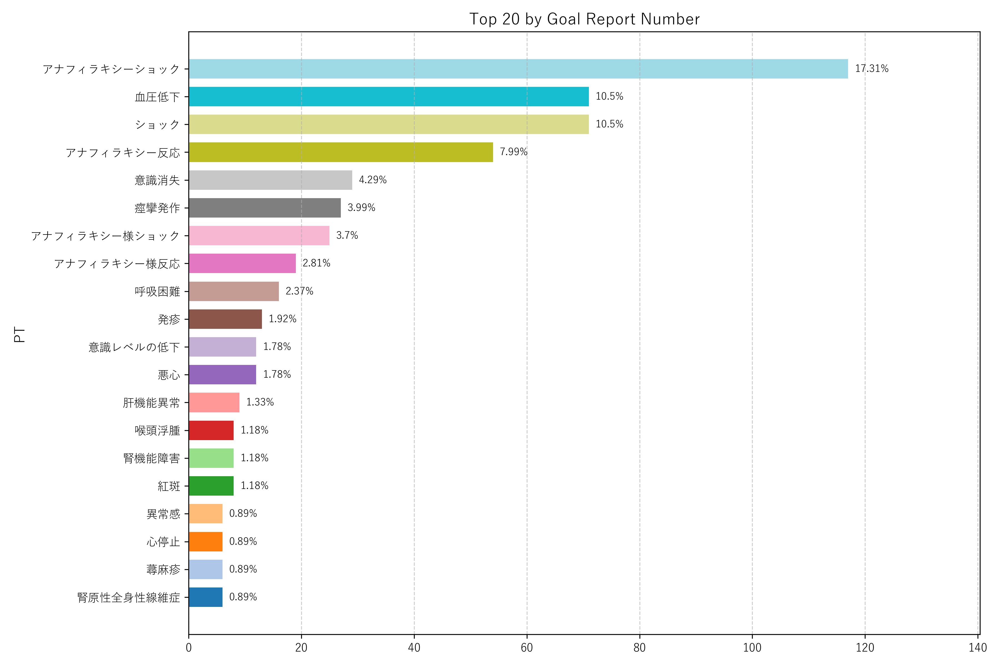
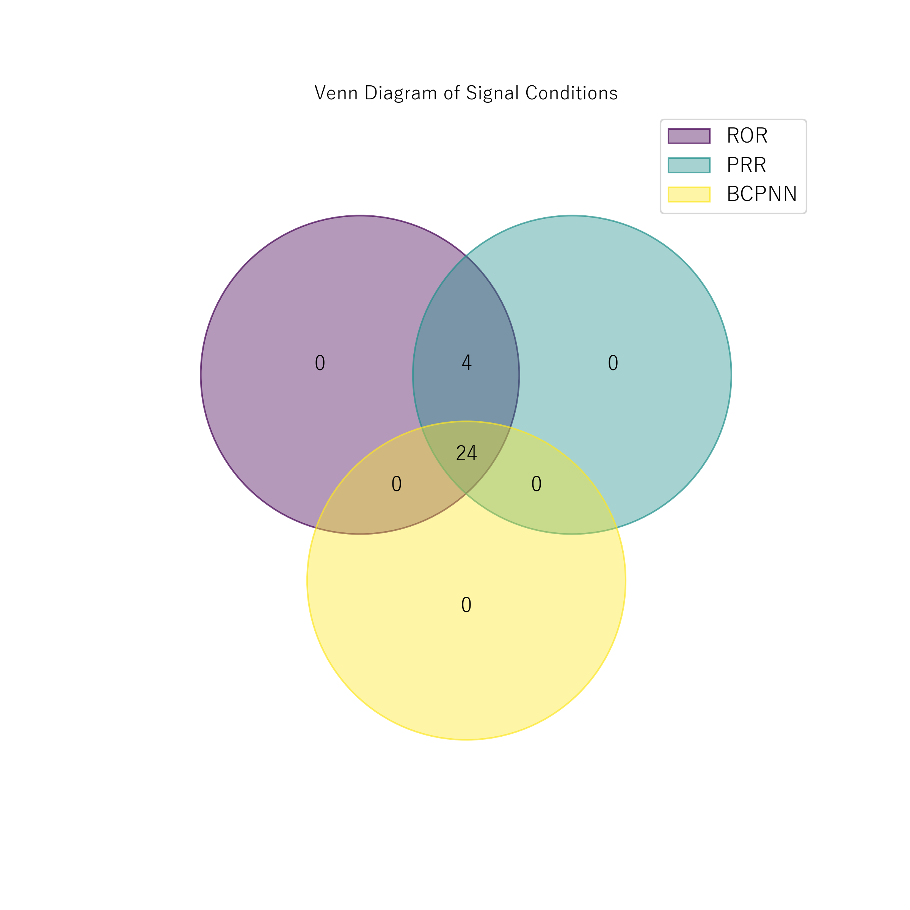
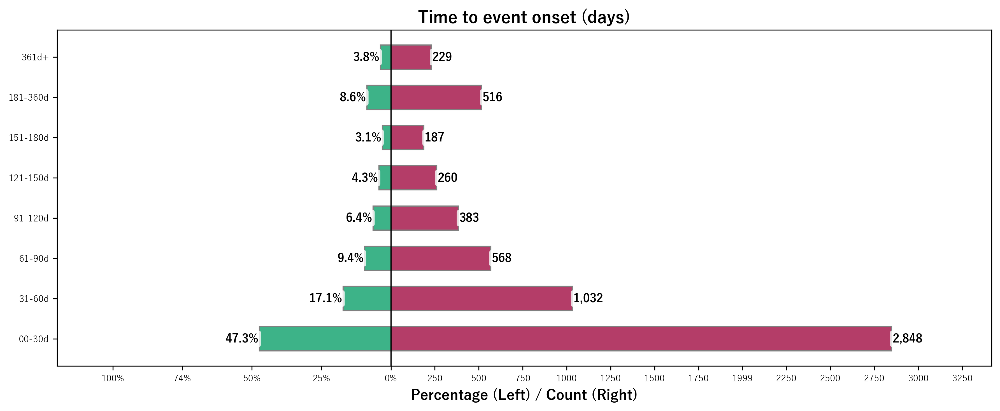
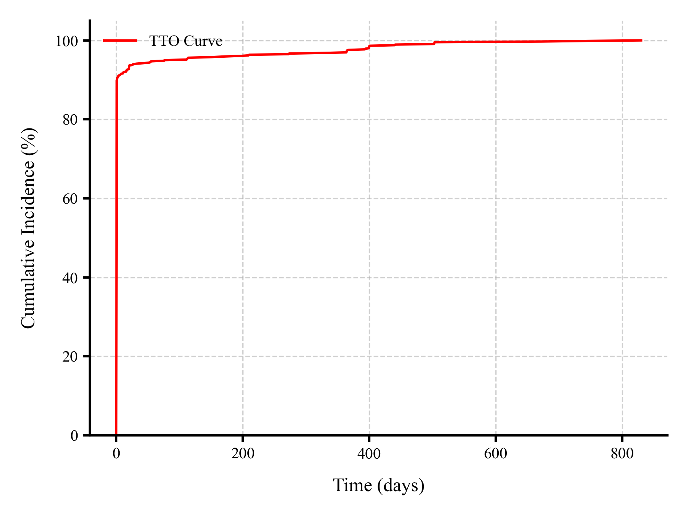
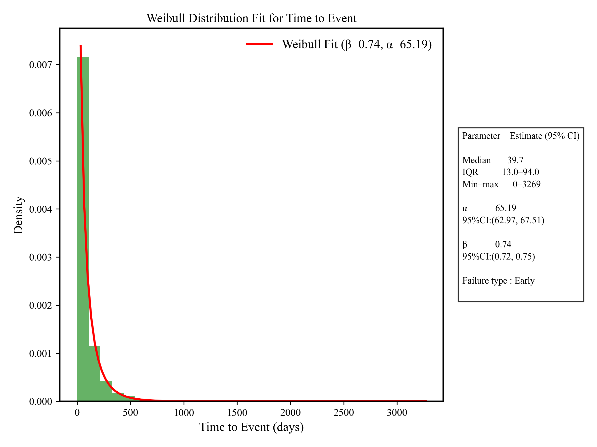