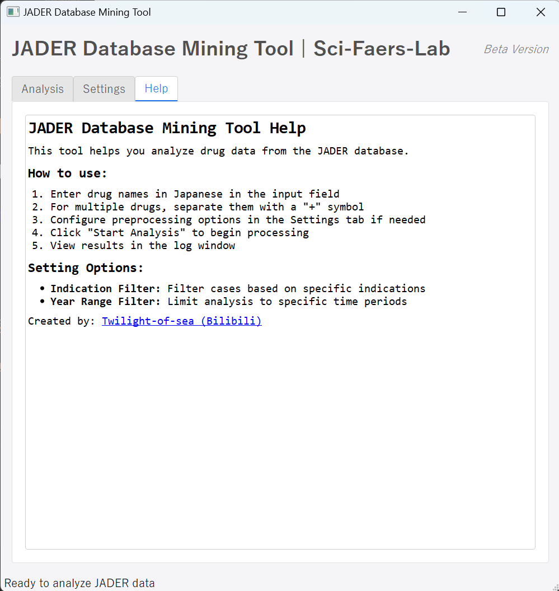

- [数据库结构、挖掘工具使用演示视频](https://www.bilibili.com/video/BV1C732z2ECR/)
---
### 定位
- Jader是日本厚生劳动省（PMDA）的药物-不良反应报告数据库，相较于FDA的FAERS数据库，数据量和大小仅5%不到。常配合FAERS数据库进行结论验证、联合使用，不建议单独用这个数据库来做。
- 
- 作为SciFaersLab的免费插件使用，现最新1.52版本请参考上边视频和邮箱的推送安装 
- 导出数据包括：目标药物的原始数据库、基线数据统计表、重要图像和不良反应信号值计算结果四个部分

---
- 部分图像导出

