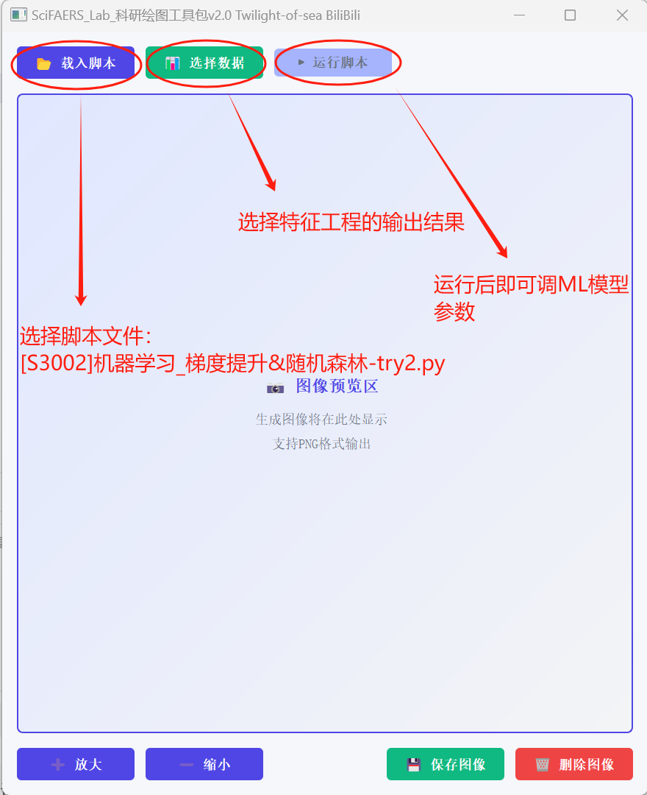

## 更新内容：
1. 数据库更新至25q1，从04q1开始，累积85个季度

2. 信号监测系统：
    a. UI界面美化，右上角切换白天黑夜模式，更符合现代审美
    b. 每次运行自动会导出男女老少四个亚组的不良反应事件AE分布表，懒人福音

3. 亚组分析工具（小数据）：
    a. 增加了一个导出的信息：分出来的这个亚组中，一共有多少个报告？N = x

4. 信息统计工具：
    a. 增加了导出报告的不良事件分布的详细程度，并将其移动到了第一个工作表来显示

5. 绘图工具包：
    a. UI美化，增加了放大缩小按键
    b. 修复了几个BUG
    c. 整合了多种机器学习框架

5. 新增配套资料：
    a. 9000种药物发文情况统计，药物信息来自于美国IMS统计的市场规模信息，发文情况来自于美国NCBI的Pubmed数据库，可以看自己的目标药物，有哪些文章提到过，把筛选条件设置为0，可以用来看哪些药物没有人发表过文章，还添加了药理信息和特定人群用药信息，可以辅助选题。
    b. 新增SMQ的PT对映表：文件名：SMQ_pt.xlsx，如果想要关注某个SMQ中反应情况，可以用我们的亚组分析工具（小数据）来分割，都整理成+号连接的PT了，方便大家复制粘贴
    c. NCBI数据：FAERS相关绝大部分文章的发文信息：PMID\Title\Author\Abstract\Journal\Date等，想查询对标的文章，直接根据Abstrct和PMID去搜索就可以

6. 重磅更新-机器学习测试版：
    大家会发现目录中多了一个"特征工程_beta.exe"，这个软件在运行时除了比例失衡四格表abcd外，还会从数据库中抽提更多数据特征以用于后续的机器学习，可能需要较长的运行时间。
    在Report文件夹中，有一个氟西汀的特征提取报告，可以用脚本文件夹中的[S3002]机器学习_梯度提升向量机&随机森林-try2.py来试用。注意运行时候的Gold Strand默认是氟西汀的官方说明书中的不良反应的PT。注意看生成的图片以及窗口中显示的算法性能绩效。同理，如果要对自己的目标药物执行机器学习的话，需要得到自己目标药物的标准说明书中不良反应的PT，并将其填入对话框中，替换氟西汀的原有内容。
    

7. 新增对比脚本：
    a. 多药信号对比：热力、泡泡矩阵、堆积图、平行图、雷达图等等，教程网址：范文拆解/多药信号图绘制教程.md · Twilight_of_sea/SciFaersLab - 码云 - 开源中国
    b. 多亚组/多药的AE累积发生率曲线绘制，方法和上边的一样，不过复制的是DRUG_GOAL.csv

8. 部分老版本删除过的脚本回归：
    a. [1005]信号值（PT）-频数Top15-森林图-ror-type1.py
    b. [1012]信号值（PT）-频数Top15-森林图-bcpnn-type2.py
    c. [1003]信号值（PT）-频数Top15-森林图-bcpnn-type1.py

