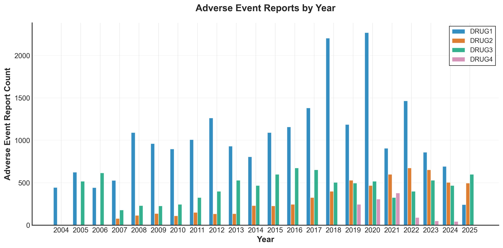
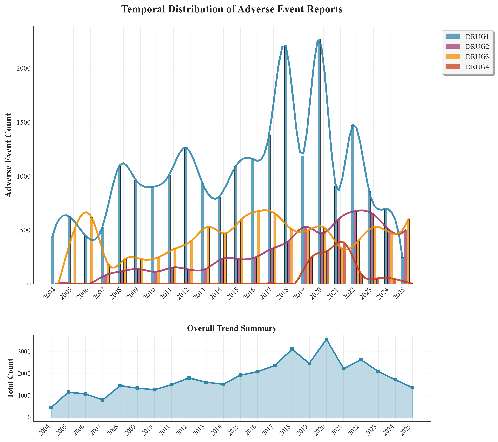
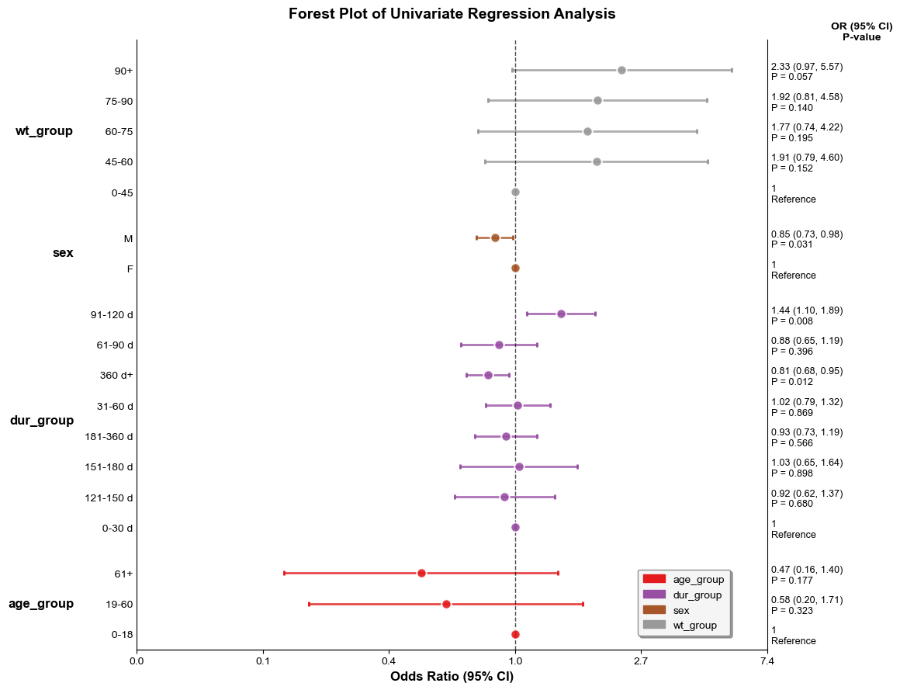
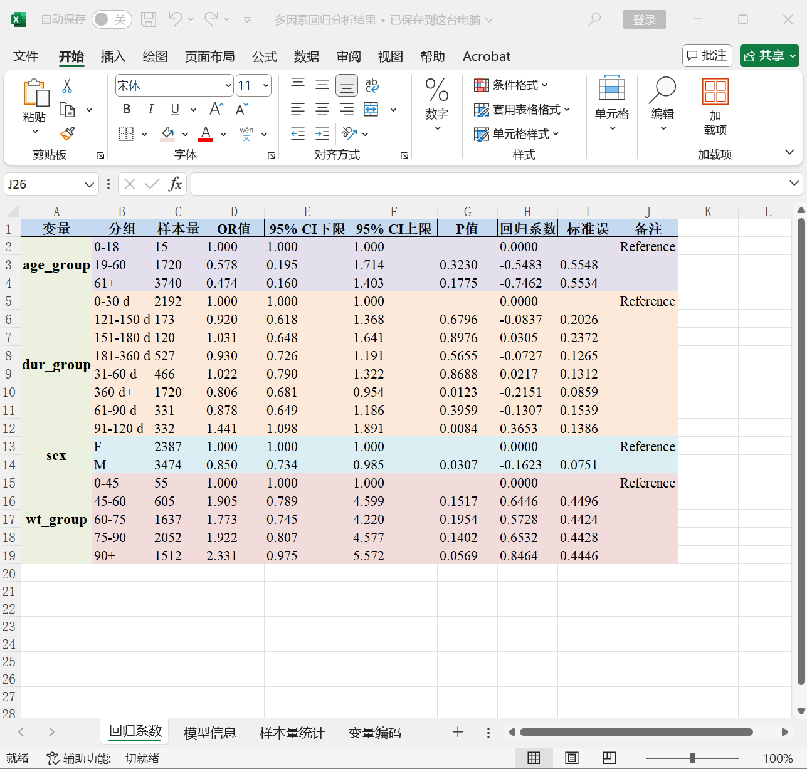

## 1.52增补更新内容：
1. 优化筛选药物联用方法的筛选语句逻辑，请详见Gitee的说明文档
示例: 阿司匹林与氯吡格雷联用
药物信息:
阿司匹林: Aspirin, NORGESIC
氯吡格雷: Clopidogrel, PLAVIX, CLOPIDOGREL BISULFATE
分析语句(如果用到&、#的筛选公式时，必须用英文小括号隔开每种药物，不然会报错):
单独使用: (Aspirin+NORGESIC)#(Clopidogrel+PLAVIX+CLOPIDOGREL BISULFATE)
联合使用: (Aspirin+NORGESIC)&(Clopidogrel+PLAVIX+CLOPIDOGREL BISULFATE)
2. 更新了一些脚本：用于一些场景下的多因素逻辑回归，多药对比报告频数条形图等等

