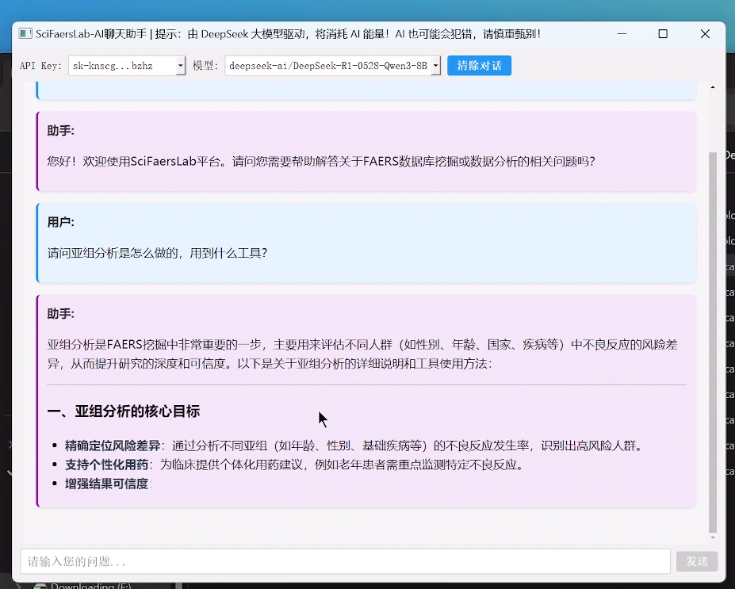
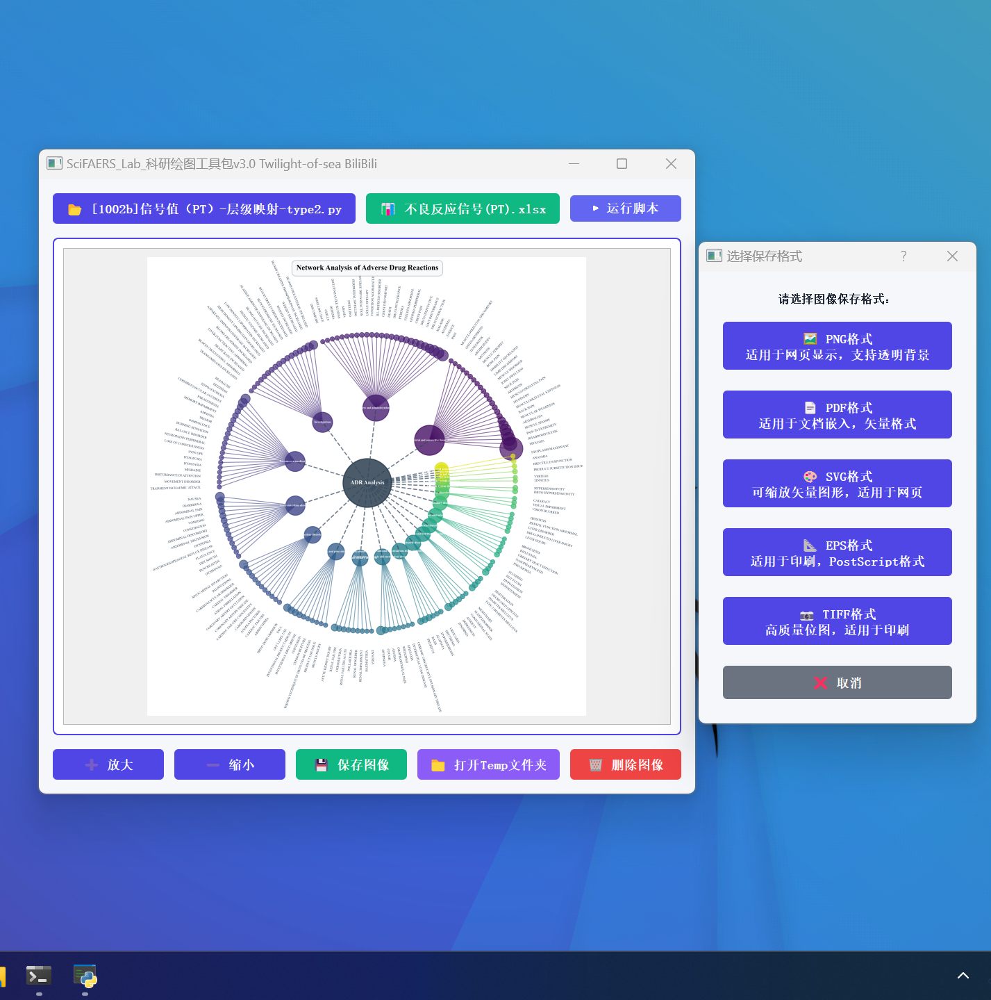
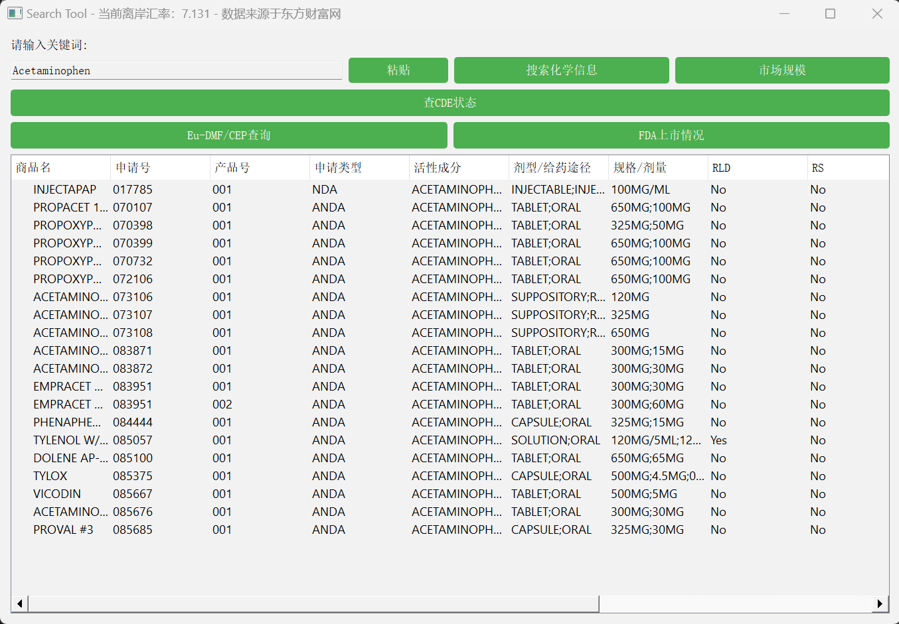
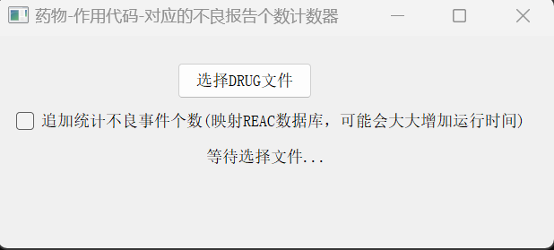

## SciFaersLab整合包 V1.54 版本更新日志

**项目地址：**
- Gitee: https://gitee.com/Twilight-of-sea/sci-faers-lab
- Github: https://github.com/TwilightOfSea/Sci-Faers-Lab-Clone

---

### 一、新增功能：DeepSeek AI助手集成

- 全新接入FAERS数据库挖掘专业AI助手，提供免费、智能的咨询服务。该助手支持多个主流大语言模型，包括DeepSeek、通义千问、清华智谱AI和书生蒲语。
- 用户可就数据挖掘方法论、平台软件操作指南以及学术写作策略等问题进行咨询。

### 二、绘图工具包升级至3.0版本

**核心改进：**
- 图像保存功能全面升级，原生支持5种主流格式：PDF、PNG、TIFF、EPS、SVG，满足不同场景需求
- 新增Temp文件夹快速访问功能，优化用户操作体验

### 三、绘图脚本库扩充与优化

**脚本数量：** 扩展至119个专业绘图脚本

**新增脚本类型：**
- SOC层级频数统计漏斗图及层级映射
- 多算法韦恩分布图
- 朴素森林图
- 频数-信号值蝴蝶图
- IC瀑布图
- 联合森林图
- 信号交联网络图
- 多药信号值纵向热力图

**编号系统优化：** 采用字母后缀区分同类型不同风格的脚本
- 原编号方式：[1001]-性别饼图-type1、[1002]-性别饼图-type2
- 新编号方式：[1001a]-性别饼图-type1、[1001b]-性别饼图-type2

**稳定性提升：** 修复多个脚本运行异常问题

### 四、药学辅助查询工具集成

构建一站式药学信息查询平台，涵盖：
- **化学信息库：** CAS号与中英文化学物质名称对照数据库
- **市场分析：** 全球药物市场销量统计
- **国内监管：** CDE API注册登记状态查询
- **欧盟合规：** Eu-DMF欧盟API注册信息检索
- **美国市场：** FDA药物上市情况追踪

### 五、小工具功能增强

**药物-作用代码-不良报告计数器更新：**
- 新增统计选项：涉及报告的不良事件计数功能
 **性能提示：** 该功能需映射REAC数据库，处理时间较长，建议根据实际需求谨慎启用

### 六、情报数据更新
#### FAERS 数据库情报
- 药物样本量统计：更新 9000 种药物在 FAERS 数据库中的样本量-发文数量对应表，便于查看目标药物的发表情况、药理信息、说明书不良反应及特定人群用药信息，为选题提供参考依据

- 文献收录：更新 NCBI 数据库中所有 FAERS 相关论文的收录情况

### 历史更新日志：
- [v1.53版本更新日志.md](https://gitee.com/Twilight-of-sea/sci-faers-lab/blob/master/%E6%97%A7%E7%89%A9/v1.53%E7%89%88%E6%9C%AC%E6%9B%B4%E6%96%B0%E6%97%A5%E5%BF%97.md)
- [v1.52版本更新日志.md](https://gitee.com/Twilight-of-sea/sci-faers-lab/blob/master/%E6%97%A7%E7%89%A9/v1.52%E7%89%88%E6%9C%AC%E6%9B%B4%E6%96%B0%E6%97%A5%E5%BF%97.md)
- [v1.51版本更新日志.md](https://gitee.com/Twilight-of-sea/sci-faers-lab/blob/master/%E6%97%A7%E7%89%A9/v1.51%E7%89%88%E6%9C%AC%E6%9B%B4%E6%96%B0%E6%97%A5%E5%BF%97.md)
- [v1.50版本更新日志.md](https://gitee.com/Twilight-of-sea/sci-faers-lab/blob/master/%E6%97%A7%E7%89%A9/v1.50%E7%89%88%E6%9C%AC%E6%9B%B4%E6%96%B0%E6%97%A5%E5%BF%97.md)
- [v1.4版本更新日志.md](https://gitee.com/Twilight-of-sea/sci-faers-lab/blob/master/%E6%97%A7%E7%89%A9/v1.4%E7%89%88%E6%9C%AC.md)

---

*更新日期：2025年9月*