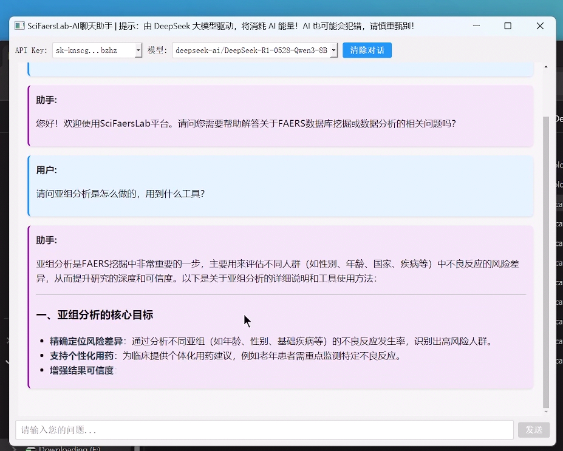

## SciFaersLab整合包 V1.55 版本更新日志

**项目地址：**
- Gitee: https://gitee.com/Twilight-of-sea/sci-faers-lab
- Github: https://github.com/TwilightOfSea/Sci-Faers-Lab-Clone

---

### 一、数据库更新

#### FAERS 数据库
- 已更新至 2025Q3 版本
- 累积数据覆盖：2004Q1 至 2025Q3，共计 87 个季度

#### JADER 数据库
- 已更新至 2025年9月版本
- 更新可以自行从[JADER官网](https://www.pmda.go.jp/safety/info-services/drugs/adr-info/suspected-adr/0005.html)下载

### 二、信号监测系统优化
**转义符相关：**
- 若用户在输入框中误输入换行符，会提前检测报错并且中止运行
- 包含特殊符号的文件夹能正常生成，解决了一些极端情况

### 三、AI对话工具优化

**核心改进：**
- 解决了部分兼容性问题
- 优先采用阿里通义千问（Qwen），提高响应速度
- 提升训练内容丰富度，使其更加精确的回答平台相关问题

### 四、绘图脚本库扩充与优化

**脚本数量：** 扩展至135个专业绘图脚本

**新增或优化脚本：**
- 诱发时间曲线-小提琴图-改
- 共病分析-Spearman Test模型[多选Soc or PT]
- PT、SOC年龄段分布条形图
- 多药年度堆叠图
- 多药信号值对比热力图(纵向)
- 使用脚本-汇总多药信号值[ROR算法]
- 不良反应事件频数图
- 层级映射-type2
- 信号值-频数蝴蝶图

### 四、VAERS数据挖掘平台上线

构建一站式疫苗不良反应监测平台，项目地址：https://gitee.com/Twilight-of-sea/sci-vaers-lab

### 五、情报数据更新
#### FAERS 数据库情报
- 药物样本量统计：更新 9000 种药物在 FAERS 数据库中的样本量-发文数量对应表，便于查看目标药物的发表情况、药理信息、说明书不良反应及特定人群用药信息，为选题提供参考依据

- 文献收录：更新 NCBI 数据库中所有 FAERS 相关论文的收录情况

### 历史更新日志：
- [v1.54版本更新日志.md](https://gitee.com/Twilight-of-sea/sci-faers-lab/blob/master/%E6%97%A7%E7%89%A9/v1.54%E7%89%88%E6%9C%AC%E6%9B%B4%E6%96%B0%E6%97%A5%E5%BF%97.md)

- [v1.53版本更新日志.md](https://gitee.com/Twilight-of-sea/sci-faers-lab/blob/master/%E6%97%A7%E7%89%A9/v1.53%E7%89%88%E6%9C%AC%E6%9B%B4%E6%96%B0%E6%97%A5%E5%BF%97.md)
- [v1.52版本更新日志.md](https://gitee.com/Twilight-of-sea/sci-faers-lab/blob/master/%E6%97%A7%E7%89%A9/v1.52%E7%89%88%E6%9C%AC%E6%9B%B4%E6%96%B0%E6%97%A5%E5%BF%97.md)
- [v1.51版本更新日志.md](https://gitee.com/Twilight-of-sea/sci-faers-lab/blob/master/%E6%97%A7%E7%89%A9/v1.51%E7%89%88%E6%9C%AC%E6%9B%B4%E6%96%B0%E6%97%A5%E5%BF%97.md)
- [v1.50版本更新日志.md](https://gitee.com/Twilight-of-sea/sci-faers-lab/blob/master/%E6%97%A7%E7%89%A9/v1.50%E7%89%88%E6%9C%AC%E6%9B%B4%E6%96%B0%E6%97%A5%E5%BF%97.md)
- [v1.4版本更新日志.md](https://gitee.com/Twilight-of-sea/sci-faers-lab/blob/master/%E6%97%A7%E7%89%A9/v1.4%E7%89%88%E6%9C%AC.md)

---

*更新日期：2025年11月*