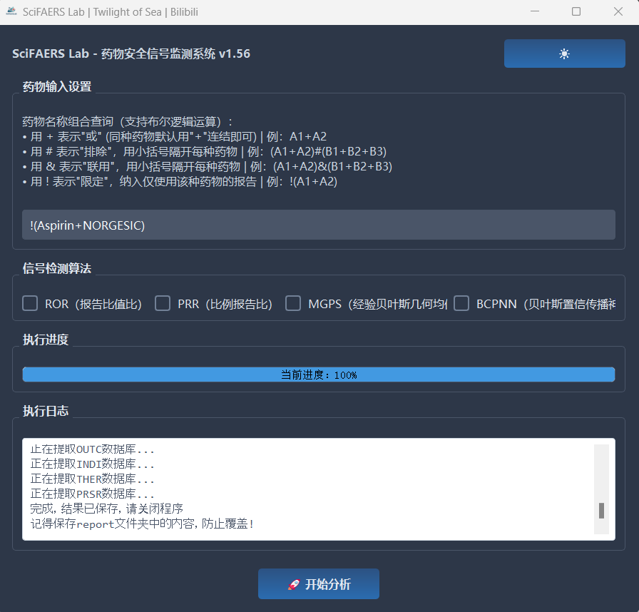
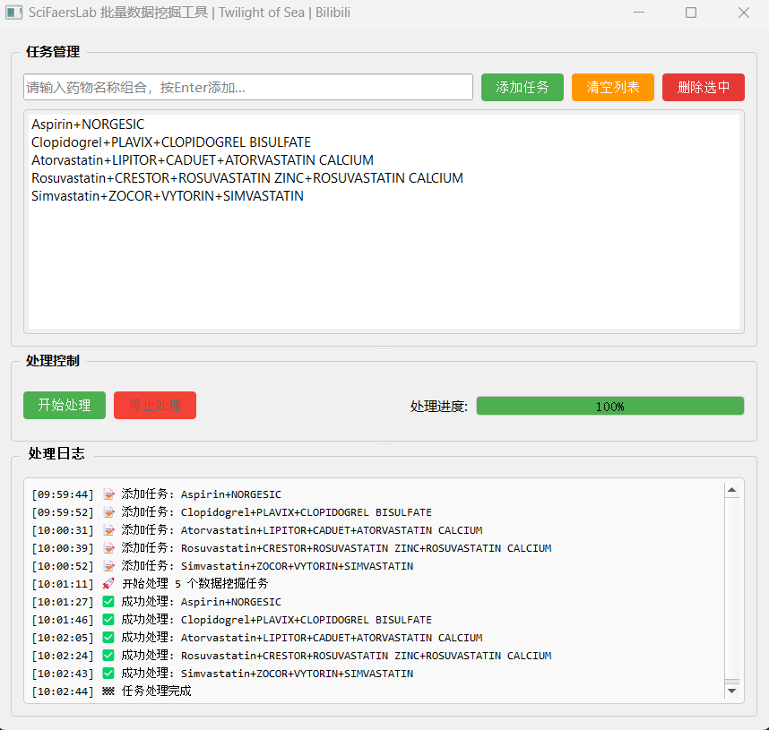
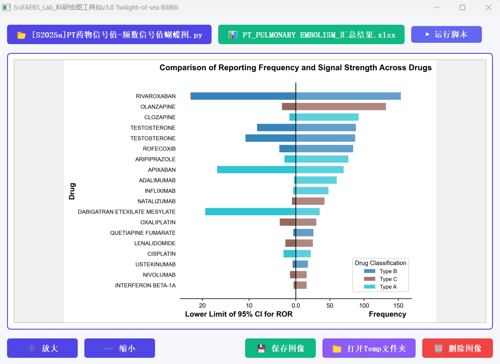
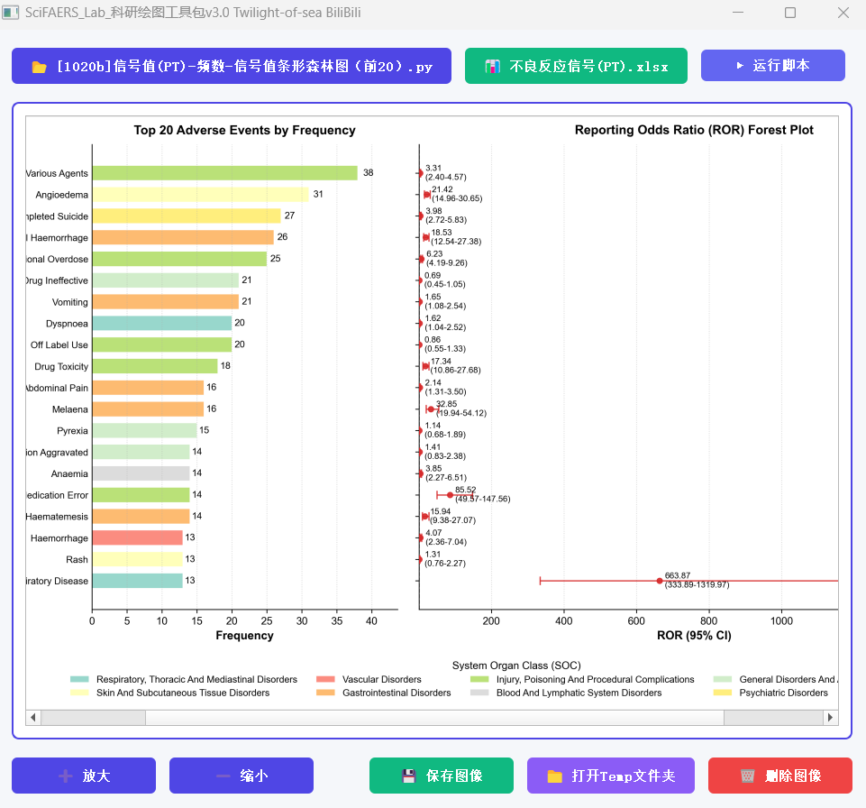
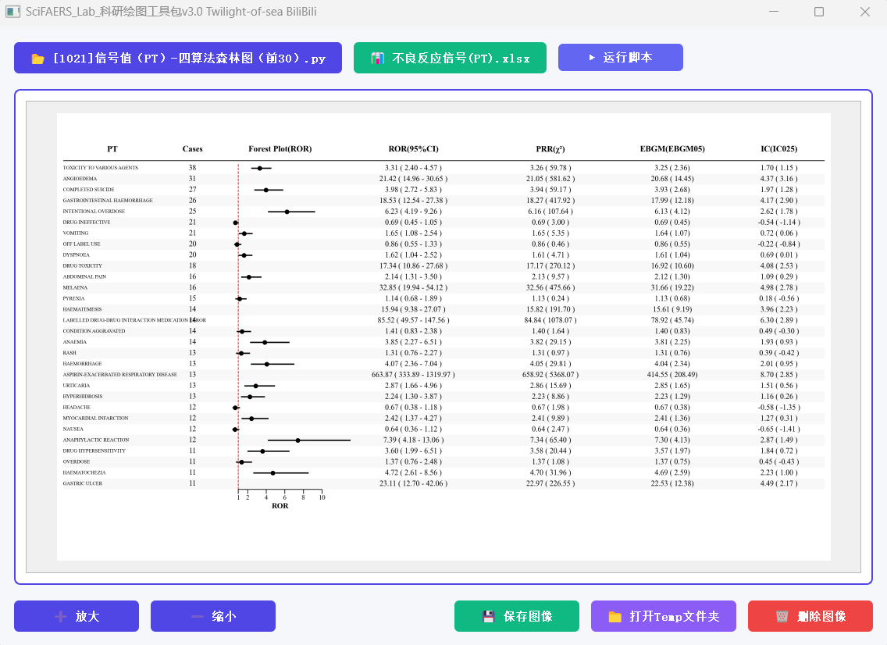
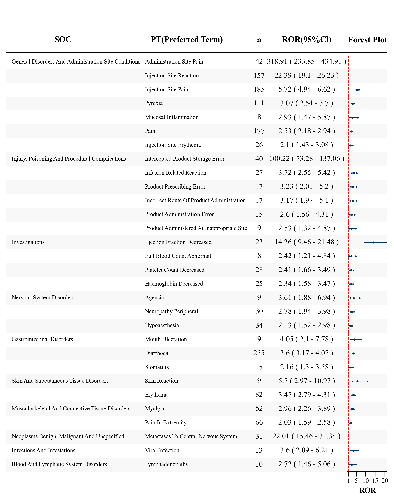

## SciFaersLab整合包 V1.56 版本更新日志

**项目地址：**
- Gitee: https://gitee.com/Twilight-of-sea/sci-faers-lab
- Github: https://github.com/TwilightOfSea/Sci-Faers-Lab-Clone

---

### 一、数据库覆盖范围

#### FAERS 数据库
- 2004Q1 至 2025Q3，共计 87 个季度

#### JADER 数据库
- 已更新至 [2025年11月版本](https://www.pmda.go.jp/safety/info-services/drugs/adr-info/suspected-adr/0005.html)

### 二、信号监测系统v1.56

#### 新增报告筛选运算符："!"

| 符号语法                  | 含义                          |
|---------------------------|-------------------------------|
| ()&()                     | 两种药物联用                  |
| ()&()&()...               | 两种或多种药物联用            |
| ()#()                     | 某种药物单独使用，排除另一种药物 |
| ()#()#()...               | 某种药物单独使用，排除另几种药物 |
| ()&()#()#()...            | 两种药物联合使用，同时排除另几种药物 |
| !()                       | 只使用括号中的药物，不用任何其他药物 |

**逻辑运算符适用于信号监测系统和亚组分析工具(小数据)**

- 阿司匹林常和氯吡格雷联用
  - 单独使用分析：(Aspirin+NORGESIC)#(Clopidogrel+PLAVIX+CLOPIDOGREL BISULFATE)
  - 联合使用分析：(Aspirin+NORGESIC)&(Clopidogrel+PLAVIX+CLOPIDOGREL BISULFATE)
  - 纳入仅使用阿司匹林的报告：!(Aspirin+NORGESIC)

#### 性能优化
- 进一步优化存储结构和运算逻辑，降低峰值内存占用  

### 三、信号监测系统-批量挖掘工具

**核心功能：**
- 支持多数据挖掘任务一次性提交，实现无人值守自动化运行
- 新增特定 PT 信号值提取脚本，优化某种不良反应与不同药物关联分析类课题的操作体验

### 四、绘图脚本库扩充与优化

**脚本数量：** 扩展至150个专业绘图脚本

**新增或优化脚本：**
- 信号值（PT）-条形图&森林图
- 信号值（PT）-四算法森林图
- 信号值（PT）-自选30PT-森林图-ror-复杂版
- 提取特定PT的多药信号值，**旨在反映药物之间信号差异**（[操作教程](https://gitee.com/Twilight-of-sea/sci-faers-lab/tree/master/%E7%89%B9%E6%AE%8A%E5%9B%BE%E5%83%8F%E7%BB%98%E5%88%B6%E6%95%99%E7%A8%8B)）
  - PT药物信号值-四算法森林图
  - PT药物信号值-频数条形图
  - PT药物信号值-频数&信号值森林图
  - PT药物信号值-频数信号值蝴蝶图
  - PT药物信号值-ROR\BCPNN森林图

### 五、小工具：parquet转CSV
- 新增批量转换功能，支持多份 Parquet 文件同时转换，告别单一文件逐一处理的低效模式；
- 适配亚组分析工具（大数据场景）导出并去重工具处理后的 parquet 格式数据，可批量将其转换为 CSV 格式，确保能被信息统计工具直接读取，支撑基线数据的生成与后续分析。

### 六、VAERS数据挖掘平台上线

构建一站式疫苗不良反应监测平台，项目地址：https://gitee.com/Twilight-of-sea/sci-vaers-lab

### 七、情报数据更新
#### FAERS 数据库情报
- 药物样本量统计：更新 9000 种药物在 FAERS 数据库中的样本量-发文数量对应表，便于查看目标药物的发表情况、药理信息、说明书不良反应及特定人群用药信息，为选题提供参考依据

- 文献收录：更新 NCBI 数据库中所有 FAERS 相关论文的收录情况

### 历史更新日志：
- [v1.55版本更新日志.md](https://gitee.com/Twilight-of-sea/sci-faers-lab/blob/master/%E6%97%A7%E7%89%A9/v1.55%E7%89%88%E6%9C%AC%E6%9B%B4%E6%96%B0%E6%97%A5%E5%BF%97.md)
- [v1.54版本更新日志.md](https://gitee.com/Twilight-of-sea/sci-faers-lab/blob/master/%E6%97%A7%E7%89%A9/v1.54%E7%89%88%E6%9C%AC%E6%9B%B4%E6%96%B0%E6%97%A5%E5%BF%97.md)
- [v1.53版本更新日志.md](https://gitee.com/Twilight-of-sea/sci-faers-lab/blob/master/%E6%97%A7%E7%89%A9/v1.53%E7%89%88%E6%9C%AC%E6%9B%B4%E6%96%B0%E6%97%A5%E5%BF%97.md)
- [v1.52版本更新日志.md](https://gitee.com/Twilight-of-sea/sci-faers-lab/blob/master/%E6%97%A7%E7%89%A9/v1.52%E7%89%88%E6%9C%AC%E6%9B%B4%E6%96%B0%E6%97%A5%E5%BF%97.md)
- [v1.51版本更新日志.md](https://gitee.com/Twilight-of-sea/sci-faers-lab/blob/master/%E6%97%A7%E7%89%A9/v1.51%E7%89%88%E6%9C%AC%E6%9B%B4%E6%96%B0%E6%97%A5%E5%BF%97.md)
- [v1.50版本更新日志.md](https://gitee.com/Twilight-of-sea/sci-faers-lab/blob/master/%E6%97%A7%E7%89%A9/v1.50%E7%89%88%E6%9C%AC%E6%9B%B4%E6%96%B0%E6%97%A5%E5%BF%97.md)
- [v1.4版本更新日志.md](https://gitee.com/Twilight-of-sea/sci-faers-lab/blob/master/%E6%97%A7%E7%89%A9/v1.4%E7%89%88%E6%9C%AC.md)

---

*更新日期：2025年12月*