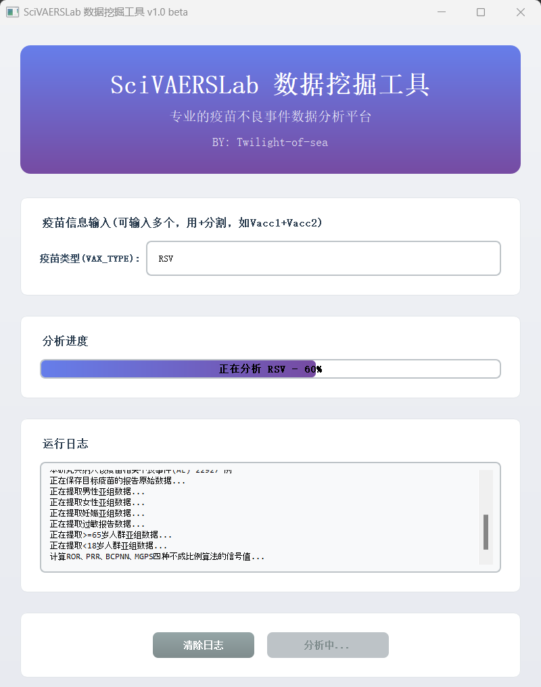

## SciFaersLab整合包 V1.57 版本更新日志

**项目地址：**
- Gitee: https://gitee.com/Twilight-of-sea/sci-faers-lab
- Github: https://github.com/TwilightOfSea/Sci-Faers-Lab-Clone

---

### 一、数据库更新

#### FAERS 数据库
- 已更新至 2025Q4 版本
- 累积数据覆盖：2004Q1 至 2025Q4，共计 88 个季度

#### JADER 数据库
- 已更新至 202601版本
- 下载链接：[JADER官网](https://www.pmda.go.jp/safety/info-services/drugs/adr-info/suspected-adr/0005.html)

#### CVARD 数据库
- 已更新至最新版本：The data set is updated on a monthly basis and currently covers the following time period: 1965 to 2025-09-30.
- 下载链接：[Government of Canada](https://www.canada.ca/en/health-canada/services/drugs-health-products/medeffect-canada/adverse-reaction-database/medeffect-canada-caveat-privacy-statement-interpretation-data-search-canada-vigilance-adverse-reaction-online-database.html)

### 二、新增插件：加拿大CVARD数据库挖掘工具
**说明文档：**
- [Gitee-SciFaersLab-CVARD插件](https://gitee.com/Twilight-of-sea/sci-faers-lab/blob/master/%E6%97%A7%E7%89%A9/CVARD%E5%8A%A0%E6%8B%BF%E5%A4%A7%E6%95%B0%E6%8D%AE%E5%BA%93%E6%8C%96%E6%8E%98%E5%B7%A5%E5%85%B7.md)  

**核心功能：**
- 原始数据导出、信号值计算以及基线数据生成
- 支持数据预处理，限定数据库挖掘的范围
- 支持亚组分析，特定人群不良反应发生情况
- 涵盖110+绘图脚本，兼容大部分用于FAERS数据库的绘图模板

  

### 三、新增插件：药物相互作用(DDI)计算器
**说明文档：**
- [Gitee-SciFaersLab-DDI计算器](https://gitee.com/Twilight-of-sea/sci-faers-lab/blob/master/%E6%97%A7%E7%89%A9/DDI%E8%8D%AF%E7%89%A9%E7%9B%B8%E4%BA%92%E4%BD%9C%E7%94%A8%E8%AE%A1%E7%AE%97%E8%AF%B4%E6%98%8E%E6%96%87%E6%A1%A3.md)  

**核心功能：**
- 支持批量添加任务和执行任务
- 支持设定多个PT为目标变量，用'+'连接
- 自动导出原始数据及DDI计算结果

### 四、信号监测系统优化
- 更新至1.57版本，进一步提升了运行时的稳定性

### 五、绘图脚本库扩充与优化

**脚本数量：** 扩展至164个专业绘图脚本

**新增或优化脚本：**
- P2001-P2006逻辑回归分析绘图脚本
- [2003]DEMO_GOAL-报告时间频数折线图（年）
- [1080]Bonferroni校正P值计算
- [P1034]多亚组年龄对比柱状图
- [P1035]多亚组性别对比柱状图
- CVARD系列共7个专用脚本

### 六、VAERS数据挖掘平台上线

构建一站式疫苗不良反应监测平台，项目地址：https://gitee.com/Twilight-of-sea/sci-vaers-lab

### 七、情报数据更新
#### FAERS 数据库情报
- 药物样本量统计：更新 9000 种药物在 FAERS 数据库中的样本量-发文数量对应表，便于查看目标药物的发表情况、药理信息、说明书不良反应及特定人群用药信息，为选题提供参考依据

- 文献收录：更新 NCBI 数据库中所有 FAERS 相关论文的收录情况

### 历史更新日志：
- [v1.56版本更新日志.md](https://gitee.com/Twilight-of-sea/sci-faers-lab/blob/master/%E6%97%A7%E7%89%A9/v1.56%E7%89%88%E6%9C%AC%E6%9B%B4%E6%96%B0%E6%97%A5%E5%BF%97.md)
- [v1.55版本更新日志.md](https://gitee.com/Twilight-of-sea/sci-faers-lab/blob/master/%E6%97%A7%E7%89%A9/v1.55%E7%89%88%E6%9C%AC%E6%9B%B4%E6%96%B0%E6%97%A5%E5%BF%97.md)
- [v1.54版本更新日志.md](https://gitee.com/Twilight-of-sea/sci-faers-lab/blob/master/%E6%97%A7%E7%89%A9/v1.54%E7%89%88%E6%9C%AC%E6%9B%B4%E6%96%B0%E6%97%A5%E5%BF%97.md)

- [v1.53版本更新日志.md](https://gitee.com/Twilight-of-sea/sci-faers-lab/blob/master/%E6%97%A7%E7%89%A9/v1.53%E7%89%88%E6%9C%AC%E6%9B%B4%E6%96%B0%E6%97%A5%E5%BF%97.md)
- [v1.52版本更新日志.md](https://gitee.com/Twilight-of-sea/sci-faers-lab/blob/master/%E6%97%A7%E7%89%A9/v1.52%E7%89%88%E6%9C%AC%E6%9B%B4%E6%96%B0%E6%97%A5%E5%BF%97.md)
- [v1.51版本更新日志.md](https://gitee.com/Twilight-of-sea/sci-faers-lab/blob/master/%E6%97%A7%E7%89%A9/v1.51%E7%89%88%E6%9C%AC%E6%9B%B4%E6%96%B0%E6%97%A5%E5%BF%97.md)
- [v1.50版本更新日志.md](https://gitee.com/Twilight-of-sea/sci-faers-lab/blob/master/%E6%97%A7%E7%89%A9/v1.50%E7%89%88%E6%9C%AC%E6%9B%B4%E6%96%B0%E6%97%A5%E5%BF%97.md)
- [v1.4版本更新日志.md](https://gitee.com/Twilight-of-sea/sci-faers-lab/blob/master/%E6%97%A7%E7%89%A9/v1.4%E7%89%88%E6%9C%AC.md)

---

*更新日期：2026年2月*