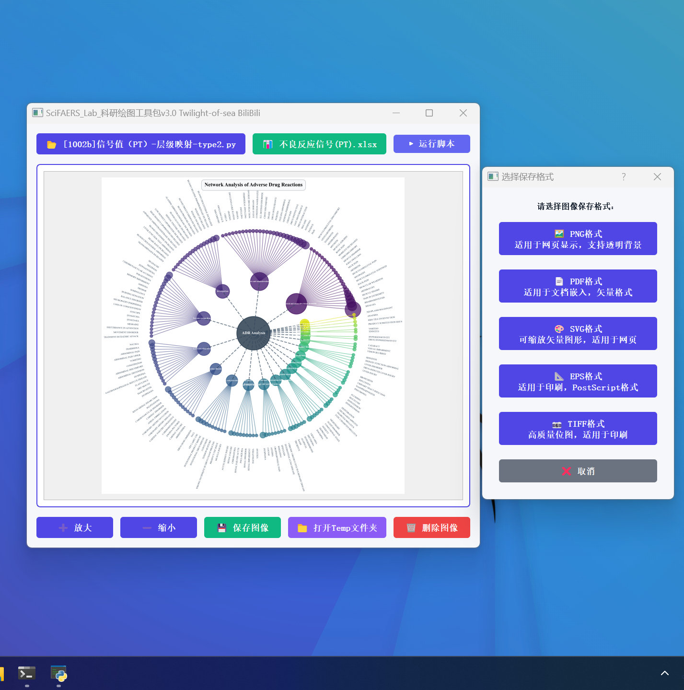
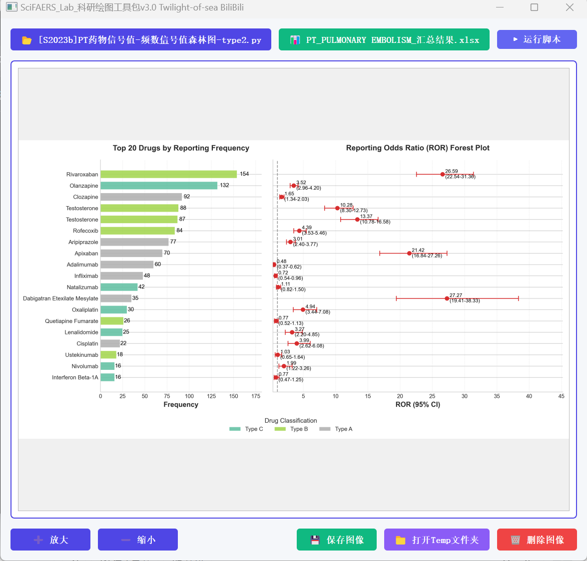
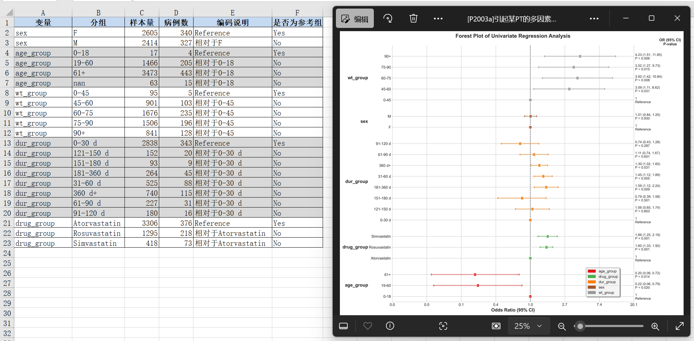

1. JADER挖掘插件开始支持联用排除输入逻辑，三大数据库均支持同样的输入格式条件。三个版本的信号检测工具都优化好了，需要重新打包一下（已实现）
2. CVARD数据库信号检测工具性别亚组筛选bug修复
3. 数据库更新和情报更新

## SciFaersLab整合包 V1.59 版本更新日志

**项目地址：**
- Gitee: https://gitee.com/Twilight-of-sea/sci-faers-lab
- Github: https://github.com/TwilightOfSea/Sci-Faers-Lab-Clone

---

### 一、数据库更新

#### FAERS 数据库
- 已更新至 2026Q2 版本
- 累积数据覆盖：2004Q1 至 2026Q2，共计 90 个季度

#### JADER 数据库
- 已更新至 202607版本
- 下载链接：[JADER官网](https://www.pmda.go.jp/safety/info-services/drugs/adr-info/suspected-adr/0005.html)

#### CVARD 数据库
- 已更新至最新版本：The data set is updated on a monthly basis and currently covers the following time period: 1965 to 2026-03-31.
- 下载链接：[Government of Canada](https://www.canada.ca/en/health-canada/services/drugs-health-products/medeffect-canada/adverse-reaction-database/medeffect-canada-caveat-privacy-statement-interpretation-data-search-canada-vigilance-adverse-reaction-online-database.html)

### 二、日本、加拿大、美国三个不良反应数据库的信号监测工具已同步支持复杂筛选条件：
- 用于联用药物分析/单独用药分析/敏感性分析（详见以下说明）
##### 1. 基本说明
- 运算符号说明：
  - "+" 表示"或"
  - "&" 表示"与" 
  - "#" 表示"非"
  - "!" 表示"限定"

- 分析方法：
  - 联用分析：使用"&"，如 A&B 表示分析A药物联用B药物的情况
  - 单独用药分析：使用"#"，如 A#B 表示分析A药物单独使用(不联用B)的情况
  - 敏感性分析：使用"!"，纳入**仅**使用目标药物的报告，如 !(A1+A2+A3) 表示分析A药物单独使用(不联用任何其他药物)的情况

##### 2. 药物联用分析/敏感性分析实例

注意：实际使用时，药物可能有多个名称，需要用**英文小括号**括起来，每种药物用'+'连接。即使药物仅有一个名称，也需要用小括号括起来。具体见下面的例子：
| 符号语法                  | 含义                          |
|---------------------------|-------------------------------|
| ()&()                     | 两种药物联用                  |
| ()&()&()...               | 两种或多种药物联用            |
| ()#()                     | 某种药物单独使用，排除另一种药物 |
| ()#()#()...               | 某种药物单独使用，排除另几种药物 |
| ()&()#()#()...            | 两种药物联合使用，同时排除另几种药物 |
| !()                       | 只使用括号中的药物，不用任何其他药物 |

**示例1：阿司匹林常和氯吡格雷联用**
- 条件：
  - Aspirin(阿司匹林)商品名：Aspirin, NORGESIC
  - Clopidogrel(氯吡格雷)商品名：Clopidogrel, PLAVIX, CLOPIDOGREL BISULFATE
- 分析方法：
  - 单独使用分析：(Aspirin+NORGESIC)#(Clopidogrel+PLAVIX+CLOPIDOGREL BISULFATE)
  - 联合使用分析：(Aspirin+NORGESIC)&(Clopidogrel+PLAVIX+CLOPIDOGREL BISULFATE)
  - 纳入仅使用阿司匹林的报告：!(Aspirin+NORGESIC)

**示例2：多药联用分析**
药物I与A、B、C三种药物的联用分析，假设这四种药物都有两种名字，实际的输入为：
- I单独使用：(I1+I2)#(A1+A2)#(B1+B2)#(C1+C2)
- I联合A使用：(I1+I2)&(A1+A2)#(B1+B2)#(C+C2)
- I联合B使用：(I1+I2)&(B1+B2)#(A1+A2)#(C1+C2)
- I联合C使用：(I1+I2)&(C1+C2)#(A1+A2)#(B1+B2)

**示例3：同名药物筛选**
问题：如何准确筛选CITALOPRAM而不包含ESCITALOPRAM？
解决方案：使用(CITALOPRAM)#(ESCITALOPRAM)  

### 三、BUG修复与优化
- 修复CVARD数据库有时应用性别筛选时报错的问题

### 四、绘图脚本库扩充与优化

**脚本数量：** 扩展至159个专业绘图脚本，适配于三大数据库的分析图像绘制

### 四、情报数据更新
#### FAERS 数据库情报
- 药物样本量统计：更新 9000 种药物在 FAERS 数据库中的样本量-发文数量对应表，便于查看目标药物的发表情况、药理信息、说明书不良反应及特定人群用药信息，为选题提供参考依据

- 文献收录：更新 NCBI 数据库中所有 FAERS 相关论文的收录情况

### 历史更新日志：
- [v1.58版本更新日志.md](https://gitee.com/Twilight-of-sea/sci-faers-lab/blob/master/%E6%97%A7%E7%89%A9/v1.58%E7%89%88%E6%9C%AC%E6%9B%B4%E6%96%B0%E6%97%A5%E5%BF%97.md)
- [v1.57版本更新日志.md](https://gitee.com/Twilight-of-sea/sci-faers-lab/blob/master/%E6%97%A7%E7%89%A9/v1.57%E7%89%88%E6%9C%AC%E6%9B%B4%E6%96%B0%E6%97%A5%E5%BF%97.md)
- [v1.56版本更新日志.md](https://gitee.com/Twilight-of-sea/sci-faers-lab/blob/master/%E6%97%A7%E7%89%A9/v1.56%E7%89%88%E6%9C%AC%E6%9B%B4%E6%96%B0%E6%97%A5%E5%BF%97.md)
- [v1.55版本更新日志.md](https://gitee.com/Twilight-of-sea/sci-faers-lab/blob/master/%E6%97%A7%E7%89%A9/v1.55%E7%89%88%E6%9C%AC%E6%9B%B4%E6%96%B0%E6%97%A5%E5%BF%97.md)
- [v1.54版本更新日志.md](https://gitee.com/Twilight-of-sea/sci-faers-lab/blob/master/%E6%97%A7%E7%89%A9/v1.54%E7%89%88%E6%9C%AC%E6%9B%B4%E6%96%B0%E6%97%A5%E5%BF%97.md)

- [v1.53版本更新日志.md](https://gitee.com/Twilight-of-sea/sci-faers-lab/blob/master/%E6%97%A7%E7%89%A9/v1.53%E7%89%88%E6%9C%AC%E6%9B%B4%E6%96%B0%E6%97%A5%E5%BF%97.md)
- [v1.52版本更新日志.md](https://gitee.com/Twilight-of-sea/sci-faers-lab/blob/master/%E6%97%A7%E7%89%A9/v1.52%E7%89%88%E6%9C%AC%E6%9B%B4%E6%96%B0%E6%97%A5%E5%BF%97.md)
- [v1.51版本更新日志.md](https://gitee.com/Twilight-of-sea/sci-faers-lab/blob/master/%E6%97%A7%E7%89%A9/v1.51%E7%89%88%E6%9C%AC%E6%9B%B4%E6%96%B0%E6%97%A5%E5%BF%97.md)
- [v1.50版本更新日志.md](https://gitee.com/Twilight-of-sea/sci-faers-lab/blob/master/%E6%97%A7%E7%89%A9/v1.50%E7%89%88%E6%9C%AC%E6%9B%B4%E6%96%B0%E6%97%A5%E5%BF%97.md)
- [v1.4版本更新日志.md](https://gitee.com/Twilight-of-sea/sci-faers-lab/blob/master/%E6%97%A7%E7%89%A9/v1.4%E7%89%88%E6%9C%AC.md)

---

*更新日期：2026年5月*