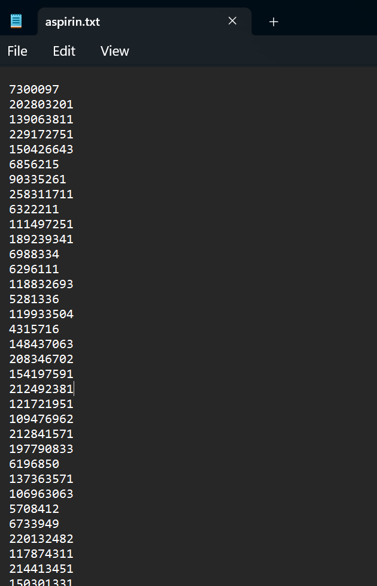
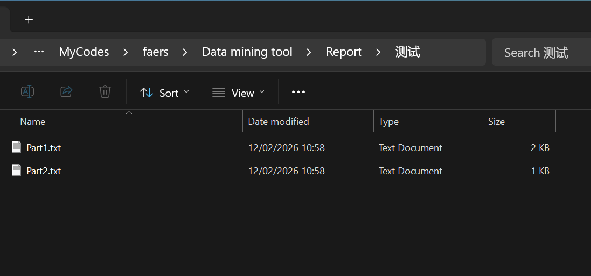
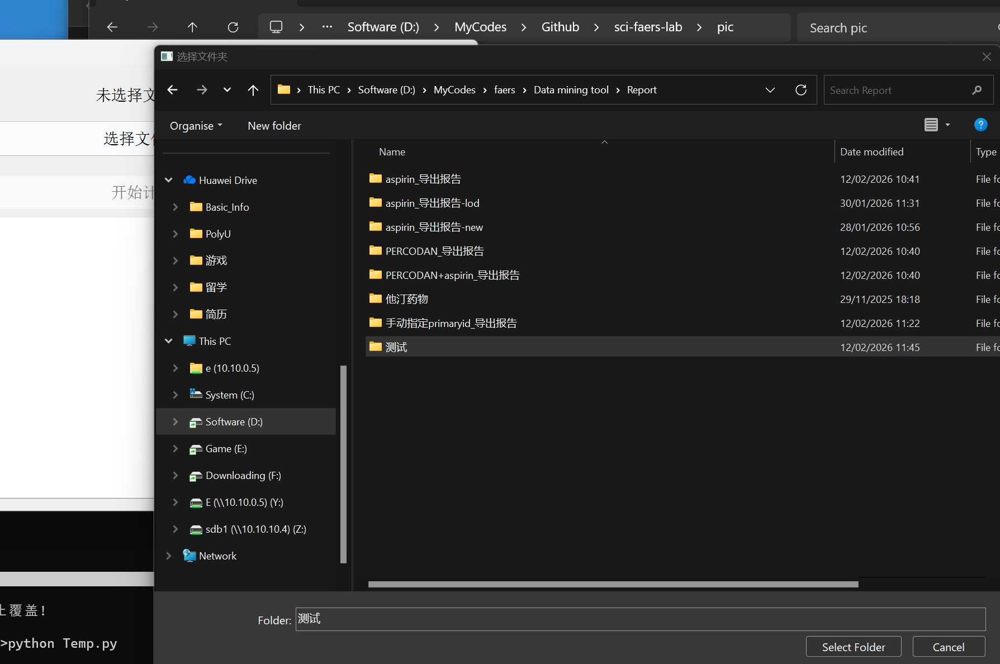

- 此工具适用于用户需要手动指定纳入的报告来计算信号值的情况
- 由于应用场景非常少，不会在邮件更新中推送，若有需要，请手动下载

### 方法
- 获取报告编号：
  - 方法1：新建一个txt文件，每行输入报告编码(primaryid)
  - 方法2：信号监测系统的导出报告中，原始数据的文件夹中会有一个文件：primaryid.txt，可以直接拿来使用  

  - 
  
- 将存放报告编号的一个或者多个txt文件，放在一个新建的文件夹中，这些txt文件的文件名可以是任意文件名
  - 

- 打开此工具，选中该文件夹，点击开始计算，结果会保存在report文件夹中
  - 

- **该版本不提供推送**，如若需要，请通过下方的网盘链接下载，和信号监测系统放在同一目录即可
- 链接：https://pan.quark.cn/s/370c4ca60ebf