## 操作步骤
- 视频教程：https://www.bilibili.com/
- 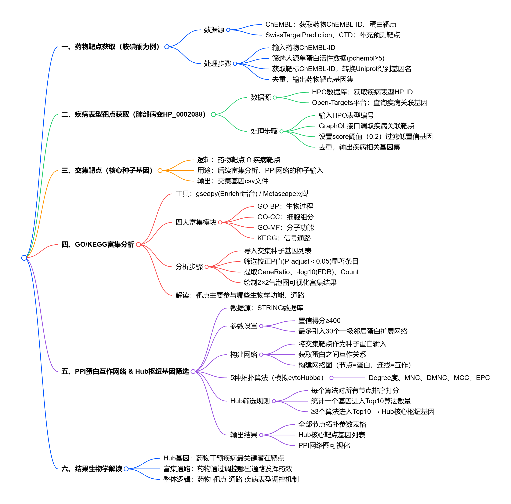


### 一、筛选药物分子靶点，完成合并与去重
1. 从ChEMBL数据库中获取**目标药物ID**以及**Canonical SMILES编码**
  - 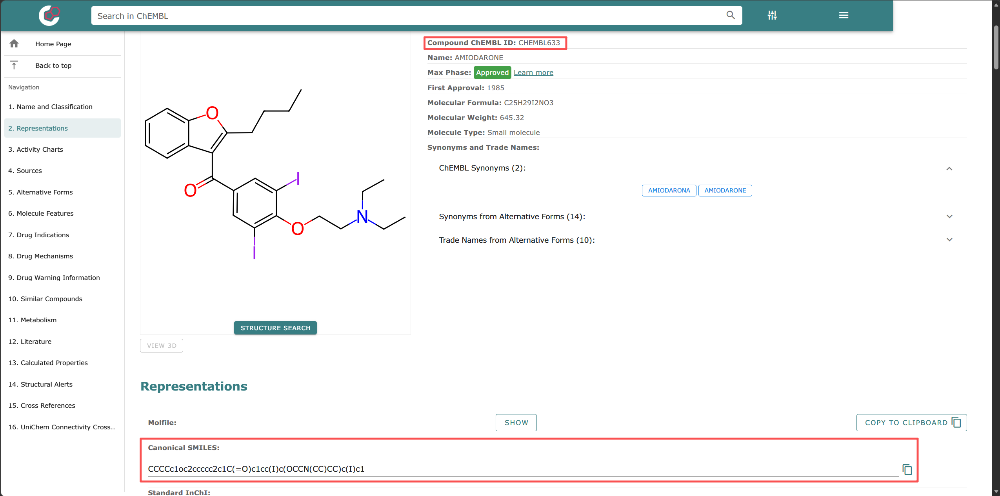

   - 示例：胺碘酮AMIODARONE，CHEMBL633，CCCCc1oc2ccccc2c1C(=O)c1cc(I)c(OCCN(CC)CC)c(I)c1


2. 根据研究需求，选取**至少一个**数据库获取化合物潜在作用靶点。单一数据库会漏掉部分潜在靶点。引入大量假阳性靶点，且引入额外去重工作。（查询地址见下方表格）
  - 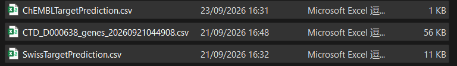

    ```
    from chembl_webresource_client.new_client import new_client #ChEMBL数据库查询代码
    import requests,time
    tids={a["target_chembl_id"] for a in new_client.activity.filter(molecule_chembl_id="CHEMBL633",target_organism="Homo sapiens",target_type="SINGLE PROTEIN",pchembl_value__gte=5) if a.get("target_chembl_id")}
    genes=set()
    for tid in tids:
        for c in new_client.target.get(tid).get("target_components",[]):
            if acc:=c.get("accession"): time.sleep(0.25);js=requests.get(f"https://rest.uniprot.org/uniprotkb/{acc}.json",timeout=10).json();genes.add(js["genes"][0]["geneName"]["value"])
    print(genes)
    ```
3. 整合靶点信息：打开整合包中的Set-Venn-Tool网页工具，将找到的靶点信息文件复制到网页工具中，点击下载交集文件作为合并与去重之后的药物作用靶点
  - 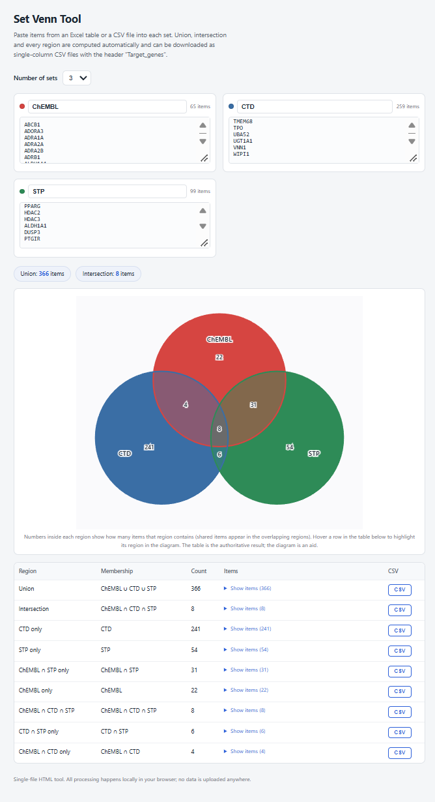

| 数据库名称                                   | 主要特点                                                                                         | 查询网址                                                            |
|-----------------------------------------|----------------------------------------------------------------------------------------------|---------------------------------------------------------------|
| ChEMBL                                  | EMBL‑EBI 维护，人工整理的类药分子生物活性数据库；收录靶点、化合物、活性实验、文献数据，可获取 IC50、Ki 等活性值，用于药物发现与网络药理学研究PMC           | https://www.ebi.ac.uk/chembl/                                 |
| SwissTargetPrediction（STP）              | 基于 2D+3D 分子相似度预测靶点；支持人、小鼠、大鼠等多物种；输入 SMILES 即可预测                 | https://www.swisstargetprediction.ch/                         |
| CTD（Comparative Toxicogenomic Database） | 人工文献挖掘，聚焦毒理基因组；整合化学物质、基因、疾病、表型、暴露数据，适合解析化合物毒性与疾病作用机制分析PMC                                    | https://ctdbase.org/detail.go?type=chem&acc=D000638&view=gene |
| SEA（Similarity Ensemble Approach）       | UCSF Shoichet 实验室开发；采用集合相似度算法，基于 ChEMBL 配体库；输入 SMILES 进行靶点预测，输出 E‑value 评估预测显著性，可作为靶点预测的补充工具 | https://sea.bkslab.org/（目前已经整合入ChEMBL数据库）                                       |


---
### 二、获取疾病表型ID和关联靶点
1. 进入Human Phenotype Ontology网站，获取疾病表型编号
   - https://www.ebi.ac.uk/ols4/ontologies/hp?tab=classes
   - 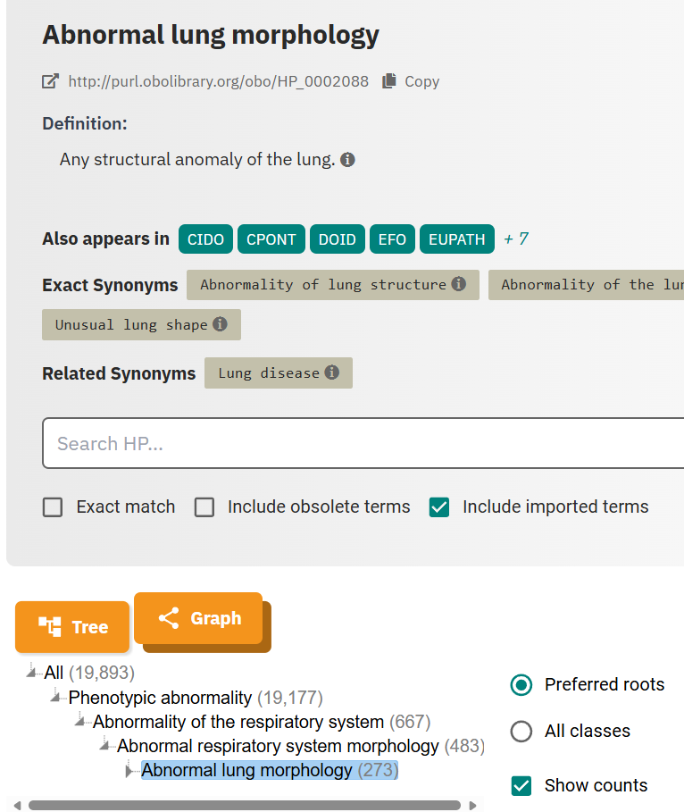
   - 示例：Abnormal lung morphology肺部形态异常：HP_0002088
2. 设定筛选阈值，向Open-Targets(开放靶点平台)请求靶点信息
   ```
    import requests
    OT_API = "https://api.platform.opentargets.org/api/v4/graphql"
    SCORE_THRESHOLD = 0.2
    gql_query = """query getDiseaseTargets($efoId: String!) {disease(efoId:$efoId){id name associatedTargets(page:{index:0,size:1000}){count rows{score target{approvedSymbol id}}}}}"""
    variables = {"efoId":"HP_0002088"}
    res = requests.post(OT_API, json={"query":gql_query,"variables":variables}, timeout=30)
    res.raise_for_status()
    data = res.json()
    if "errors" in data: raise RuntimeError(f"GraphQL error: {data['errors']}")
    disease = data["data"]["disease"]
    if not disease: raise ValueError("未找到该疾病表型")
    pheno_genes = {row["target"]["approvedSymbol"] for row in disease["associatedTargets"]["rows"] if row["score"]>=SCORE_THRESHOLD and row["target"]["approvedSymbol"]}
   ```
   - 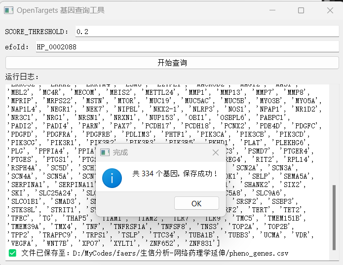    
    
3. 靶点筛选：再次打开Set-Venn-Tool网页工具，导入药物靶点集与疾病表型关联靶点集，求取二者交集并导出，获得交集靶点文件。
    - 为便于后续脚本识别，交集靶点文件需要重命名为：药物名称.csv，示例：AMIODARONE.csv

---

### 三、经典富集分析
1. 打开绘图工具包，选择富集分析脚本，一键出图，支持保存为png/pdf/svg/eps/tiff格式，富集分析详细结果表格保存在Temp文件夹中

   - 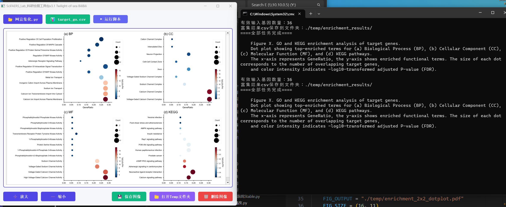    
   - 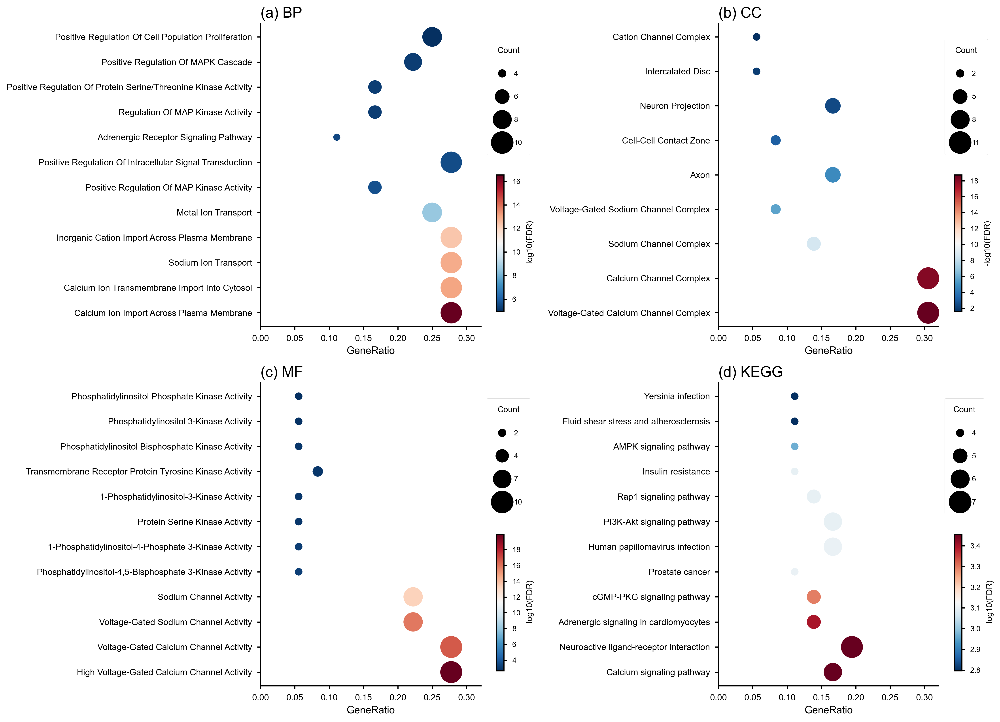    
  
- **BP（Biological Process，生物过程）**
看基因参与了哪些**生物学事件**，比如细胞凋亡、免疫反应、细胞增殖、氧化应激。
👉 回答：这些基因在细胞里**干了什么事**。
- **CC（Cellular Component，细胞组分）**
看基因产物（蛋白）在**细胞的哪个位置**发挥作用，比如细胞膜、线粒体、细胞核、核糖体。
👉 回答：基因产物**待在哪里**。
- **MF（Molecular Function，分子功能）**
看基因编码的蛋白具备**分子层面的功能**，比如酶活性、受体结合、DNA 结合、离子通道。
👉 回答：这个蛋白本身**有什么分子能力**。
- **KEGG（基因与基因组百科全书）**
富集**信号通路、代谢通路**，是基因之间上下游调控的完整通路。比如 PI3K-Akt 通路、糖酵解通路。
👉 回答：这些基因共同参与哪条**调控 / 代谢通路**。

---

### 四、药物-靶点-通路网路图绘制
1. 打开绘图工具包，选择成分靶点KEGG通路网络图绘制脚本，一键出图，支持保存为png/pdf/svg/eps/tiff格式

   - 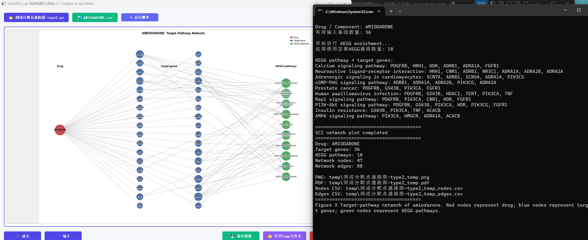   
   - 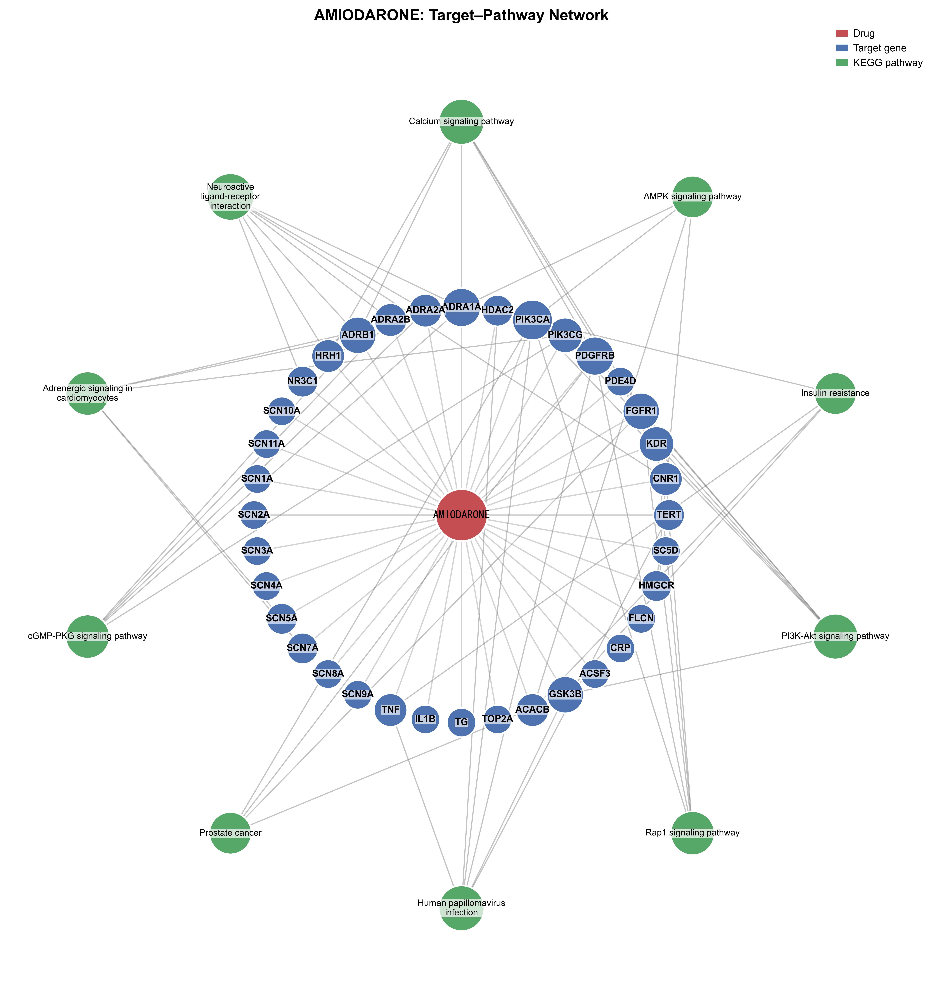
  
---
### 五、构建PPI蛋白作用网络
1. 打开绘图工具包，选择蛋白互作网络构建与算法赋分脚本，点击运行，自动请求STRING数据库，完成蛋白网络构建和Degree/MCC/MNC/DMNC/EPC算法打分。
2. 自由设定Hub靶点筛选阈值：在至少 N 种算法中得分进入Top10的靶点被定为Hub基因，N取值范围0~5
   - 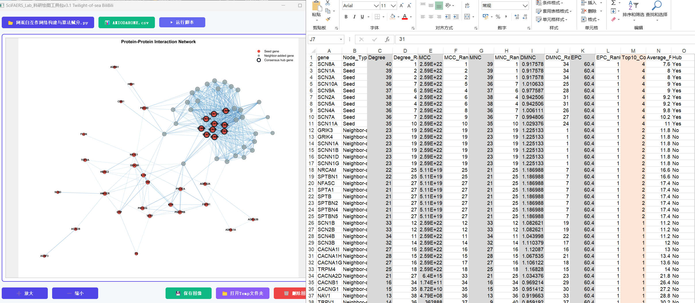
   - 
---
### 结果解读
在网络药理学研究的结果生物学解读中，主要包含三方面内容：
   - **Hub 基因**是药物干预疾病最关键的潜在靶点；
   - **富集通路**用于阐释药物通过调控哪些信号通路发挥药效；
   - **整体逻辑**则构建起 “药物 - 靶点 - 通路 - 疾病表型” 的完整调控机制链条，以此系统解析药物作用的分子机理。