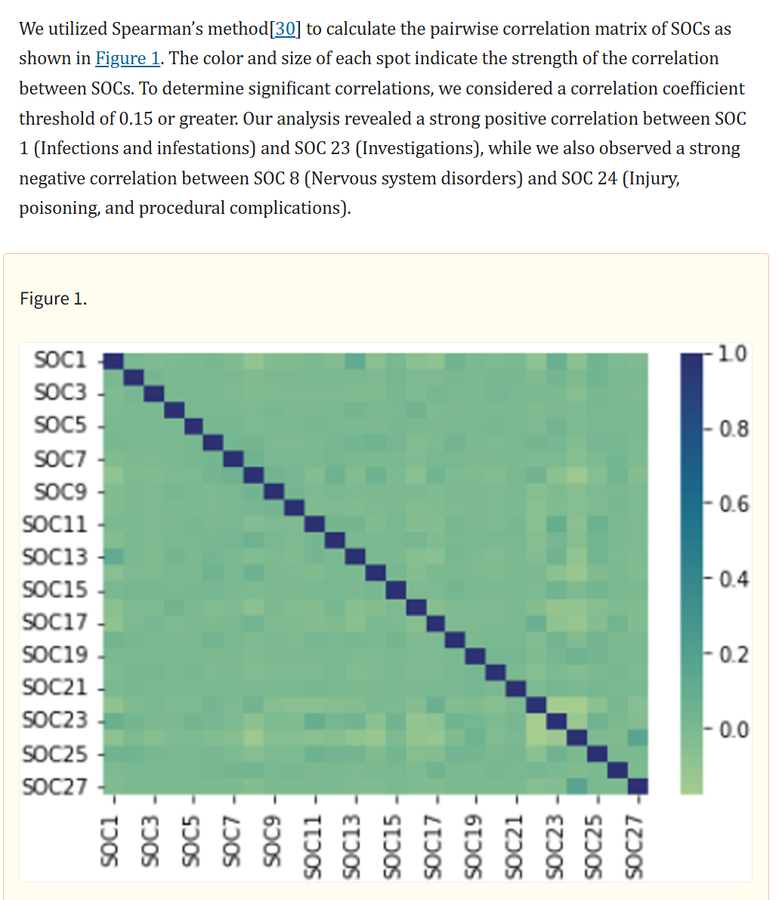
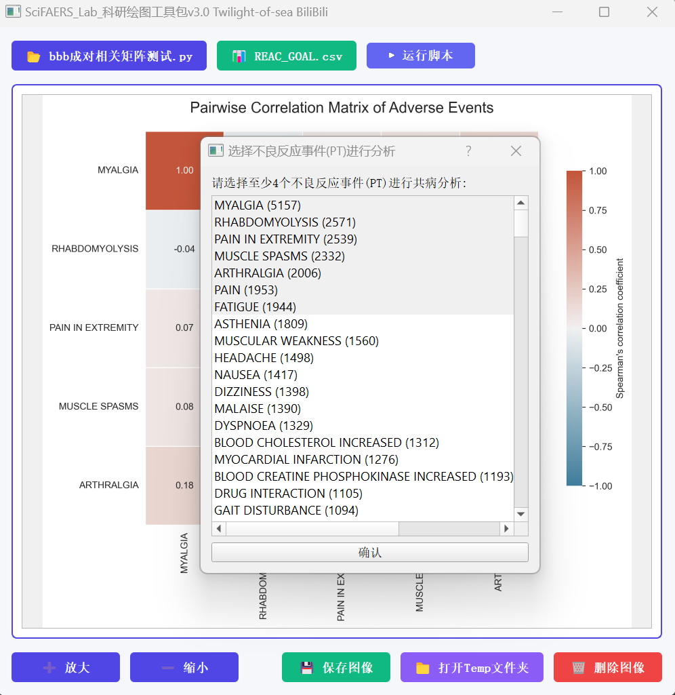
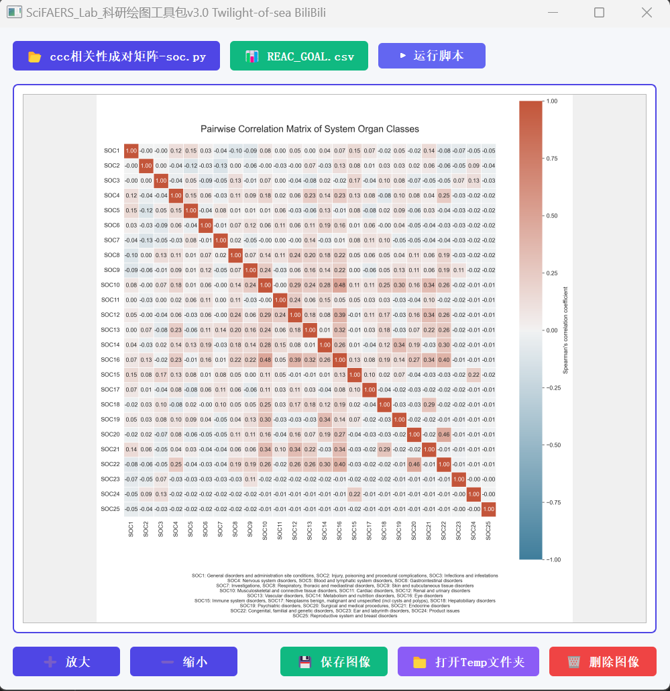
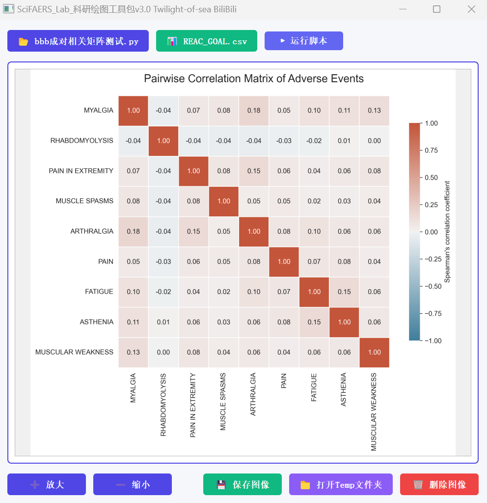
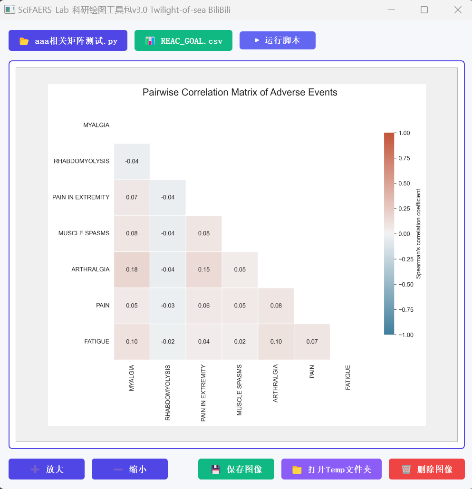

## Spearman相关分析在药物不良反应研究中的应用

Spearman相关系数是一种非参数统计方法，用于衡量两个变量之间的单调关系强度，特别适合处理非正态分布数据或序数数据。在药物不良反应研究中，这种方法可以帮助您：

1. 发现不同不良反应事件之间的关联模式
2. 识别可能同时出现的不良反应组合
3. 揭示潜在的共病机制
- 推荐学习文章:https://pmc.ncbi.nlm.nih.gov/articles/PMC10872386/

-  

## 运行方法
- 打开绘图工具包，导入原始数据：REAC以及作图脚本
- 程序自动对不良事件进行频数统计分析，用户选中目标的不良事件以进行Spearman检验  

   

- 绘制图像，可以保存图像为png\pdf\tiff\eps等格式  

  

   

   

 

## 结果解释

1. **相关矩阵图**：这个热图直观地展示了不同不良反应事件之间的关联强度。
   - 红色区域表示正相关（两种不良反应倾向于同时出现）
   - 蓝色区域表示负相关（一种不良反应出现时，另一种倾向于不出现）
   - 颜色越深，相关性越强

2. **显著相关的解读**：
   - 正相关（>0.15）：表明这两种不良反应可能有共同的生理机制或互为诱因
   - 负相关（<-0.15）：可能表明这些不良反应之间存在某种互斥关系

3. **临床意义**：
   - 帮助医生预测患者可能出现的其他不良反应
   - 为药物安全监测提供依据
   - 揭示潜在的药物作用机制

这种分析方法的优势在于它能够从大量不良反应报告中发现潜在的模式，而这些模式可能不容易通过传统的单一事件分析发现。