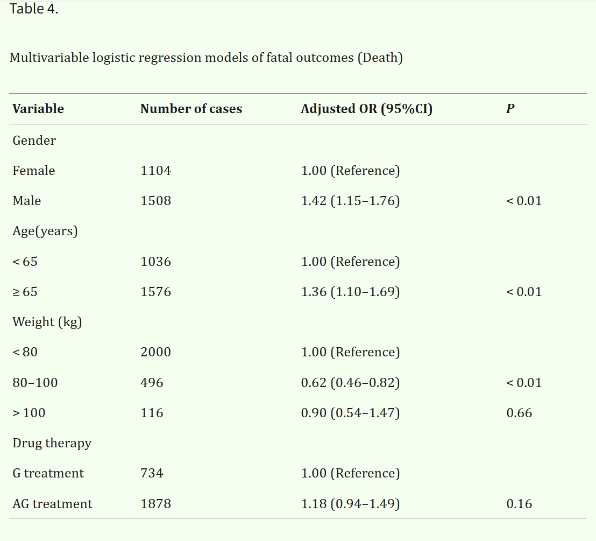

## 影响结局的多因素逻辑回归分析：
- [视频教程-逻辑回归原理](https://www.bilibili.com/video/BV1h4KzzfE47)
- [视频教程-联用药物逻辑回归分析](https://www.bilibili.com/video/BV1u93tzgE1x)
- [视频教程-多药物逻辑回归分析](https://www.bilibili.com/video/BV1VL33zwELn)
- 典型文章: [PMC11924625](https://pmc.ncbi.nlm.nih.gov/articles/PMC11924625/)
- 


### 引言
- 一个基本问题：我有一组患有某种疾病的病人的数据样本，记录着在的患者年龄，以及患者最终是否死亡。
- 可以用什么统计学模型检测年龄是否为死亡的影响因素？


### 独立样本t检验

- 首先确认您的数据符合以下条件：
1. **因变量**：年龄（连续变量）
2. **自变量**：疾病状态（二分类变量：患病/未患病）
3. **数据正态分布**
4. **两组样本独立**
5. **方差齐性**（需要检验）

#### 1. 数据准备
将数据分为两组：
- 组1：患病患者的年龄
- 组2：未患病患者的年龄

#### 2. 描述性统计
计算两组的：
- 样本量（n₁, n₂）
- 平均值（x̄₁, x̄₂）
- 标准差（s₁, s₂）

#### 3. 方差齐性检验
使用Levene检验或F检验：
- H₀：两组方差相等
- 如果p > 0.05，假设方差齐性

#### 4. t检验计算

**如果方差齐性：**
```
合并标准差：Sp = √[((n₁-1)s₁² + (n₂-1)s₂²)/(n₁+n₂-2)]
标准误：SE = Sp√(1/n₁ + 1/n₂)
t统计量：t = (x̄₁ - x̄₂)/SE
自由度：df = n₁ + n₂ - 2
```

**如果方差不齐（Welch t检验）：**
```
标准误：SE = √(s₁²/n₁ + s₂²/n₂)
t统计量：t = (x̄₁ - x̄₂)/SE
自由度：df = (s₁²/n₁ + s₂²/n₂)²/[(s₁²/n₁)²/(n₁-1) + (s₂²/n₂)²/(n₂-1)]
```

#### 5. 假设检验
- **H₀**：患病组与未患病组的平均年龄无差异（μ₁ = μ₂）
- **H₁**：两组平均年龄存在差异（μ₁ ≠ μ₂）
- **显著性水平**：α = 0.05

#### 6. 结果解释
- 如果 |t| > t_{α/2,df} 或 p < 0.05：拒绝H₀，认为年龄与疾病存在关联
- 计算效应量（Cohen's d）：d = (x̄₁ - x̄₂)/Sp

#### R语言：
```r
# 假设数据框为df，包含age和disease列
t.test(age ~ disease, data = df, var.equal = TRUE)  # 方差齐性
t.test(age ~ disease, data = df, var.equal = FALSE) # 方差不齐
```

#### Python（scipy）：
```python
from scipy import stats
group1 = df[df['disease'] == 1]['age']
group2 = df[df['disease'] == 0]['age']
t_stat, p_value = stats.ttest_ind(group1, group2, equal_var=True)
```

#### SPSS：
分析 → 比较均值 → 独立样本t检验


### Mann-Whitney U检验
**背景**：想比较A班和B班学生的数学成绩是否有显著差异

**数据**：
- A班成绩：65, 70, 75, 80, 85
- B班成绩：60, 68, 72, 78

#### 1. 合并排序
将两组数据合并后从小到大排序，并记录来源：
```
60(B), 65(A), 68(B), 70(A), 72(B), 75(A), 78(B), 80(A), 85(A)
```
#### 2. 分配秩次
给每个数据分配排名：
```
60(B)→1, 65(A)→2, 68(B)→3, 70(A)→4, 72(B)→5, 
75(A)→6, 78(B)→7, 80(A)→8, 85(A)→9
```

#### 3. 计算秩和
- A班秩和：2+4+6+8+9 = 29
- B班秩和：1+3+5+7 = 16

#### 4. 计算U值
```
UA = nA×nB + nA(nA+1)/2 - RA
   = 5×4 + 5×6/2 - 29
   = 20 + 15 - 29 = 6

UB = nA×nB + nB(nB+1)/2 - RB  
   = 5×4 + 4×5/2 - 16
   = 20 + 10 - 16 = 14
```

#### 5. 结果解释
- U统计量 = min(UA, UB) = 6
- 通过查表或软件比较临界值来判断是否显著

- Mann-Whitney U检验本质上在问：**如果两组真的没有差异，观察到这种排名分布的概率有多大？**
- 如果一组的成绩普遍较高，它们在合并排序中会占据较高的位置，秩和就会较大，对应的U值就会较小。

### 卡方检验：

1. **重编码**（常见方式）：
   ```
   青年组：18-39岁
   中年组：40-59岁
   老年组：≥60岁
   ```

2. 建一个列联表
   ```
   |        | 青年组 | 中年组 | 老年组 | 合计 |
   |--------|--------|--------|--------|------|
   | 死亡   |   a    |   b    |   c    |  a+b+c |
   | 存活   |   d    |   e    |   f    |  d+e+f |
   | 合计   |  a+d   |  b+e   |  c+f   |   n    |
   ```
3. **检验统计量**：χ² = Σ[(观察频数-期望频数)²/期望频数]

4. 确定自由度
df = (行数-1) × (列数-1) = (2-1) × (k-1) = k-1
5. 查表或计算得到P值

- **零假设**：年龄组与死亡率无关
- **判断标准**：p < 0.05拒绝零假设


### 逻辑回归方法
#### 特点：
- 因变量可以是连续，也可以是类别变量
- P值，和OR值（风险对比）
- FAERS论文中出现频率7%左右
#### 功能：

- 涉及到两个概念：**因素**和**结果变量**。举个简单的例子：抽烟、喝酒、嚼槟榔对于癌症的影响，前三者是自变量，癌症是结果变量
- 

- 

可以考虑的因素：
- 回归公式: target_pt ~ C(sex) + C(age_group) + C(wt_group) + C(dur_group)
````
C(sex)：性别
C(age_group)：年龄组
C(wt_group)：体重组
C(dur_group)：持续时间组
````
- 

#### 步骤
0. 数据清洗，去除缺失和错误值
1. 重编码（可选）
   1. 需注意：
   2. Missing不能太多，样本量足够才可能有置信度高的结果
   3. 每个组别，需要有至少两种变量，才能计算相对风险
2. 建模
3. 计算

#### 结果解读：
1. P值小于<0.05，表示具有统计学意义，存在关联
2. OR表示和参照组对比的风险下降和上升

- 
---
# 操作方法

### **一、数据表构建与准备**
#### 1. 创建数据汇总表格
**1.1 单药物分析**  
- 从目标药物原始数据中复制以下四张数据表：`DRUG`、`DEMO`、`OUTC`、`REAC`。  
- 将四表整合至**同一个Excel工作簿**，保持原始表名大写（如`DRUG`、`DEMO`）。  
- **示例参考**：  
  

**1.2 多药物分析（N种药物）**  
- 分别导出每种药物的`DRUG`、`DEMO`、`OUTC`、`REAC`表，合并至同一工作簿。  
- **工作表命名规则**：药物名称 + 后缀（如`drugname1.DEMO`、`drugname1.REAC`），共生成 **4N个工作表**。  
- **示例参考**：  
  

**1.3 药物联用分析**  
- 导出药物联用组合的原始数据，复制`DRUG`、`DEMO`、`OUTC`、`REAC`表。  
- **工作表命名规则**：联用描述 + 后缀（如`Combined.DEMO`、`Combined.REAC`）。  
- **示例参考**：  
  

---

### **二、根据因变量命名这个EXCEL表格**
1. **确定研究结局类型**：  
   - 若以**特定不良事件（PT）**为因变量，命名工作簿为 **PT.xlsx**（例：`DIZZINESS.xlsx`），需使用大写医学专业术语。  
   - 若以**特定报告结局（OUTC）**为因变量，命名工作簿为 **OUTC_代码.xlsx**（例：`DE.xlsx`），具体代码需与数据库中保持一致。
  
---

### **三、可视化与结果展示**
1. 使用**绘图工具包**加载Excel工作簿，选择对应的`脚本a_多因素回归分析`运行分析。  
2. 结果会额外生成一个表格文件，保存至 **Temp文件夹**，允许手动编辑整理。  
3. 整理好后，可以用对应的`脚本b_绘图`生成分析新的图表