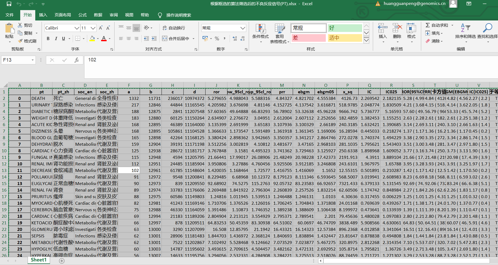
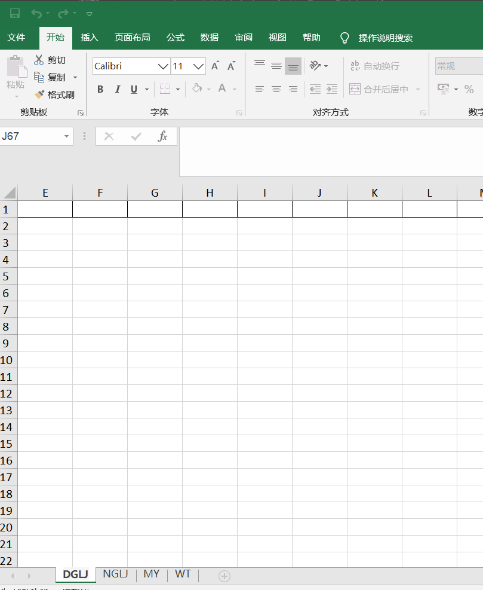
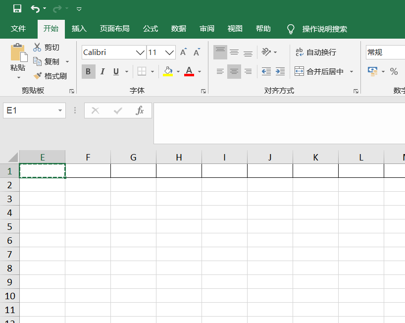
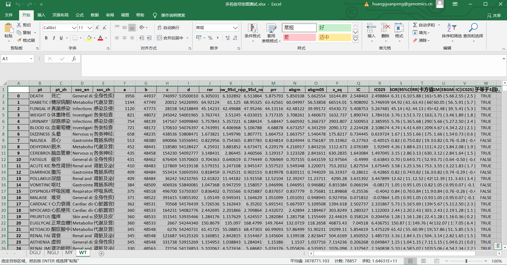
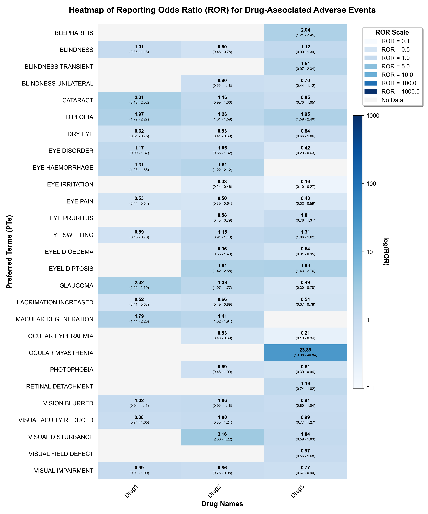
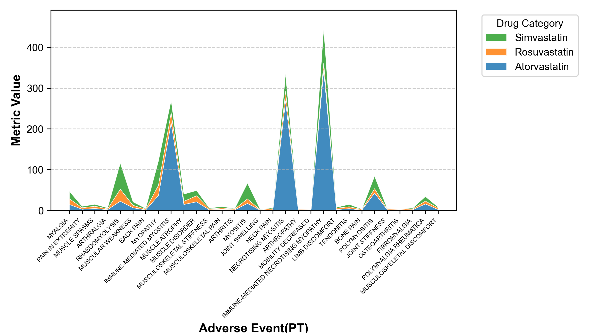
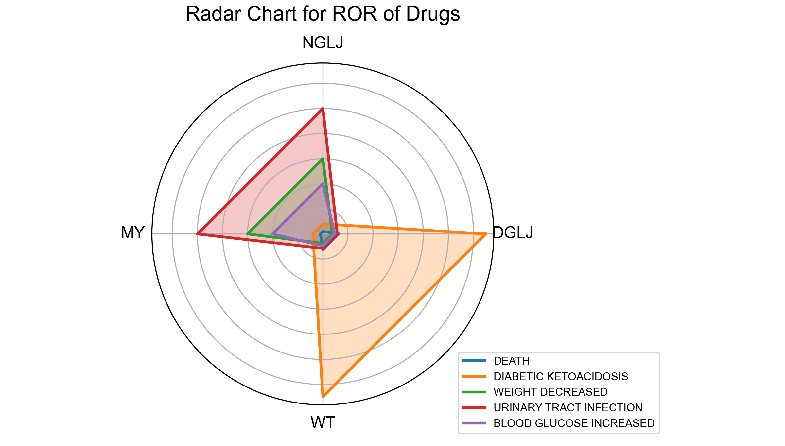

#### [视频演示](https://www.bilibili.com/video/BV1ru7pz4EcH)
**目标**：将4个药物(DGLJ、MY、NGLJ、WT)的不良反应数据合并到一个Excel文件中

**核心步骤**：

1. **数据选择**：从每个药物的"筛选后不良反应信号(PT).xlsx"文件中，用Ctrl+拖拽选择需要的PT数据(根据需要选择，不一定全选)，Ctrl+C复制

  

2. **创建汇总文件**：新建空白Excel文件，在这个文件中，为每个药物创建独立工作表(重命名为药物名称)

  

3. **数据粘贴**：在对应工作表的A1单元格位置，用Ctrl+V粘贴各药物数据

  

4. **重复处理**：对4个药物重复"选择→创建表→粘贴"的操作

    

5. **保存文件**：检查4个工作表完整性，保存为"四药物不良反应汇总"

**最终结果**：获得一个包含4个工作表的Excel文件，每个表对应一种药物的不良反应数据。

#### 第二步：绘图
- 打开绘图工具包，导入我们准备好的多药物不良反应汇总表格，导入绘图脚本，点击运行。挑选你喜欢的风格  

    
  
    

    

    
  
    

