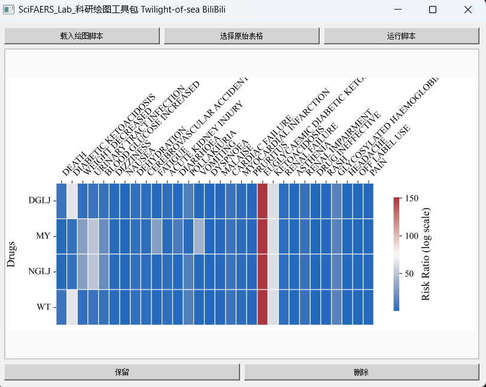

#### [视频演示](https://www.bilibili.com/video/BV1ru7pz4EcH)
#### 第一步：制表
📌 四款药物不良反应报告合并教程（DGLJ/MY/NGLJ/WT）

1️⃣ 准备初始文件

确保已导出四个药物的报告文件： DGLJ、MY、NGLJ、WT（每个都是独立excel文件）
先处理第一个药物（例如DGLJ）
2️⃣ 全选复制数据
① 双击打开 DGLJ 的"筛选后不良反应信号(PT).xlsx"
② 左手按住键盘左下角的【Ctrl】键不放
③ 先按【A】全选表格（看到数据变蓝说明选中）
④ 保持按着Ctrl，再按【C】复制数据  

  

3️⃣ 创建汇总文件
➔ 新建空白excel：右键桌面→新建→Microsoft Excel工作表
➔ 打开新建的文件，底部默认有Sheet1工作表
➔ 右键Sheet1→【重命名】改为"DGLJ"  

  

4️⃣ 粘贴数据
在"DGLJ"工作表：
① 点击左上角第一个单元格（A1位置）
② 左手同时按【Ctrl+V】粘贴数据  

  

5️⃣ 重复操作其他药物
① 回到MY药物的原文件，重复步骤2️⃣全选复制
② 在汇总文件新建工作表：点击底部➕号新建Sheet
③ 右键新Sheet→重命名为"MY"
④ 在"MY"表按【Ctrl+V】粘贴
（NGLJ和WT重复同样操作）  

    

6️⃣ 最终保存
✅ 检查四个工作表是否齐全
✅ 按【Ctrl+S】保存文件
✅ 建议命名为"四药物不良反应汇总"
✅ 关闭所有excel窗口完成操作

💡 小贴士：

每次复制前记得先关闭已处理的原文件，避免窗口混淆

#### 第二部：绘图
- 打开绘图工具包，和之前其他绘图一样，导入表格，导入绘图脚本，点击运行。挑选你喜欢的风格  

  

