- [视频教程](www.bilibili.com)
  

## 第一步
确定需要研究的目标药物，如果是做诱发某不良反应的药物分析的方向，可以参考[文章套路](../文章套路.md#s分析某种不良反应和不同药物的关联)，了解如何获取药物排名。接下来进行药物的商品名和API名称整理（如下图）

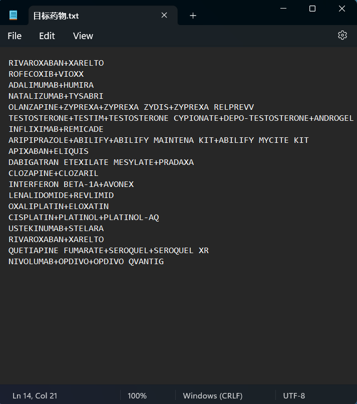

- 建议直接写成+连接的格式，并且将API药物活性成分的名称打头，方便后续操作

## 第二步
打开信号监测系统进行批量数据挖掘，输入刚刚整理好的药物列表，输入完成后点击开始处理，等待任务完成

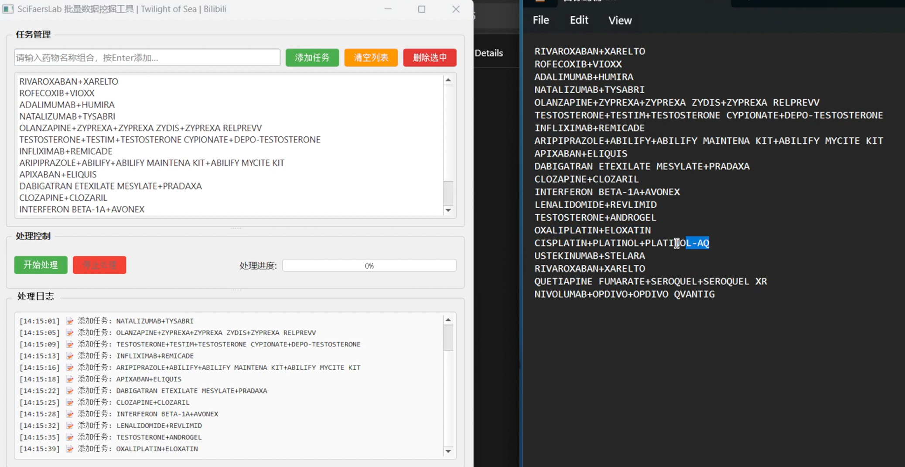

## 第三步
这些药物的报告会生成在Report文件夹中，请新建一个文件，将这些报告全部移动进去，便于后续操作。如下图将20个导出报告移动到了这个文件夹中

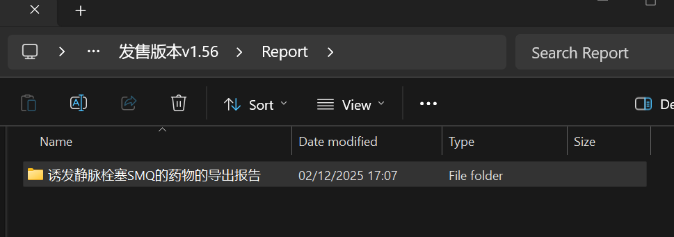

## 第四步
- 使用绘图工具包，导入脚本[S2020]**从多药报告中提取某PT信号值**，然后载入任意一个非空的excel表格，点击运行。

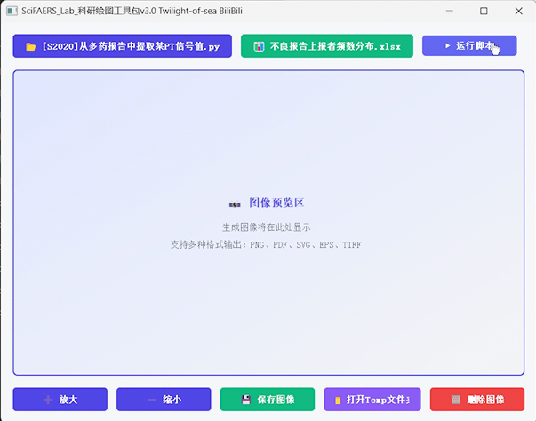

- 输入所需要提取信号值的PT的英文名称
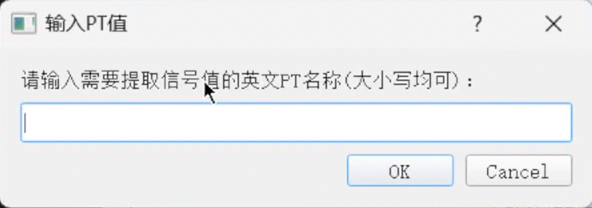

- 选中刚刚新建的存放药物的导出报告的文件夹
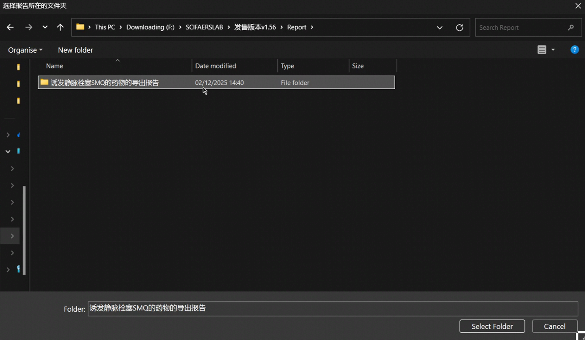

- 等待数据提取完成
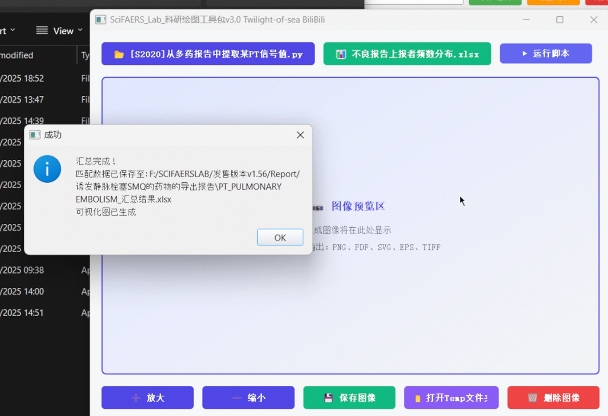

## 第五步
得到目标PT的多药汇总表格

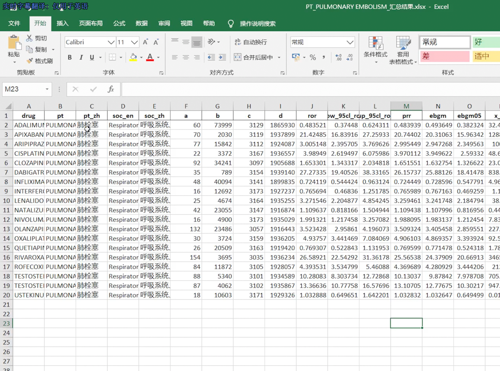

## 第六步：图形化
- 在这个表格中新建一列'drug classification'，填入药物类型，如图：

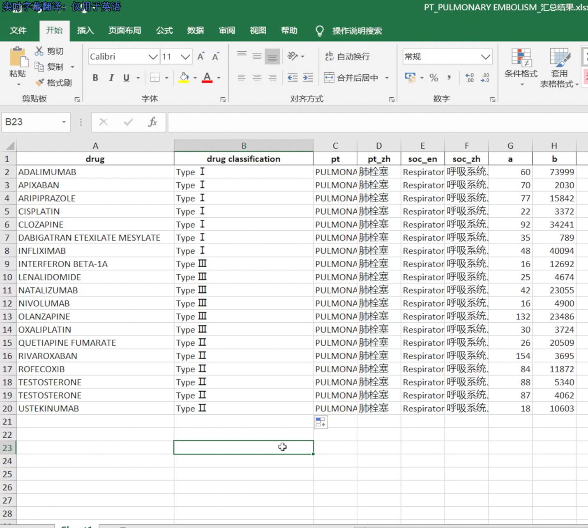

- 使用绘图工具包进行图形绘制，截止到25年12月初，已有从编号[S2021]开始的14个绘图脚本供大家选择，下面为一些图例

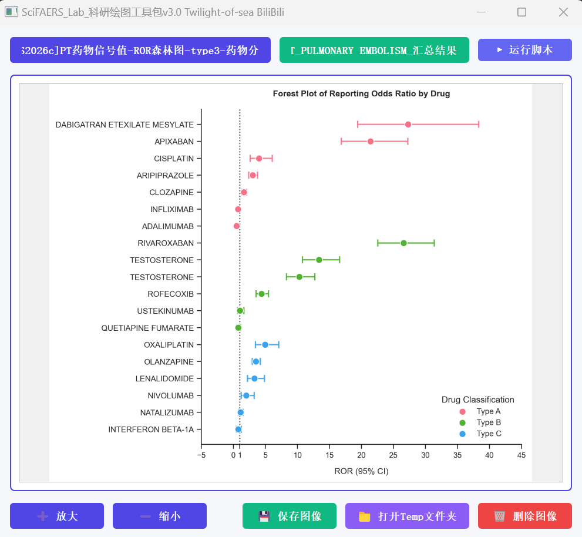

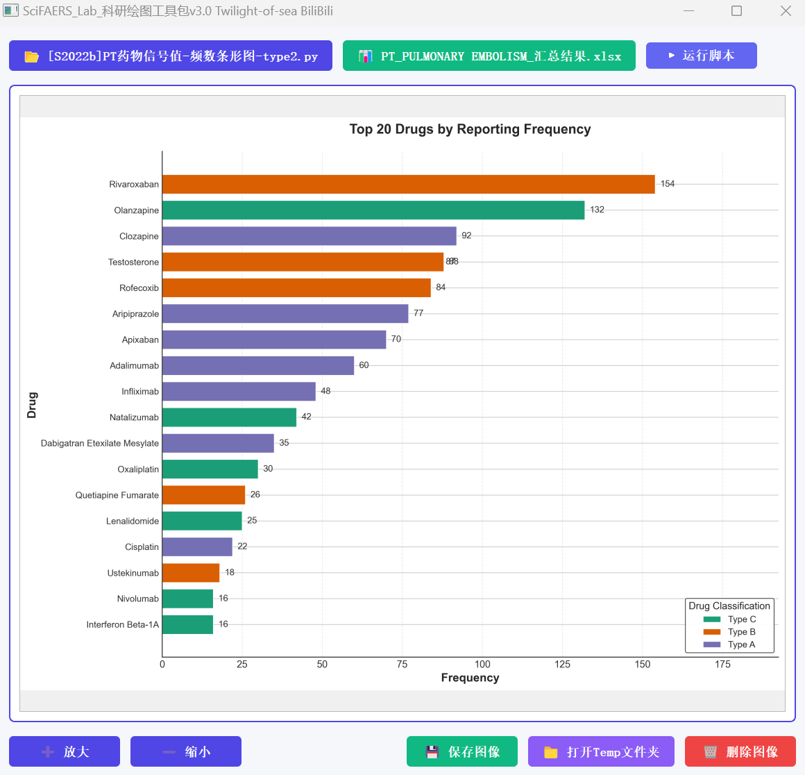

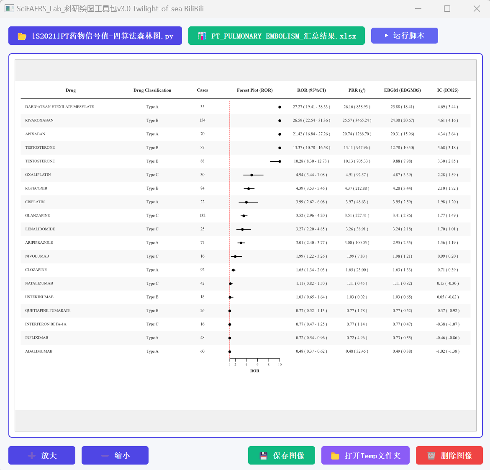

