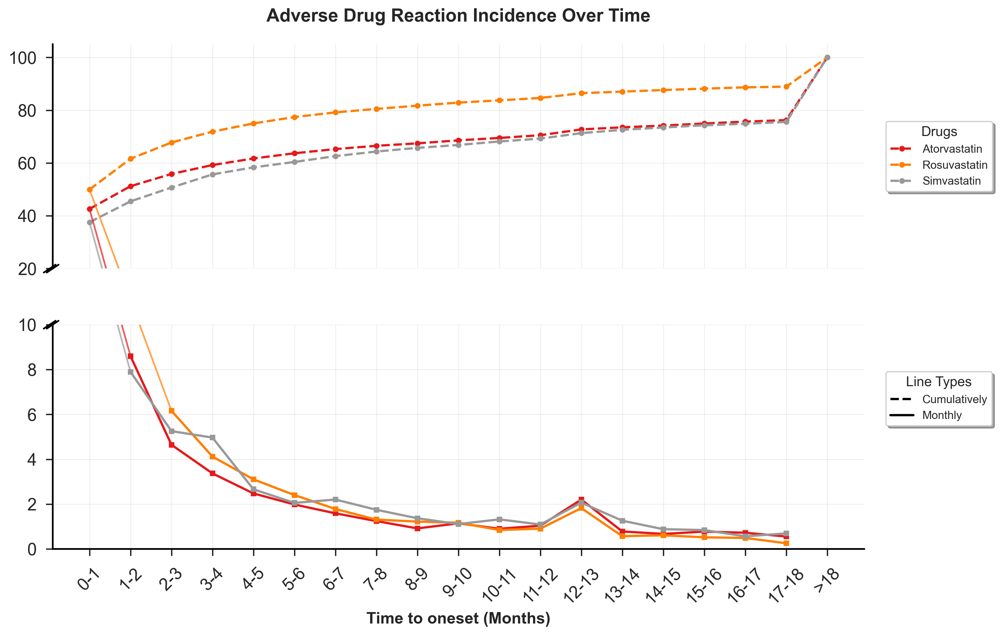

#### [视频教学](https://www.bilibili.com/video/BV1EF75zhEAj/)
#### [实战演示-多药](https://www.bilibili.com/video/BV1j93izGE9s/)
#### [实战演示-联用药物](https://www.bilibili.com/video/BV1WygCzBEce/)

## 图文教程如下
-  
- 
- 
- 

### 一、针对特定PT或SMQ的分析
**操作步骤：**
- 使用亚组分析工具（小数据）从原始数据报告中筛选目标PT或SMQ的报告
- 复制拆分结果中的Drug_Goal数据
- 将数据粘贴到Excel工作簿的不同工作表中

### 二、不同亚组对比分析
**操作步骤：**
1. 使用亚组分析工具（小数据）分割目标药物的原始数据，形成各个亚组
   - 亚组示例：男性vs女性、青年vs老年等
   - 工具使用参考：[亚组分析工具教程](https://www.bilibili.com/video/BV14yVpzZEHU/)
2. 新建Excel文件，将不同亚组人群的Drug_Goal原始数据分别复制到多个工作表中
3. 运行绘图工具完成绘图

### 三、不同药物对比分析
**操作步骤：**
1. 将不同药物导出的原始数据中的Drug_Goal数据复制到同一Excel工作簿的不同工作表中
2. 运行绘图工具完成绘图

---
- 注意：以上的三个维度可以任意配合，如：
#### 例子1：特定PT + 不同亚组对比分析

**分析目标：** 分析"心律失常"这一PT在不同性别亚组中的表现差异

**操作步骤：**
1. 使用亚组分析工具筛选出所有包含"心律失常"PT的报告
2. 将筛选结果按性别分割为"男性"和"女性"两个亚组
3. 在Excel中创建两个工作表：
   - Sheet1: 男性-心律失常的Drug_Goal数据
   - Sheet2: 女性-心律失常的Drug_Goal数据
4. 运行绘图工具，对比分析心律失常在不同性别中的发生模式

#### 例子2：不同药物 + 特定SMQ分析

**分析目标：** 比较药物A和药物B在"心血管疾病"SMQ方面的安全性差异

**操作步骤：**
1. 使用亚组分析工具分别从药物A和药物B的原始数据中筛选"心血管疾病"相关的所有报告
2. 在Excel中创建两个工作表：
   - Sheet1: 药物A-心血管疾病SMQ的Drug_Goal数据
   - Sheet2: 药物B-心血管疾病SMQ的Drug_Goal数据
3. 运行绘图工具，比较两种药物在心血管安全性方面的表现

#### 例子3：三维度综合分析

**分析目标：** 分析特定PT"肝功能异常"在不同年龄组和不同药物中的表现

**操作步骤：**
1. 使用亚组分析工具筛选包含"肝功能异常"PT的报告
2. 将结果按年龄分组（如≤65岁 vs >65岁）和药物类型进行二次分割
3. 在Excel中创建四个工作表：
   - Sheet1: 药物A-青年组-肝功能异常
   - Sheet2: 药物A-老年组-肝功能异常
   - Sheet3: 药物B-青年组-肝功能异常
   - Sheet4: 药物B-老年组-肝功能异常
4. 运行绘图工具，进行多维度对比分析

- 这种多维度配合分析能够更深入地挖掘数据中的安全性信号模式。