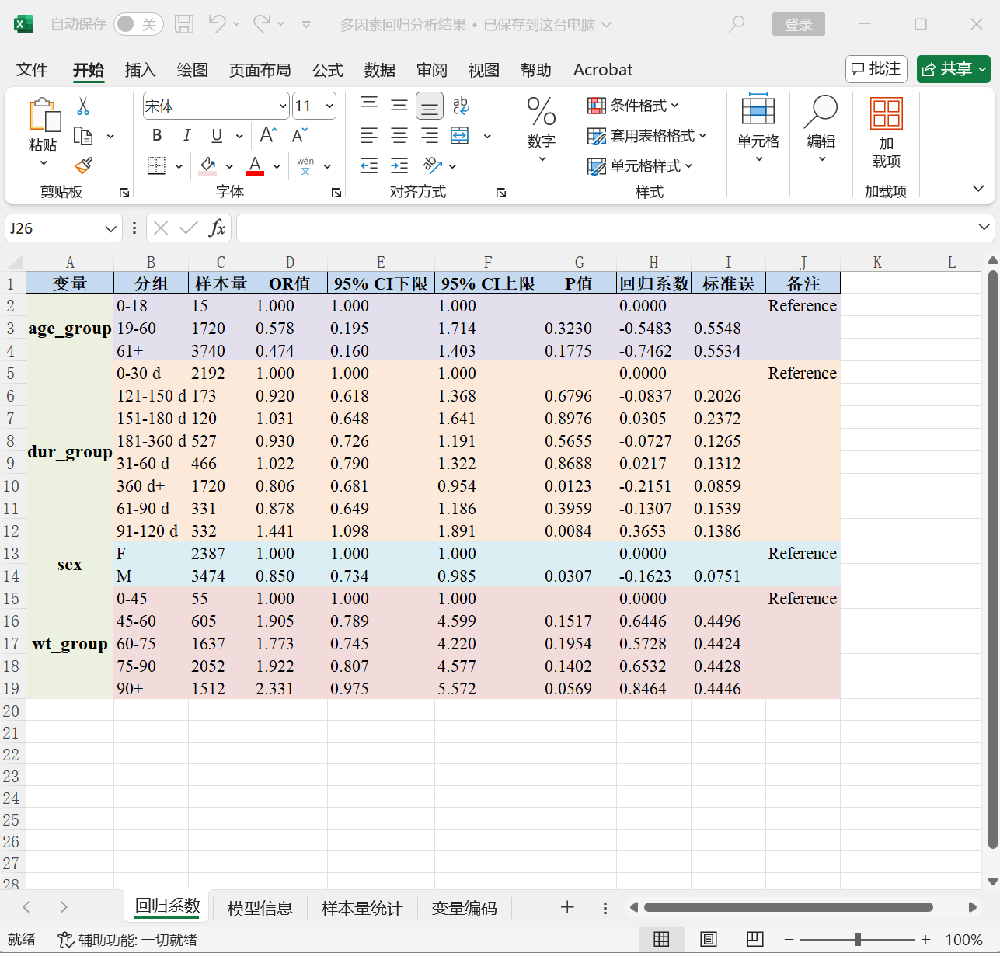
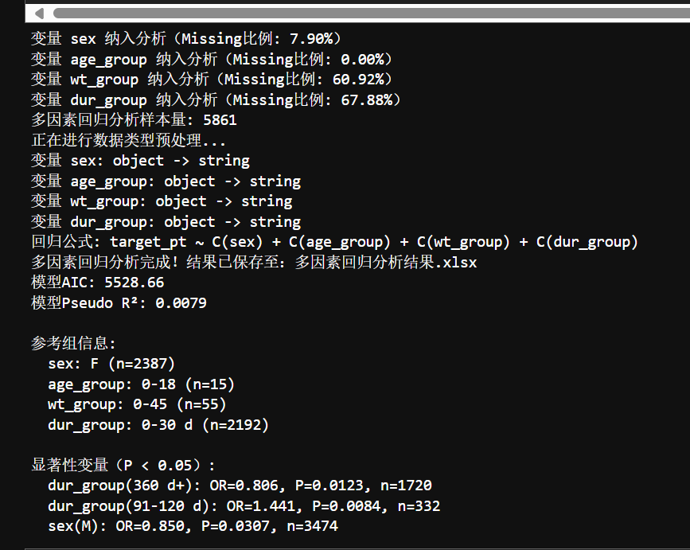
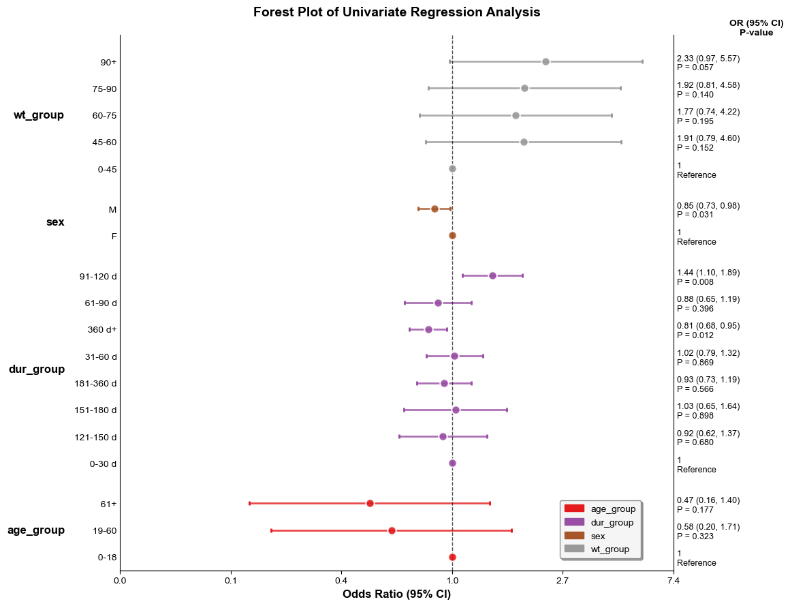
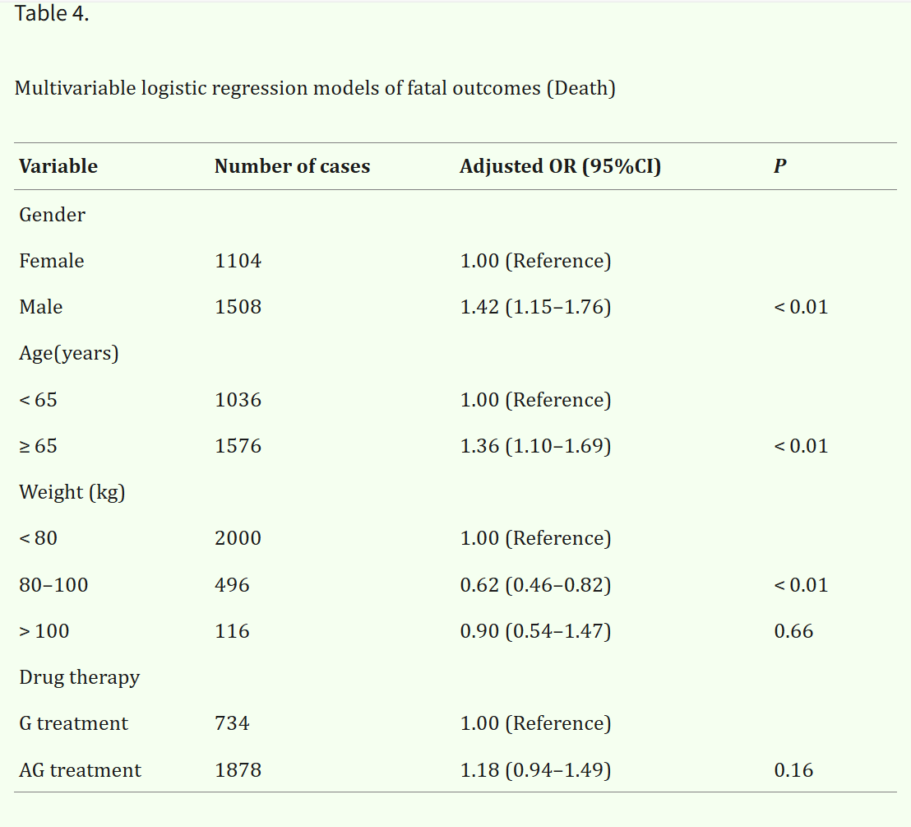

## 多因素逻辑回归分析：
- [视频教程]()
- 典型文章: [PMC11924625](https://pmc.ncbi.nlm.nih.gov/articles/PMC11924625/)

### 功能：
- 考察多个因素对结果变量的影响，识别哪些因素和结果有重要的关联
- 涉及到两个概念：**因素**和**结果变量**。举个简单的例子：抽烟、喝酒、嚼槟榔对于癌症的影响，前三者是自变量，癌症是结果变量
- 

可以考虑的因素：
- 回归公式: target_pt ~ C(sex) + C(age_group) + C(wt_group) + C(dur_group)
````
C(sex)：性别
C(age_group)：年龄组
C(wt_group)：体重组
C(dur_group)：持续时间组
````
- 


需注意：
1. Missing不能太多，样本量足够才可能有置信度高的结果
2. 每个组别，需要有至少两种变量，才能计算相对风险

结果解读：
1. P值小于<0.05，表示具有统计学意义，存在关联
2. OR表示和参照组对比的风险下降和上升

- 

具体操作方法：
1. 选择需要研究的结局变量，可以是某不良反应或是某种事件结局
2. 将原始数据复制粘贴到excel表格中，将这个excel表格重命名为结局变量，如（'DIZZINESS.xlsx'或者'DEATH.xlsx'）
3. 使用绘图工具包，导入这个表格，选中多因素回归分析功能脚本
4. 分析结果和森林图的图像会保存在Temp文件夹中

- FAERS文章大概3000个左右，大约7%文章使用了回归分析
- 