- 所有内容都写在这一个文档里，省的翻来翻去，怕麻烦，善用ctrl+F搜索文章内容

- 使用说明的框架包括两个部分：
    - 软件使用说明
    - 数据库挖掘分析方法实现

## 软件操作

### 一、不良数据库信号监测系统

- #### 界面
1. 顶部输入框：输入目标药物名称，可通过下列几个推荐的网址综合查询（英文，包括API名称、商品名、研发代号等等）
    - https://www.drugfuture.com/fda/drugsearch.aspx
    - https://zh.wikipedia.org/zh-cn/
    - https://www.chemicalbook.com/ProductIndex.aspx
    - https://www.google.com
    - https://www.pharmcube.com/product/PharmaGo/index
    
2. 复选框：选择筛选算法，是否勾选区别不大，均会生成下列两种文件
    - 生成文件："./Report/导出报告/不良反应信号报告/不良反应信号(PT).xlsx"：筛选前结果
    - 生成文件："./Report/导出报告/不良反应信号报告/根据框选的算法筛选后的不良反应信号(PT).xlsx"，筛选后结果

3. 底部按钮：“开始分析”
    - 读取"./Lib_Data/Data_Lake"文件夹中的数据库文件，根据所输入的药物名进行信号检测
    - 请确保这个文件夹存在。  
    
    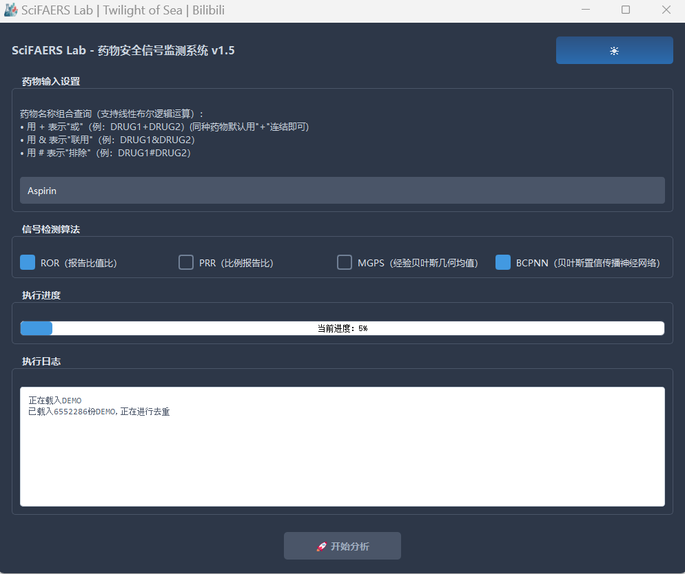
4. 简洁、优雅的UI界面，右上角可以自由切换白天/黑夜模式

- #### 导出报告  

    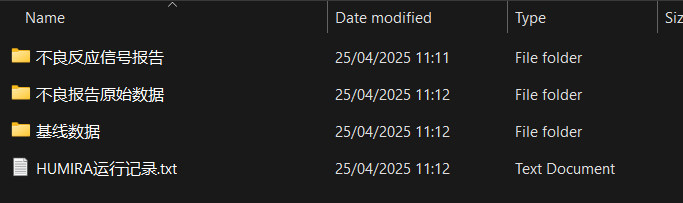  

1. 运行记录的TXT文件：记录着运行过程中产生的一些信息：用于绘制流程图
    - 注意区分不良报告和不良事件的定义：一份不良报告中可能有多个不良事件  
    
2. 基线数据：  
   
   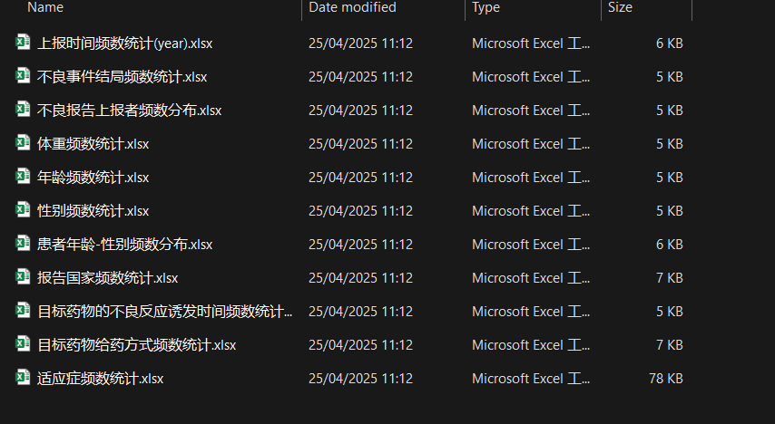

    - 作用之一是在文章中做出这样的表格，展示出国家、性别、年龄段等特征：  
  
      

    - 作用之二是配合SciFaersLab的其他软件做后续的数据分析和作图  
  
    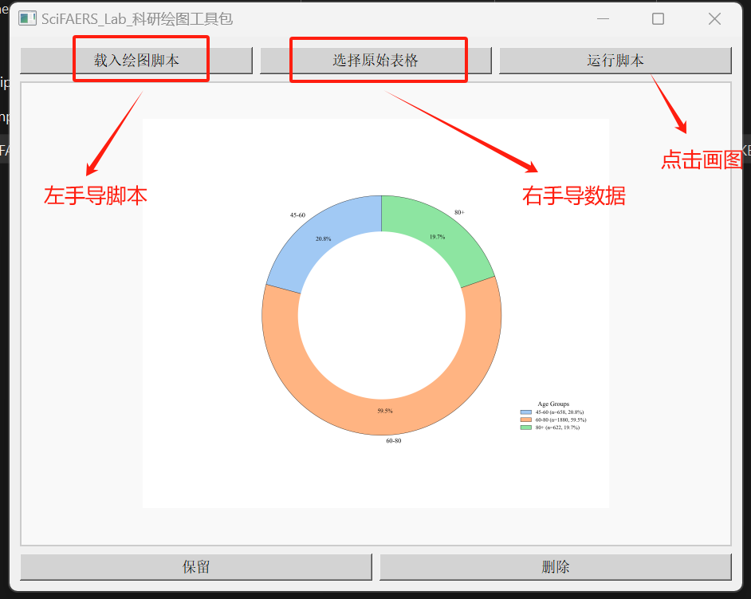
    
3. 不良报告原始数据：
    - 不良原始数据，完全来自于FDA的公开数据库，可以直接打开
    - 还可以用于亚组分析工具和信息统计工具做进一步的分析和画图(如诱发事件分析)  
  
    
4. 不良反应信号报告：
    - 不良反应信号(PT).xlsx
    - 显示每种不良反应在不同算法的信号判定标准和结果  
  
      

    - PS：具体公式和代码请参考：附加的信号计算器和算法说明文件  
  
    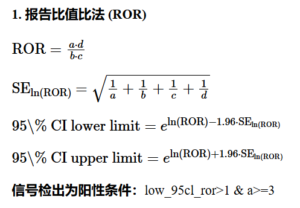  

5. 亚组不良事件数目统计:
   - 统计目标药物引起的不良事件个数
   - 统计目标药物在老人(>65)群体中引起的不良事件个数和百分比例
   - 统计目标药物在儿童(<18)群体中引起的不良事件个数和百分比例
   - 统计目标药物在男性/女性群体中引起的不良事件个数和百分比例  
  
   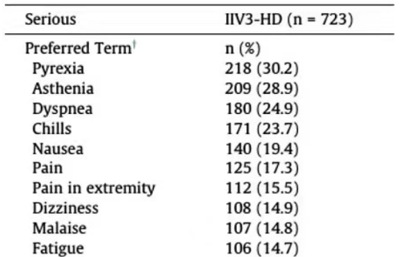

#### 联用药物分析/单独用药分析
1. 一句话描述：
    - 所有程序的药物名称数据框，均可以用这个筛选逻辑：+，&，#表示或、与、非的线性运算逻辑。
    
2. 例子：
```
- 药物I常常和A、B、C三种药物其中的一种联用，我们要分析I单独使用的情况，以及I联合A使用情况、联合B使用情况，联合C使用情况，对着四种情景进行分析？

    答：
    I单独使用的情况：剔除目标药物为I与A、B、C联合使用的报告：输入I#A#B#C
    I联合A使用情况：目标药物为I与A但是不联用B,C: 输入I&A#B#C
    I联合B使用情况：目标药物为I与B但是不联用A,C：输入I&B#A#C
    I联合C使用情况：目标药物为I与C但是不联用A,B:输入I&C#A#B

- 想要筛选“CITALOPRAM”，但是因为“ESCITALOPRAM”也包含前面的字段，所以会结果会把“ESCITALOPRAM”的结果掺杂进来，怎么处理？  

    答：输入：CITALOPRAM#ESCITALOPRAM
    
````

### 二、亚组分析工具（大数据）

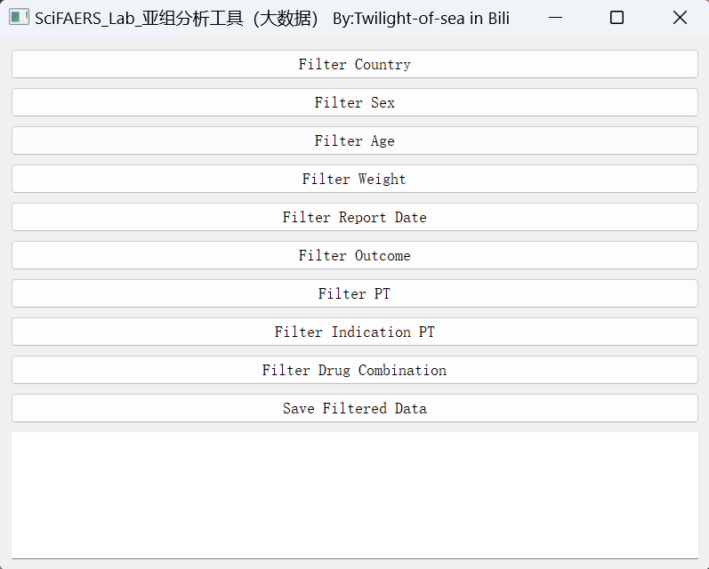

- #### 功能定位：
1. 通过数据库分割的方式，划分亚组。将导出的亚组数据库放入Data_Lake文件夹中，替换原有数据。接着运行不良数据库信号监测系统，在该亚组下进行信号检测。
    - 举例：观察某个药物在女性群体引发的不良反应信号和男性群体之间的差异。

2. 还可以处理一些需求：
    - 针对某类不良反应的分析。举例：引起胃炎这个不良反应的药物分析。

- #### 运行方法
1. 按下任意一个Filter（分割）按键后，会读取"./Lib_Data/Data_Lake"文件夹内的parquet数据库文件，请确保这个文件夹存在。
2. 分割选项：
    1. Sex、Age、
        - 性别：按性别分割亚组，勾选F，或者M
        - 年龄：按年龄分割亚组，填入年龄范围即可：如18-65岁、65岁-9999岁
    2. Weight、Country：
        - 体重：体重划分亚组
        - 国家：选择国家代码：如果看不懂国家二字代码，可参考Readme的使用前必读文件
    3. Report Date、Outcome
        - 报告时间：根据fda_dt字段筛选
    4. Indication PT
        - 根据适应症划分亚组：比如划分阿尔兹海默症患者亚组可输入：Alzheimer
    5. PT
        - 不良反应首位语：可参考meddra辞典映射表，Readme的使用前必读文件
    6. Drug Combination
        - 支持+，&，#表示的或、与、非的线性运算逻辑
3. 保存
    - 点击Save Filtered Data
        - 选择一个文件夹，将分割好的亚组数据库保存


### 三、亚组分析工具（小数据）  

   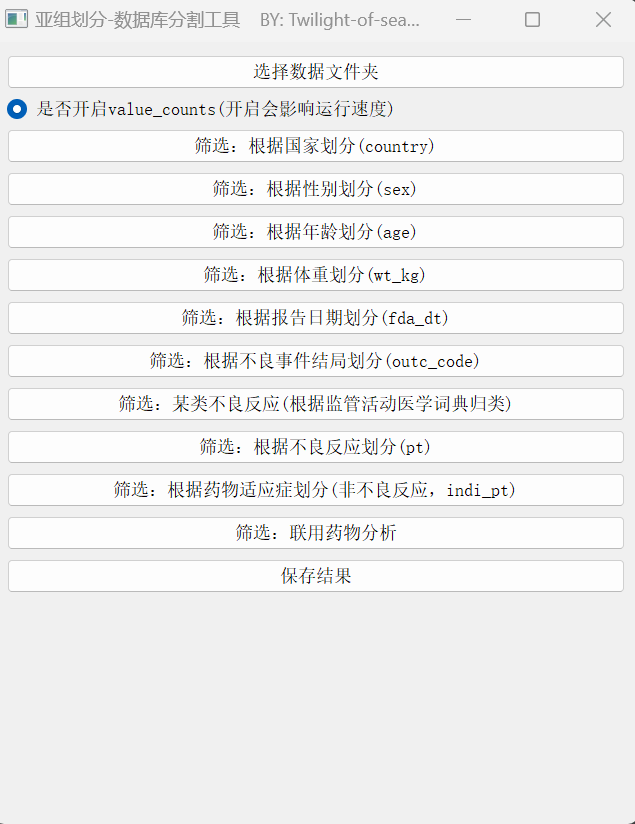

- #### 功能定位：
1. 信号监测系统的导出报告是目标药物(A)的总体原始数据，亚组分析工具可以依据以下的维度进行把总体划分成各个亚组（这些维度可以任意叠加），并且配合信息统计工具和绘图工具进行多角度的深入分析和作图。
   - 特定年龄段人群
   - 单一性别人群
   - 出现某类不良反应AE的报告或者出现某类SMQ的报告
   - 联用了另外一种药物(B)的报告 + 没有联用药物(B)的报告
   - 治疗某种特定的适应症的AE报告
   - 某种不良事件结局的报告
   - 特定国家或地区
   - 超重人群(体重大于90公斤)


- #### 运行方法：
1. 选择数据文件夹，导入目标药物(A)原始数据
2. 点击任意筛选选项，自定义筛选
3. 点击保存结果  
   

   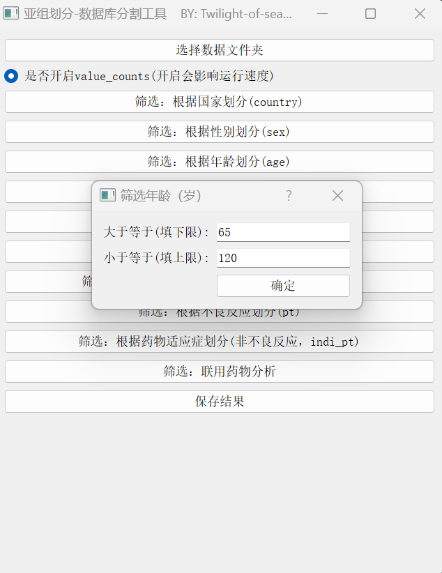  

    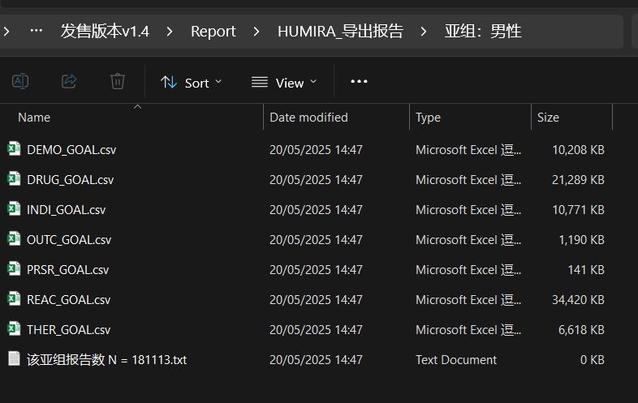

### 四、信息统计工具

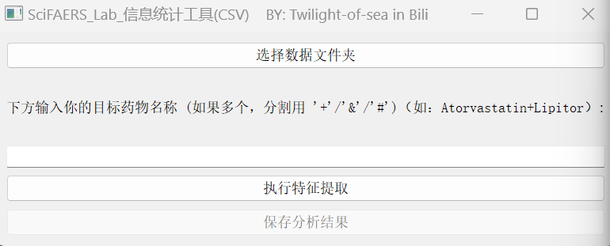

- #### 功能定位：
1. 对原始数据生成一个详细的分析报表，包括但不限于，请自行尝试：
   - AE频数统计
   - 报告年份统计
   - 诱发时间统计分析-韦伯分布
   - 性别分布、体重分布、年龄分布
   - 药物联用情况分析
   - 适应症分析
   - 上报者、事件结局频数统计  

    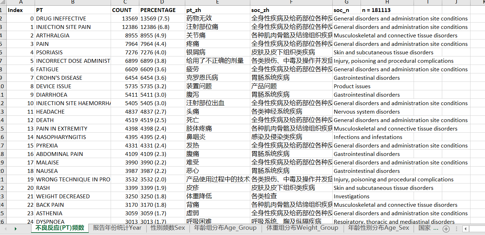  

    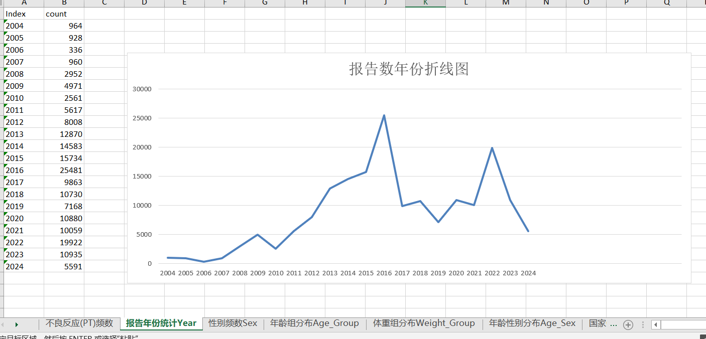   

2. 绘图工具中适配作图脚本数量为60+，编号为C开头，如：
   - [C0009]数据统计表-诱发时间分布图 & [C0008]数据统计表-体重段分布图 

    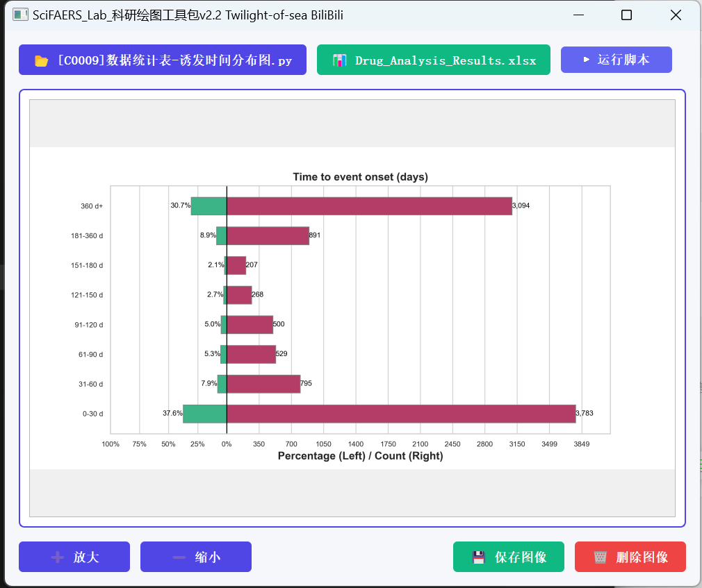  


    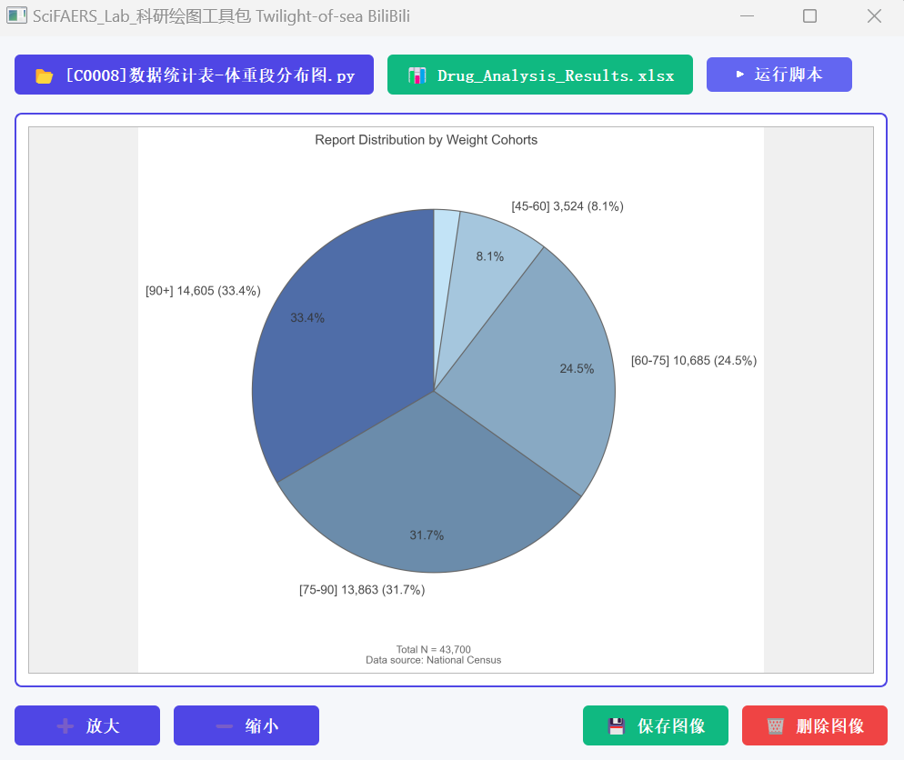      

- #### 使用方法：
1. 点击选择数据文件夹，导入亚组的原始数据
2. 点击特征提取
3. 选择分析报表生成在哪个文件夹中


### 五、画图工具


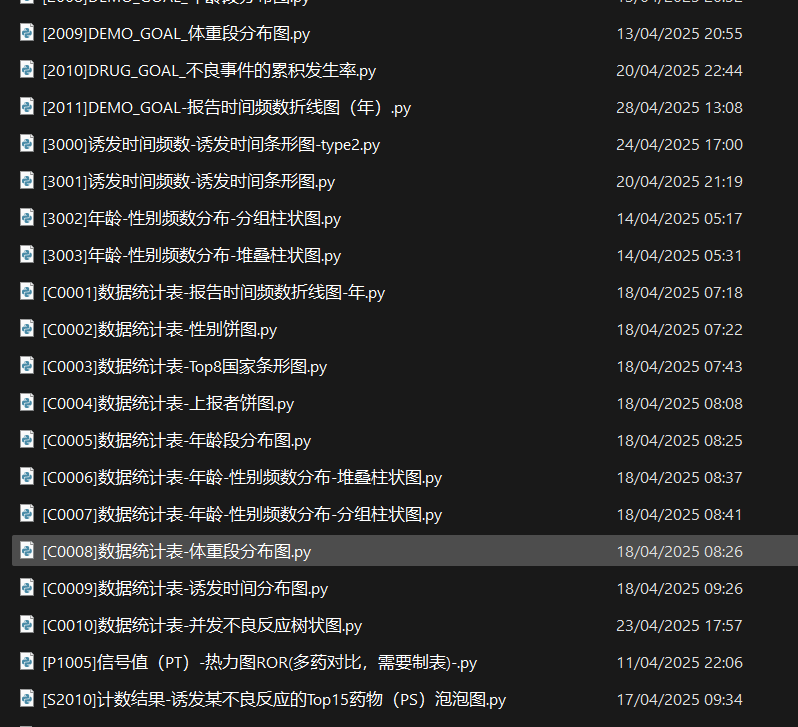

- #### 脚本命名规则
1. 命名：
    - 依赖数据表+图片类型+备注
2. 编号：
    - 数字开头：
        - 1000开头：信号值相关表格作图
        - 2000开头：原始数据作图
        - 3000开头：基线数据作图
    - C开头：信息统计工具导出的数据统计表绘图
    - P和S开头的作图脚本，可能涉及到手动操作的过程，如有需要，[分析角度指引](./分析角度指引.md)中会给出操作链接。


## 一些写作套路的实现

- 常见套路（以下分析可以在总体，也可以在某亚组内）：
    1. 单个药物的不良事件分析；
    2. 单个药物对于某一类不良事件的分析；
    3. 多个药物的不良事件分析；
    4. 多个药物针对某一个/某一类不良事件的分析；
    5. 哪些药物可以引起某一个不良事件；
    6. 联合用药。


