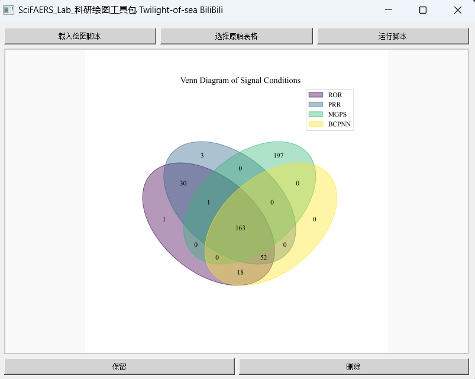

友情链接：[如何用软件实现90%的文章套路](./文章套路.md)

## 软件操作

### 一、不良数据库信号监测系统 [B站教学视频](https://www.bilibili.com/video/BV136JEzqEtt/) 

- #### 界面
1. 顶部输入框：输入目标药物名称，可通过下列几个推荐的网址综合查询（英文，包括API名称、商品名、研发代号等等）
    - https://www.drugfuture.com/
    - https://zh.wikipedia.org/zh-cn/
    - https://www.chemicalbook.com/ProductIndex.aspx
    - https://www.google.com
    - https://www.pharmcube.com/product/PharmaGo/index
    
2. 复选框：选择筛选算法，是否勾选区别不大，均会生成下列两种文件
    - 生成文件："./Report/导出报告/不良反应信号报告/不良反应信号(PT).xlsx"：筛选前结果
    - 生成文件："./Report/导出报告/不良反应信号报告/根据框选的算法筛选后的不良反应信号(PT).xlsx"，筛选后结果

3. 底部按钮：“开始分析”
    - 读取"./Lib_Data/Data_Lake"文件夹中的数据库文件，根据所输入的药物名进行信号检测
    - 请确保这个文件夹存在。  
    
    
4. 简洁、优雅的UI界面，右上角可以自由切换白天/黑夜模式

- #### 导出报告  

      

1. 运行记录的TXT文件：记录着运行过程中产生的一些信息：用于绘制流程图
    - 注意区分不良报告和不良事件的定义：一份不良报告中可能有多个不良事件  
    
2. 基线数据：  
   
   

    - 作用之一是在文章中做出这样的表格，展示出国家、性别、年龄段等特征：  
  
      

    - 作用之二是配合其他一些分析脚本做后续的绘图（如下图）  
  
    
    
3. 不良报告原始数据：
    - 不良原始数据，完全来自于FDA的公开数据库，可以直接打开
    - 还可以用于亚组分析工具和信息统计工具做进一步的分析和画图(如累积发生率分析、多元逻辑回归分析等等...)  
  
    
    
4. 不良反应信号报告：
    - 不良反应信号(PT).xlsx
    - 显示每种不良反应在不同算法的信号判定标准和结果  
  
      
       

    - PS：具体公式和代码请参考：附加的信号计算器和算法说明文件  

5. 亚组不良事件数目统计:
   - 统计目标药物引起的不良事件个数
   - 统计目标药物在老人(>=65)群体中引起的不良事件个数和百分比例
   - 统计目标药物在儿童(<18)群体中引起的不良事件个数和百分比例
   - 统计目标药物在男性/女性群体中引起的不良事件个数和百分比例  
  
   

- #### 联用药物分析/单独用药分析
1. 两句话描述：
    - +，&，#表示或、与、非的线性运算逻辑。
    - 如果分析A药物联用B药物的情况，输入A&B
    - 如果分析A单独使用不联合B药使用的情况，输入A#B
    - 这个分析可以在亚组分析工具中完成，通过这种输入，把原始数据拆分成两组，再分别用信息统计工具统计不良反应发生情况和人口学等信息。
    
2. 复杂例子：
```
- 药物I常常和A、B、C三种药物其中的一种联用，我们要分析I单独使用的情况，以及I联合A使用情况、联合B使用情况，联合C使用情况，对着四种情景进行分析？

    答：
    I单独使用的情况：剔除目标药物为I与A、B、C联合使用的报告：输入I#A#B#C
    I联合A使用情况：目标药物为I与A但是不联用B,C: 输入I&A#B#C
    I联合B使用情况：目标药物为I与B但是不联用A,C：输入I&B#A#C
    I联合C使用情况：目标药物为I与C但是不联用A,B:输入I&C#A#B

- 想要筛选“CITALOPRAM”，但是因为“ESCITALOPRAM”也包含前面的字段，所以会结果会把“ESCITALOPRAM”的结果掺杂进来，怎么处理？  

    答：输入：CITALOPRAM#ESCITALOPRAM
    
````
### 二、亚组分析工具（小数据）[B站教学视频](https://www.bilibili.com/video/BV14yVpzZEHU/)  

   

- #### 功能定位：
1. 信号监测系统导出的报告包含目标药物(A)的总体原始数据。该工具能够对这些原始报告进行精细化拆分，支持按任意标准划分人群亚组（如1-3岁、4-7岁等年龄段的细分），并生成可与信息统计工具和绘图工具无缝对接的导出文件，特别便于分析特定亚组的不良事件发生频次并进行可视化展示。
   - 特定年龄段人群
   - 男/女性别人群
   - 重量级患者（比如体重大于90公斤的）
   - 出现了某特殊不良反应的人群（PT,SOC,SMQ）（比如心脏毒性、肌肉酸痛）
   - 患有某种疾病的人群（比如二型糖尿病）
   - 死亡或者严重结局人群
   - 药物A联用B的报告 + 药物A没有联用B的报告（分别输入A&B,A#B）
   - 特定国家或地区

- #### 运行方法：
1. 载入原始数据
2. 自由筛选
3. 保存结果，划分出来的亚组有多少报告会有提示！
4. 保存后会得到一个文件夹，请用**四、信息统计工具**选择该文件夹并执行分析。  

   
     

    


### 三、亚组分析工具（大数据）[B站教学视频](https://www.bilibili.com/video/BV1CDVpz9EXK/)


- #### 功能定位：
1. 功能一：有时候，我们想看某个药物在特定人群中的不良反应信号值，就得先用这个软件把数据库整体划分一下再来运行信号监测系统。
   1. 比如说我要看普萘洛尔在女性群体中的信号，就可以在这里把女性的人群分出来，再做挖掘；
   2. 同理，如果我要看匹伐他汀在老人群体中的不良反应信号，就在这里把Age设定为65-120岁，把老人划出来，再做信号挖掘

2. 功能二：反着来做课题，从某种不良反应推导到药物
    - 比如说看横纹肌溶解（PT or SMQ），可能是哪些药物引起的不良反应

- #### 运行方法
1. 按下任意一个Filter（分割）按键后，会读取"./Lib_Data/Data_Lake"文件夹内的parquet数据库文件，请确保这个文件夹存在。
2. 分割选项：
    1. Sex、Age、
        - 性别：按性别分割亚组，勾选F，或者M
        - 年龄：按年龄分割亚组，填入年龄范围即可：如18-65岁、65岁-120岁
    2. Weight、Country：
        - 体重：体重划分亚组
        - 国家：选择国家代码：如果看不懂国家二字代码，可参考Readme的使用前必读文件
    3. Report Date、Outcome
        - 报告时间：根据fda_dt字段筛选
    4. Indication PT
        - 根据适应症划分亚组：比如划分阿尔兹海默症患者亚组可输入：Alzheimer
    5. PT
        - 不良反应首位语：可参考meddra辞典映射表（在Readme文件夹里）
        - 也可以划出来某类的SMQ（在Readme文件夹的SMQ文件中）
    6. Drug Combination
       - +，&，#表示或、与、非的线性运算逻辑。
       - 如果看AB两药联用，输入A&B
       - 如果看A单独使用，输入A#B
3. 保存
    - 点击Save Filtered Data
        - 选择一个文件夹，将分割好的亚组数据库保存

4. 保存后的可选操作：
   - 打开小工具文件夹中的去重工具，将得到的数据去重


### 四、信息统计工具

  

- #### 功能定位：
1. 对两个亚组分析工具的导出结果，生成一个详细的基线数据分析报表，请自行尝试，有十多个统计表，都在一个工作簿里头，包括如下等信息：
   - AE频数统计
   - 报告年份统计
   - 诱发时间统计分析-韦伯分布
   - 性别分布、体重分布、年龄分布
   - 药物联用情况分析
   - 适应症分析
   - 上报者、事件结局频数统计  

      

       

2. 导出的这个工作簿当然也可以绘图，脚本编号为C开头，大概有十张图如：
   - [C0009]数据统计表-诱发时间分布图 & [C0008]数据统计表-体重段分布图 

      


          


### 五、画图工具


- #### 脚本命名规则
1. 命名：
    - 依赖数据表+图片类型+备注
2. 编号：
    - 数字开头：
        - 1000开头：信号值相关表格作图
        - 2000开头：原始数据作图
        - 3000开头：基线数据作图
    - C开头：信息统计工具导出的数据统计表绘图
    - P和S开头的作图脚本，要手动创建excel表格，[文章套路](./文章套路.md)中会给出详细指引。

