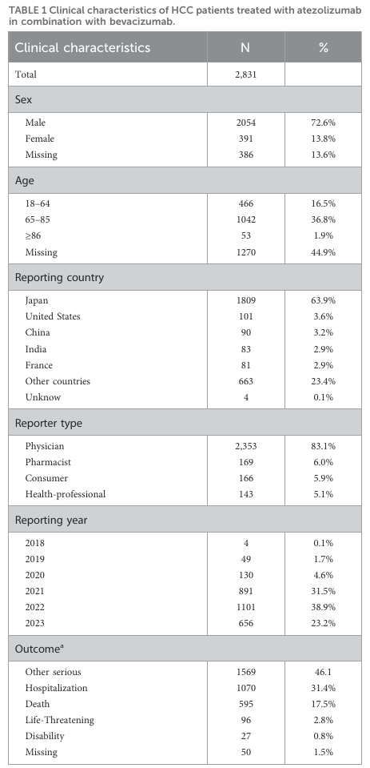
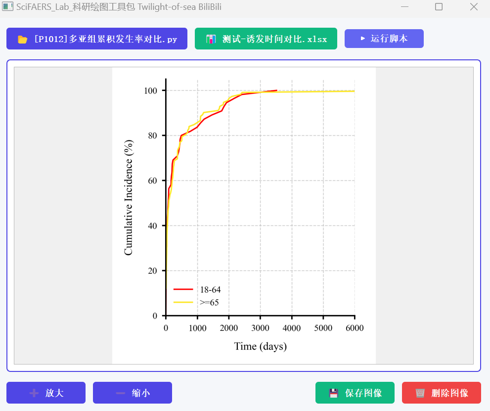
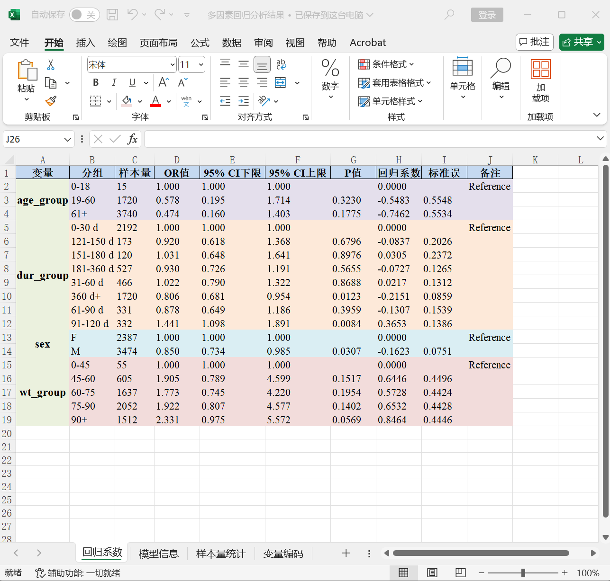
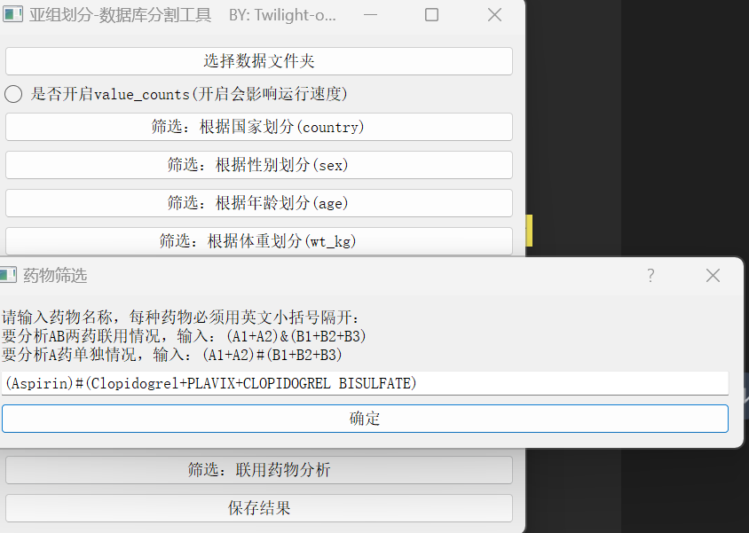
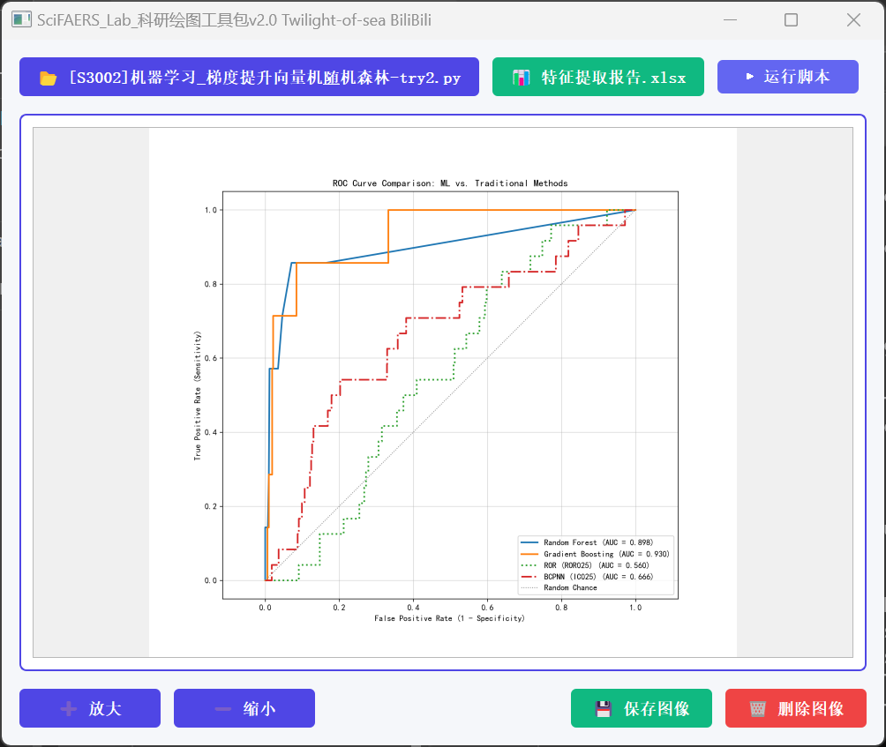
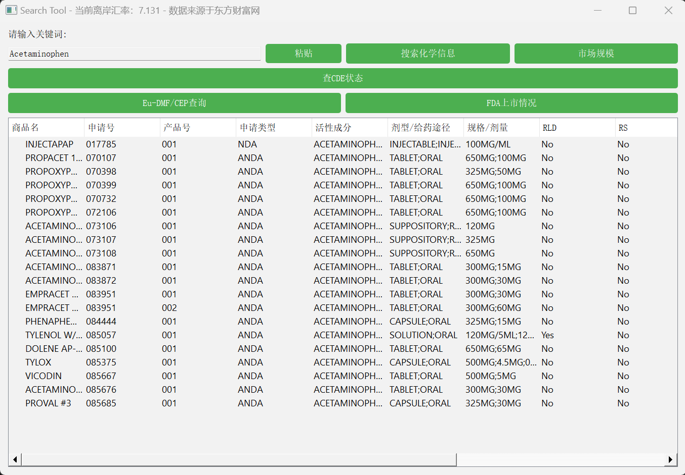
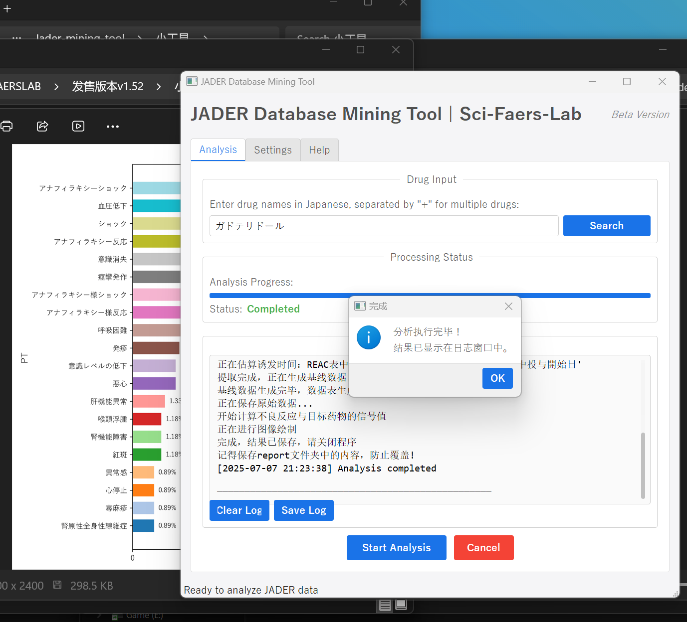

友情链接：[如何用软件实现90%的文章套路](./文章套路.md)

## 软件操作

### 一、不良数据库信号监测系统  
- [B站教学视频](https://www.bilibili.com/video/BV136JEzqEtt/)
- #### 界面
1. 顶部输入框：输入目标药物名称，可通过下列几个推荐的网址综合查询（英文，包括API名称、商品名、研发代号等等）
    - https://www.drugfuture.com/
    - https://zh.wikipedia.org/zh-cn/
    - https://www.chemicalbook.com/ProductIndex.aspx
    - https://www.google.com
    - https://www.pharmcube.com/product/PharmaGo/index
    
2. 复选框：选择筛选算法，是否勾选区别不大，均会生成下列两种文件
    - 生成文件："./Report/导出报告/不良反应信号报告/不良反应信号(PT).xlsx"：筛选前结果
    - 生成文件："./Report/导出报告/不良反应信号报告/根据框选的算法筛选后的不良反应信号(PT).xlsx"，筛选后结果

3. 底部按钮：“开始分析”
    - 读取"./Lib_Data/Data_Lake"文件夹中的数据库文件，并进行数据预处理，清洗，去重，根据所输入的药物名报告提取，不成比例分析及信号检测。
    - 请确保这个文件夹存在。（整合包中自带完整数据库，方法部分请参阅：[数据库范围和方法说明](./数据库范围和方法说明.md)）  
    
    
4. 简洁、优雅的UI界面，右上角可以自由切换白天/黑夜模式

- #### 导出报告  

      

1. 运行记录的TXT文件：记录着运行过程中产生的一些信息：用于绘制流程图
    - 注意区分不良报告和不良事件的定义：一份不良报告中可能有多个不良事件  
    
2. 基线数据：  
   
   

    - 作用之一是在文章中做出这样的表格，展示出国家、性别、年龄段等特征：  
  
      

    - 作用之二是配合其他一些分析脚本做后续的绘图（如下图）  
  
    
    
3. 不良报告原始数据：
    - 不良原始数据，完全来自于FDA的公开数据库，可以直接打开
    - 还可以用于亚组分析工具和信息统计工具做进一步的分析和画图(如累积发生率分析、多元逻辑回归分析等等...)  
  
    
    
4. 不良反应信号报告：
    - 不良反应信号(PT).xlsx
    - 显示每种不良反应在不同算法的信号判定标准和结果  
  
      
       
         

    - PS：具体公式和代码请参考：附加的信号计算器和算法说明文件  

5. 亚组不良事件数目统计:
   - 统计目标药物引起的不良事件个数
   - 统计目标药物在老人(>=65)群体中引起的不良事件个数和百分比例
   - 统计目标药物在儿童(<18)群体中引起的不良事件个数和百分比例
   - 统计目标药物在男性/女性群体中引起的不良事件个数和百分比例  
  
   

- #### 联用药物分析/单独用药分析

##### 1. 基本说明
- 运算符号说明：
  - "+" 表示"或"
  - "&" 表示"与" 
  - "#" 表示"非"

- 分析方法：
  - 联用分析：使用"&"，如 A&B 表示分析A药物联用B药物的情况
  - 单独用药分析：使用"#"，如 A#B 表示分析A药物单独使用(不联用B)的情况
  - **一般在亚组分析工具(小数据)中完成**，通过此方式将原始数据分组，后续进行不良时间频数、生存分析或人口学信息统计分析

##### 2. 药物联用分析实例
- 
注意：实际使用时，药物可能有多个名称，需要用**英文小括号**括起来，每种药物用'+'连接。即使药物仅有一个名称，也需要用小括号括起来。具体见下面的例子：
```
()&() #两种药物联用
()#() #某种药物单独使用,排除另一种药物
()&()&()... #两种或多种药物联用
()#()#()... #某种药物单独使用,排除其他药物
()&()#()#()... #两种药物联合使用，同时排除其他药物
```

**示例1：阿司匹林常和氯吡格雷联用**
- 条件：
  - Aspirin(阿司匹林)商品名：Aspirin, NORGESIC
  - Clopidogrel(氯吡格雷)商品名：Clopidogrel, PLAVIX, CLOPIDOGREL BISULFATE
- 分析方法：
  - 单独使用分析：(Aspirin+NORGESIC)#(Clopidogrel+PLAVIX+CLOPIDOGREL BISULFATE)
  - 联合使用分析：(Aspirin+NORGESIC)&(Clopidogrel+PLAVIX+CLOPIDOGREL BISULFATE)

**示例2：多药联用分析**
药物I与A、B、C三种药物的联用分析，假设这四种药物都有两种名字，实际的输入为：
- I单独使用：(I1+I2)#(A1+A2)#(B1+B2)#(C1+C2)
- I联合A使用：(I1+I2)&(A1+A2)#(B1+B2)#(C+C2)
- I联合B使用：(I1+I2)&(B1+B2)#(A1+A2)#(C1+C2)
- I联合C使用：(I1+I2)&(C1+C2)#(A1+A2)#(B1+B2)

**示例3：同名药物筛选**
问题：如何准确筛选CITALOPRAM而不包含ESCITALOPRAM？
解决方案：使用(CITALOPRAM)#(ESCITALOPRAM)

### 二、亚组分析工具（小数据）
- [B站教学视频](https://www.bilibili.com/video/BV14yVpzZEHU/)  

   

- #### 功能定位：
1. 信号监测系统导出的报告包含目标药物(A)的总体原始数据。该工具能够对这些原始报告进行精细化拆分，支持按任意标准划分人群亚组（如1-3岁、4-7岁等年龄段的细分），并生成可与信息统计工具和绘图工具无缝对接的导出文件，特别便于分析特定亚组的不良事件发生频次并进行可视化展示。
   - 特定年龄段人群
   - 男/女性别人群
   - 重量级患者（比如体重大于90公斤的）
   - 出现了某特殊不良反应的人群（PT,SOC,SMQ）（比如心脏毒性、肌肉酸痛）
   - 患有某种疾病的人群（比如二型糖尿病）
   - 死亡或者严重结局人群
   - 药物A联用B的报告 + 药物A没有联用B的报告（分别输入A&B,A#B）
   - 特定国家或地区

- #### 运行方法：
1. 载入原始数据
2. 自由筛选
3. 保存结果，划分出来的亚组有多少报告会有提示！
4. 保存后会得到一个文件夹，请用**四、信息统计工具**选择该文件夹并执行分析。  

   
     

    


### 三、亚组分析工具（大数据）
- [B站教学视频](https://www.bilibili.com/video/BV1CDVpz9EXK/)


- #### 功能定位：
1. 功能一：有时候，我们想看某个药物在特定人群中的不良反应信号值，就得先用这个软件把数据库整体划分一下再来运行信号监测系统。
   1. 比如说我要看普萘洛尔在女性群体中的信号，就可以在这里把女性的人群分出来，再做挖掘；
   2. 同理，如果我要看匹伐他汀在老人群体中的不良反应信号，就在这里把Age设定为65-120岁，把老人划出来，再做信号挖掘

2. 功能二：反着来做课题，从某种不良反应推导到药物
    - 比如说看横纹肌溶解（PT or SMQ），可能是哪些药物引起的不良反应

- #### 运行方法
1. 按下任意一个Filter（分割）按键后，会读取"./Lib_Data/Data_Lake"文件夹内的parquet数据库文件，请确保这个文件夹存在。
2. 分割选项：
    1. Sex、Age、
        - 性别：按性别分割亚组，勾选F，或者M
        - 年龄：按年龄分割亚组，填入年龄范围即可：如18-65岁、65岁-120岁
    2. Weight、Country：
        - 体重：体重划分亚组
        - 国家：选择国家代码：如果看不懂国家二字代码，可参考Readme的使用前必读文件
    3. Report Date、Outcome
        - 报告时间：根据fda_dt字段筛选
    4. Indication PT
        - 根据适应症划分亚组：比如划分阿尔兹海默症患者亚组可输入：Alzheimer
    5. PT
        - 不良反应首位语：可参考meddra辞典映射表（在Readme文件夹里）
        - 也可以划出来某类的SMQ（在Readme文件夹的SMQ文件中）
    6. Drug Combination
       - +，&，#表示或、与、非的线性运算逻辑。
       - 如果看AB两药联用，输入A&B
       - 如果看A单独使用，输入A#B
3. 保存
    - 点击Save Filtered Data
        - 选择一个文件夹，将分割好的亚组数据库保存

4. 保存后的可选操作：
   - 打开小工具文件夹中的去重工具，将得到的数据去重

5. 在分割完成后，可以将数据导入"./Lib_Data/Data_Lake"文件夹内，替换原有文件，再通过执行信号监测工具以完成特定人群内的信号检出。（PS: 注意备份原有的文件）


### 四、信息统计工具

  

- #### 功能定位：
1. 对两个亚组分析工具的导出结果，生成一个详细的基线数据分析报表，请自行尝试，有十多个统计表，都在一个工作簿里头，包括如下等信息：
   - AE频数统计
   - 报告年份统计
   - 诱发时间统计分析-韦伯分布
   - 性别分布、体重分布、年龄分布
   - 药物联用情况分析
   - 适应症分析
   - 上报者、事件结局频数统计  

      

       

2. 导出的这个工作簿当然也可以绘图，脚本编号为C开头，大概有十张图如：
   - 诱发时间蝶形图 & 年龄-性别频数分布 

      


          


### 五、画图工具


> 当前v1.53版本，脚本目录中文件数量：101
> 未来更新版本中，脚本数量为：119

- #### 脚本命名规则
1. 命名：
    - 依赖数据表+图片类型+备注
2. 编号：
    - 数字开头：
        - 1000开头：信号值相关表格作图
        - 2000开头：原始数据作图
        - 3000开头：基线数据作图
    - C开头：信息统计工具导出的数据统计表绘图
    - P和S开头的作图脚本，要手动创建excel表格，[文章套路](./文章套路.md)中会给出详细指引。

- #### 保存图片或矢量图格式  


  


### 六、特征提取工具(机器学习用)
- 在[文章套路](./文章套路.md)中有更详细的功能说明
- [B站视频：给懒人看的FAERS机器学习教程](https://www.bilibili.com/video/BV1su39zKEPX/)
-  

- 执行特征提取工具，得到特征提取报告。运行脚本[S3002]等，设置模型参数和Gold Standard，自动完成建模、AUC曲线绘制、模型性能打分。
-  
-  
-  
-  

### 小工具：药物-作用代码-对应的不良报告个数计数器
- 新增统计选项：涉及报告的不良事件计数功能
 **性能提示：** 该功能需映射REAC数据库，处理时间较长，建议根据实际需求谨慎启用


1. 特殊套路：分析某类不良反应是由哪些药物诱发的，哪几个药物诱发这类报告的频数最多。详细步骤请看[文章套路](./文章套路.md)    


2. 特殊套路：联用药物分析，用于展示与目标药物联用频繁的药物，为此方向做铺垫。详细步骤请看[文章套路](./文章套路.md)  


3. 用于展示数据库中实际检索到的目标药物的名称，以及其所对应的引起不良报告的频数分布


### 小工具：药学辅助查询工具
- [视频教程](https://www.bilibili.com/video/BV1qGHezZEgJ)  


构建一站式药学信息查询平台，涵盖：
- **化学信息库：** CAS号与中英文化学物质名称对照数据库
- **市场分析：** 全球药物市场销量统计
- **国内监管：** CDE API注册登记状态查询
- **欧盟合规：** Eu-DMF欧盟API注册信息检索
- **美国市场：** FDA药物上市情况追踪




### 小工具：JADER挖掘插件
- [请点击这里了解插件详情](./旧物/Jader数据库挖掘工具.md)  

1. 界面如下：支持检索日本上市药物数据库网站，复制日文通用名后， 点击Start Analysis，导出报告在该插件的同目录的Report文件夹中，包含基线数据、图像、分析报告。


  

2. 支持自定义检索范围和适应症，通过设置界面选定预处理过程。


3. 亚组分析工具：可以自由划定任意特定亚组进行筛出，和进一步分析，导出韦伯分布建模计算结果、图像、基线数据等。


### 小工具：数据库挖掘AI小助手

- 学习了大量FAERS数据挖掘文章和SCIFAERSLAB的平台使用教程。提供免费、智能的咨询服务。该助手支持多个主流大语言模型，包括DeepSeek、通义千问、清华智谱AI和书生蒲语。
- 可就数据挖掘方法论、平台软件操作指南以及学术写作策略等问题进行咨询。  

  


